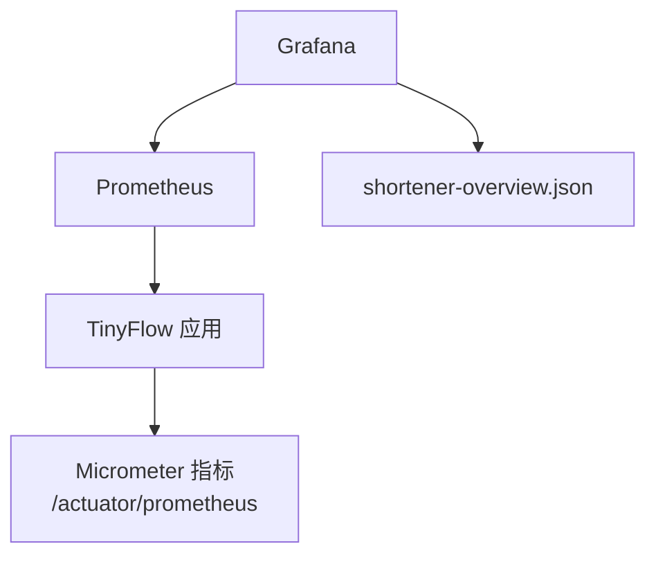
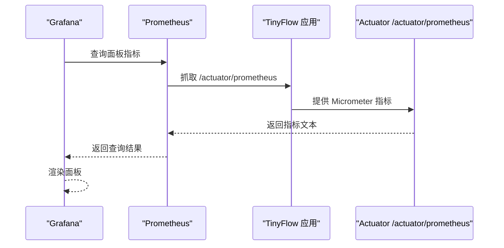
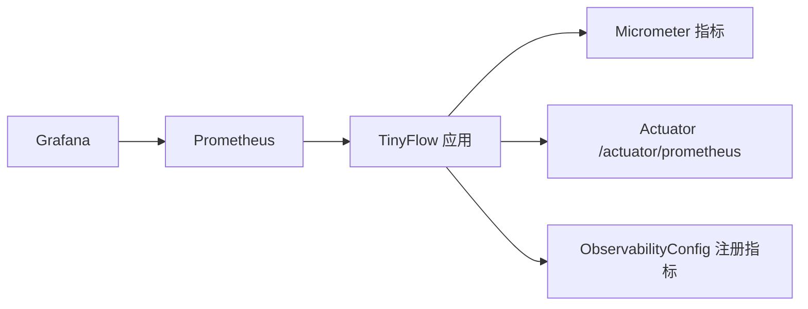

# Grafana监控大盘配置

<cite>
**本文引用的文件**
- [shortener-overview.json](file://web/infra/observability/dashboards/shortener-overview.json)
- [prometheus.yml](file://web/infra/observability/prometheus.yml)
- [application.yml](file://src/main/resources/application.yml)
- [OBSERVABILITY.md](file://OBSERVABILITY.md)
- [ObservabilityConfig.java](file://src/main/java/com/layor/tinyflow/config/ObservabilityConfig.java)
- [MonitorController.java](file://src/main/java/com/layor/tinyflow/Controller/MonitorController.java)
- [PerformanceMonitorAspect.java](file://src/main/java/com/layor/tinyflow/aspect/PerformanceMonitorAspect.java)
</cite>

## 目录
1. [简介](#简介)
2. [项目结构](#项目结构)
3. [核心组件](#核心组件)
4. [架构总览](#架构总览)
5. [详细组件分析](#详细组件分析)
6. [依赖关系分析](#依赖关系分析)
7. [性能与阈值建议](#性能与阈值建议)
8. [故障排查指南](#故障排查指南)
9. [结论](#结论)

## 简介
本文件面向运维与开发读者，提供导入与使用“短链服务监控大盘”的完整指南。该大盘基于Prometheus采集的Micrometer指标，通过Grafana进行可视化呈现，覆盖请求吞吐、延迟分位、错误率与短链跳转性能等关键维度。文档将详细说明导入步骤、关键面板含义、PromQL查询原理，并给出数据源与刷新频率的调整建议以及常见阈值参考。

## 项目结构
与Grafana监控大盘直接相关的文件位于以下位置：
- Grafana仪表盘定义：web/infra/observability/dashboards/shortener-overview.json
- Prometheus抓取配置：web/infra/observability/prometheus.yml
- 应用侧指标导出配置：src/main/resources/application.yml
- 可观测性配置与线程池/缓存指标绑定：src/main/java/com/layor/tinyflow/config/ObservabilityConfig.java
- 监控端点与健康状态：src/main/java/com/layor/tinyflow/Controller/MonitorController.java
- 方法级性能监控切面：src/main/java/com/layor/tinyflow/aspect/PerformanceMonitorAspect.java
- 可观测性使用说明与告警建议：OBSERVABILITY.md

图表来源
- [shortener-overview.json](file://web/infra/observability/dashboards/shortener-overview.json#L1-L55)
- [prometheus.yml](file://web/infra/observability/prometheus.yml#L1-L9)
- [application.yml](file://src/main/resources/application.yml#L88-L132)

章节来源
- [shortener-overview.json](file://web/infra/observability/dashboards/shortener-overview.json#L1-L55)
- [prometheus.yml](file://web/infra/observability/prometheus.yml#L1-L9)
- [application.yml](file://src/main/resources/application.yml#L88-L132)

## 核心组件
- Grafana仪表盘：定义了四个关键面板，分别展示每URI的QPS、P95延迟、5xx错误率与短链跳转P95延迟。
- Prometheus抓取配置：定义抓取目标与路径，确保Grafana能从应用的/actuator/prometheus端点获取指标。
- 应用指标导出：通过Spring Boot Actuator与Micrometer开启Prometheus导出，生成http_server_requests_seconds系列指标。
- 可观测性配置：注册线程池与缓存指标，便于更全面地观察系统运行状况。

章节来源
- [shortener-overview.json](file://web/infra/observability/dashboards/shortener-overview.json#L1-L55)
- [prometheus.yml](file://web/infra/observability/prometheus.yml#L1-L9)
- [application.yml](file://src/main/resources/application.yml#L88-L132)
- [ObservabilityConfig.java](file://src/main/java/com/layor/tinyflow/config/ObservabilityConfig.java#L1-L60)

## 架构总览
下图展示了从应用到Grafana的完整链路：应用暴露Micrometer指标，Prometheus按配置周期抓取，Grafana加载dashboard并渲染面板。

图表来源
- [prometheus.yml](file://web/infra/observability/prometheus.yml#L1-L9)
- [application.yml](file://src/main/resources/application.yml#L88-L132)
- [shortener-overview.json](file://web/infra/observability/dashboards/shortener-overview.json#L1-L55)

## 详细组件分析

### 导入与使用步骤
- 在Grafana界面中选择“Import”，上传shortener-overview.json文件。
- 确认数据源已正确指向Prometheus（默认抓取地址见prometheus.yml）。
- 刷新面板，观察数据是否正常显示。

章节来源
- [OBSERVABILITY.md](file://OBSERVABILITY.md#L163-L178)
- [shortener-overview.json](file://web/infra/observability/dashboards/shortener-overview.json#L1-L55)
- [prometheus.yml](file://web/infra/observability/prometheus.yml#L1-L9)

### 面板一：每秒请求（按URI）
- 面板标题：Requests per second (by uri)
- 作用：监控各API的实时QPS，帮助识别热点接口与异常流量。
- PromQL要点：
  - 使用rate函数计算单位时间内计数增量，窗口1分钟。
  - 过滤掉/actuator.*路径，避免内部管理端点干扰。
  - 按uri聚合，形成多条曲线。
- 实际查询表达式路径：[PromQL表达式](file://web/infra/observability/dashboards/shortener-overview.json#L14-L18)

章节来源
- [shortener-overview.json](file://web/infra/observability/dashboards/shortener-overview.json#L9-L19)

### 面板二：延迟P95（按URI）
- 面板标题：Latency p95 (by uri)
- 作用：展示各URI的P95延迟分布，定位慢接口。
- PromQL要点：
  - 使用histogram_quantile(0.95, ...)计算P95。
  - 对bucket进行sum(rate(...))后按(le, uri)聚合。
  - 同样过滤/actuator.*路径。
- 实际查询表达式路径：[PromQL表达式](file://web/infra/observability/dashboards/shortener-overview.json#L24-L30)

章节来源
- [shortener-overview.json](file://web/infra/observability/dashboards/shortener-overview.json#L20-L31)

### 面板三：错误率（5xx）
- 面板标题：Error rate (5xx)
- 作用：计算5xx错误占比，快速发现异常。
- PromQL要点：
  - 分子：统计status以5开头且uri非/actuator.*的计数速率。
  - 分母：统计uri非/actuator.*的总计数速率。
  - 结果为比例，建议以百分比形式展示。
- 实际查询表达式路径：[PromQL表达式](file://web/infra/observability/dashboards/shortener-overview.json#L31-L41)

章节来源
- [shortener-overview.json](file://web/infra/observability/dashboards/shortener-overview.json#L31-L41)

### 面板四：短链跳转P95
- 面板标题：Redirect latency p95
- 作用：专门监控短链跳转的P95延迟，保障用户体验。
- PromQL要点：
  - 限定uri匹配“/api/redirect/.*”。
  - 对bucket求和后计算P95，按le聚合。
- 实际查询表达式路径：[PromQL表达式](file://web/infra/observability/dashboards/shortener-overview.json#L42-L52)

章节来源
- [shortener-overview.json](file://web/infra/observability/dashboards/shortener-overview.json#L42-L52)

### Prometheus抓取与数据源
- 抓取间隔：全局5秒，抓取job名称为tinyflow-backend，指标端点为/actuator/prometheus。
- 抓取目标：host.docker.internal:8080（容器内访问宿主机的地址）。
- 建议：若Grafana与Prometheus在同一容器网络，需确保目标可达；如在本机运行，注意端口映射与防火墙。

章节来源
- [prometheus.yml](file://web/infra/observability/prometheus.yml#L1-L9)

### 应用指标导出与可观测性
- Micrometer导出：开启Prometheus导出，设置导出步长为1分钟，启用描述信息。
- HTTP请求直方图：配置了http.server.requests的分位数与SLO，便于P95等指标计算。
- Actuator端点：暴露/actuator/prometheus，供Prometheus抓取。
- 线程池与缓存指标：通过ObservabilityConfig注册线程池与Caffeine缓存监控，辅助定位性能瓶颈。

章节来源
- [application.yml](file://src/main/resources/application.yml#L88-L132)
- [ObservabilityConfig.java](file://src/main/java/com/layor/tinyflow/config/ObservabilityConfig.java#L1-L60)

### 监控端点与健康状态
- 健康状态：/api/monitor/health，返回熔断器状态、限流器状态与缓存统计。
- 缓存统计：/api/monitor/cache/stats，返回命中/缺失/平均负载等指标。
- 以上端点可用于验证应用侧可观测性配置是否生效。

章节来源
- [MonitorController.java](file://src/main/java/com/layor/tinyflow/Controller/MonitorController.java#L1-L114)

### 方法级性能监控切面
- PerformanceMonitorAspect对Controller与Service层方法进行环绕监控，记录慢请求与异常。
- 慢请求阈值：100ms，超过阈值写入性能日志，便于定位热点方法。

章节来源
- [PerformanceMonitorAspect.java](file://src/main/java/com/layor/tinyflow/aspect/PerformanceMonitorAspect.java#L1-L64)

## 依赖关系分析
- Grafana依赖Prometheus作为数据源，Prometheus依赖应用的/actuator/prometheus端点。
- 应用通过Micrometer导出指标，Prometheus按配置抓取。
- 观测性配置负责注册线程池与缓存指标，丰富监控维度。

图表来源
- [shortener-overview.json](file://web/infra/observability/dashboards/shortener-overview.json#L1-L55)
- [prometheus.yml](file://web/infra/observability/prometheus.yml#L1-L9)
- [application.yml](file://src/main/resources/application.yml#L88-L132)
- [ObservabilityConfig.java](file://src/main/java/com/layor/tinyflow/config/ObservabilityConfig.java#L1-L60)

章节来源
- [shortener-overview.json](file://web/infra/observability/dashboards/shortener-overview.json#L1-L55)
- [prometheus.yml](file://web/infra/observability/prometheus.yml#L1-L9)
- [application.yml](file://src/main/resources/application.yml#L88-L132)
- [ObservabilityConfig.java](file://src/main/java/com/layor/tinyflow/config/ObservabilityConfig.java#L1-L60)

## 性能与阈值建议
- 刷新频率：默认5秒，适合实时监控；在高并发场景下可适当缩短以提高灵敏度。
- 数据源：确保Prometheus能访问到应用的/actuator/prometheus端点；如容器化部署，注意网络连通与端口映射。
- 关键阈值参考（建议值，需结合业务与SLA调整）：
  - P95延迟：建议短期告警阈值在100–200ms之间，长期稳定阈值在50–100ms。
  - 5xx错误率：短期告警阈值建议小于1%，长期稳定阈值建议小于0.1%。
  - QPS：按URI区分基线，异常波动幅度超过基线2–3倍时触发预警。
  - 短链跳转P95：建议与整体P95保持一致或略低，确保跳转链路稳定性。
- 告警建议（来自文档）：
  - 熔断器打开：resilience4j_circuitbreaker_state{state="open"} == 1
  - 错误率 >1%：rate(http_server_requests_seconds_count{status=~"5.."}[1m]) > 0.01
  - P95延迟 >100ms：http_server_requests_seconds{quantile="0.95"} > 0.1
  - 缓存命中率 <90%：caffeine_cache_hit_total / (caffeine_cache_hit_total + caffeine_cache_miss_total) < 0.9

章节来源
- [OBSERVABILITY.md](file://OBSERVABILITY.md#L210-L219)
- [application.yml](file://src/main/resources/application.yml#L88-L132)

## 故障排查指南
- 仪表盘无数据
  - 检查Prometheus抓取配置与目标可达性。
  - 确认应用已暴露/actuator/prometheus端点且未被防火墙拦截。
  - 验证应用指标导出开关与导出步长配置。
- 指标异常
  - 检查/actuator/prometheus返回内容是否包含http_server_requests_seconds系列。
  - 使用监控端点验证健康状态与缓存统计是否正常。
- 面板显示异常
  - 确认Grafana数据源指向正确的Prometheus实例。
  - 调整刷新频率与时间范围，避免过长导致数据滞后。

章节来源
- [prometheus.yml](file://web/infra/observability/prometheus.yml#L1-L9)
- [application.yml](file://src/main/resources/application.yml#L88-L132)
- [MonitorController.java](file://src/main/java/com/layor/tinyflow/Controller/MonitorController.java#L1-L114)

## 结论
通过导入shortener-overview.json并正确配置Prometheus抓取，即可在Grafana中获得短链服务的核心运行视图。结合应用侧的Micrometer指标导出与可观测性配置，能够有效监控QPS、延迟、错误率与短链跳转性能。建议根据业务SLA设定阈值并接入告警平台，持续优化系统稳定性与性能表现。