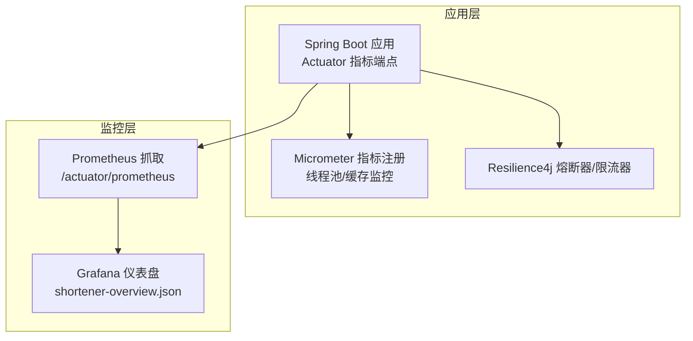
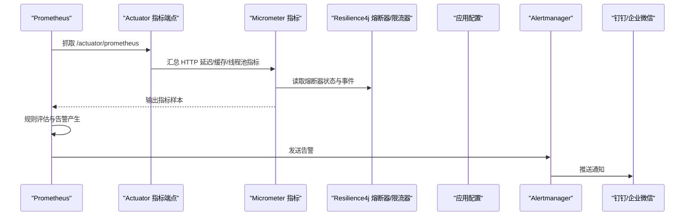
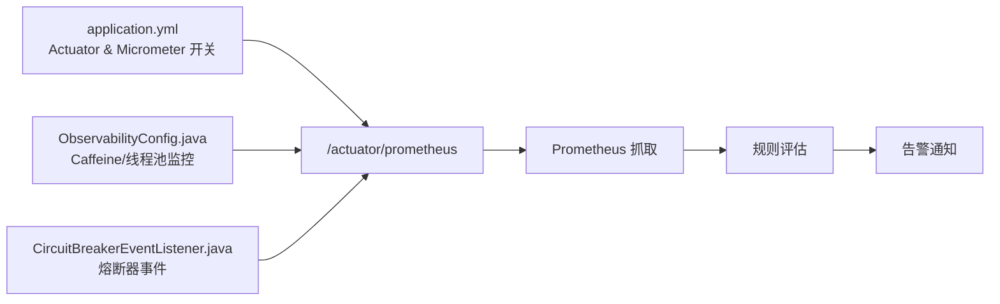

# 告警规则配置

<cite>
**本文引用的文件**
- [OBSERVABILITY.md](file://OBSERVABILITY.md)
- [prometheus.yml](file://web/infra/observability/prometheus.yml)
- [shortener-overview.json](file://web/infra/observability/dashboards/shortener-overview.json)
- [application.yml](file://src/main/resources/application.yml)
- [ObservabilityConfig.java](file://src/main/java/com/layor/tinyflow/config/ObservabilityConfig.java)
- [MonitorController.java](file://src/main/java/com/layor/tinyflow/Controller/MonitorController.java)
- [CircuitBreakerEventListener.java](file://src/main/java/com/layor/tinyflow/listener/CircuitBreakerEventListener.java)
- [CacheConfig.java](file://src/main/java/com/layor/tinyflow/config/CacheConfig.java)
</cite>

## 目录
1. [简介](#简介)
2. [项目结构与可观测性入口](#项目结构与可观测性入口)
3. [核心告警规则与PromQL表达式](#核心告警规则与promql表达式)
4. [规则集成到Prometheus配置](#规则集成到prometheus配置)
5. [告警通知渠道建议](#告警通知渠道建议)
6. [告警触发后的排查步骤](#告警触发后的排查步骤)
7. [架构与数据流概览](#架构与数据流概览)
8. [依赖关系与指标来源](#依赖关系与指标来源)
9. [性能与稳定性考量](#性能与稳定性考量)
10. [故障排查指南](#故障排查指南)
11. [结论](#结论)

## 简介
本文件基于仓库中的可观测性文档与现有监控配置，给出面向生产环境的Prometheus告警规则配置建议，覆盖以下关键场景：
- 熔断器打开告警
- 5xx错误率异常告警
- P95延迟超阈值告警
- 缓存命中率下降告警

同时提供规则集成到Prometheus配置的方法、通知渠道建议以及告警触发后的排查步骤，帮助团队快速建立稳定可靠的告警体系。

## 项目结构与可观测性入口
- 应用通过Actuator暴露Prometheus格式指标，默认路径为“/actuator/prometheus”，Scrape间隔与评估间隔在Prometheus配置中已设定。
- Micrometer与Resilience4j集成，导出HTTP请求延迟直方图、熔断器状态、缓存命中/缺失计数等指标。
- Grafana仪表盘已提供P95延迟、错误率、QPS等可视化，便于验证规则有效性与阈值合理性。

图表来源
- [prometheus.yml](file://web/infra/observability/prometheus.yml#L1-L9)
- [application.yml](file://src/main/resources/application.yml#L88-L132)
- [ObservabilityConfig.java](file://src/main/java/com/layor/tinyflow/config/ObservabilityConfig.java#L1-L60)
- [shortener-overview.json](file://web/infra/observability/dashboards/shortener-overview.json#L1-L55)

章节来源
- [prometheus.yml](file://web/infra/observability/prometheus.yml#L1-L9)
- [application.yml](file://src/main/resources/application.yml#L88-L132)
- [ObservabilityConfig.java](file://src/main/java/com/layor/tinyflow/config/ObservabilityConfig.java#L1-L60)
- [shortener-overview.json](file://web/infra/observability/dashboards/shortener-overview.json#L1-L55)

## 核心告警规则与PromQL表达式
以下规则均来自仓库可观测性文档中的建议，结合现有指标命名与抓取配置进行落地。

- 熔断器打开告警
  - 表达式参考：resilience4j_circuitbreaker_state{state="open"} == 1
  - 说明：当任一熔断器处于OPEN状态时触发告警，体现系统降级或外部依赖不可用。
  - 参考路径
    - [OBSERVABILITY.md](file://OBSERVABILITY.md#L213-L215)

- 5xx错误率 >1% 告警
  - 表达式参考：rate(http_server_requests_seconds_count{status=~"5.."}[1m]) > 0.01
  - 说明：近1分钟内5xx错误率超过1%，反映后端异常或上游流量突增。
  - 参考路径
    - [OBSERVABILITY.md](file://OBSERVABILITY.md#L214-L216)
    - [shortener-overview.json](file://web/infra/observability/dashboards/shortener-overview.json#L31-L41)

- P95延迟 >100ms 告警
  - 表达式参考：http_server_requests_seconds{quantile="0.95"} > 0.1
  - 说明：P95延迟超过100ms，提示性能退化或热点路径阻塞。
  - 参考路径
    - [OBSERVABILITY.md](file://OBSERVABILITY.md#L215-L217)
    - [shortener-overview.json](file://web/infra/observability/dashboards/shortener-overview.json#L20-L30)

- 缓存命中率 <90% 告警
  - 表达式参考：caffeine_cache_hit_total / (caffeine_cache_hit_total + caffeine_cache_miss_total) < 0.9
  - 说明：缓存命中率低于90%，提示缓存策略或容量不足，需关注热点与预热。
  - 参考路径
    - [OBSERVABILITY.md](file://OBSERVABILITY.md#L216-L218)
    - [ObservabilityConfig.java](file://src/main/java/com/layor/tinyflow/config/ObservabilityConfig.java#L46-L59)
    - [CacheConfig.java](file://src/main/java/com/layor/tinyflow/config/CacheConfig.java#L1-L19)

章节来源
- [OBSERVABILITY.md](file://OBSERVABILITY.md#L213-L218)
- [shortener-overview.json](file://web/infra/observability/dashboards/shortener-overview.json#L20-L41)
- [ObservabilityConfig.java](file://src/main/java/com/layor/tinyflow/config/ObservabilityConfig.java#L46-L59)
- [CacheConfig.java](file://src/main/java/com/layor/tinyflow/config/CacheConfig.java#L1-L19)

## 规则集成到Prometheus配置
- 抓取目标与路径
  - Prometheus已配置job“tinyflow-backend”，抓取路径为“/actuator/prometheus”，目标地址为host.docker.internal:8080。
  - 参考路径
    - [prometheus.yml](file://web/infra/observability/prometheus.yml#L1-L9)
    - [application.yml](file://src/main/resources/application.yml#L88-L105)

- 规则文件组织建议
  - 在Prometheus配置目录下创建rules子目录，将规则按业务域拆分：
    - 通用规则：包含P95延迟、5xx错误率、缓存命中率等
    - 熔断器规则：包含熔断器打开告警
  - 将上述PromQL表达式分别映射到对应规则组，设置合理的持续时间与标签（如severity、team）。

- 规则组示例（以注释形式描述）
  - 通用规则组
    - 规则名称：High5xxErrorRate
      - 表达式：rate(http_server_requests_seconds_count{status=~"5.."}[1m]) > 0.01
      - 持续时间：5m
      - 标签：severity=warning
    - 规则名称：HighP95Latency
      - 表达式：histogram_quantile(0.95, sum(rate(http_server_requests_seconds_bucket[5m])) by (le)) > 0.1
      - 持续时间：5m
      - 标签：severity=warning
    - 规则名称：LowCacheHitRate
      - 表达式：caffeine_cache_hit_total / (caffeine_cache_hit_total + caffeine_cache_miss_total) < 0.9
      - 持续时间：10m
      - 标签：severity=info
  - 熔断器规则组
    - 规则名称：CircuitBreakerOpen
      - 表达式：resilience4j_circuitbreaker_state{state="open"} == 1
      - 持续时间：1m
      - 标签：severity=critical

- 规则加载方式
  - 在Prometheus主配置中引入rules目录，确保规则文件被正确加载与评估。
  - 参考路径
    - [prometheus.yml](file://web/infra/observability/prometheus.yml#L1-L9)

章节来源
- [prometheus.yml](file://web/infra/observability/prometheus.yml#L1-L9)
- [application.yml](file://src/main/resources/application.yml#L88-L105)

## 告警通知渠道建议
- 钉钉/企业微信
  - 建议通过Prometheus Alertmanager对接钉钉或企业微信机器人Webhook，实现告警消息推送。
  - 建议在Alertmanager中为不同严重级别配置不同的路由与接收人，避免告警风暴。
- 其他渠道
  - PagerDuty、Slack、Teams等均可通过Webhook或集成适配器接入。
- 通知模板
  - 建议包含：告警名称、规则表达式、触发时间、实例标签、当前值、阈值、grafana仪表盘链接等。

[本节为通用建议，不直接分析具体文件，故无章节来源]

## 告警触发后的排查步骤
- 熔断器相关
  - 检查熔断器状态与事件日志，确认是否因外部依赖异常导致OPEN。
  - 参考路径
    - [MonitorController.java](file://src/main/java/com/layor/tinyflow/Controller/MonitorController.java#L37-L75)
    - [CircuitBreakerEventListener.java](file://src/main/java/com/layor/tinyflow/listener/CircuitBreakerEventListener.java#L1-L57)
    - [OBSERVABILITY.md](file://OBSERVABILITY.md#L197-L207)
- 5xx错误率异常
  - 结合Grafana仪表盘查看错误率趋势与URI分布，定位异常接口。
  - 参考路径
    - [shortener-overview.json](file://web/infra/observability/dashboards/shortener-overview.json#L31-L41)
- P95延迟升高
  - 分析P95延迟面板，关注热点URI与慢查询路径。
  - 参考路径
    - [shortener-overview.json](file://web/infra/observability/dashboards/shortener-overview.json#L20-L30)
- 缓存命中率下降
  - 检查缓存统计端点与缓存配置，确认是否需要调整容量或预热策略。
  - 参考路径
    - [MonitorController.java](file://src/main/java/com/layor/tinyflow/Controller/MonitorController.java#L76-L101)
    - [CacheConfig.java](file://src/main/java/com/layor/tinyflow/config/CacheConfig.java#L1-L19)
    - [ObservabilityConfig.java](file://src/main/java/com/layor/tinyflow/config/ObservabilityConfig.java#L46-L59)

章节来源
- [MonitorController.java](file://src/main/java/com/layor/tinyflow/Controller/MonitorController.java#L37-L101)
- [CircuitBreakerEventListener.java](file://src/main/java/com/layor/tinyflow/listener/CircuitBreakerEventListener.java#L1-L57)
- [shortener-overview.json](file://web/infra/observability/dashboards/shortener-overview.json#L20-L41)
- [CacheConfig.java](file://src/main/java/com/layor/tinyflow/config/CacheConfig.java#L1-L19)
- [ObservabilityConfig.java](file://src/main/java/com/layor/tinyflow/config/ObservabilityConfig.java#L46-L59)
- [OBSERVABILITY.md](file://OBSERVABILITY.md#L197-L207)

## 架构与数据流概览

图表来源
- [prometheus.yml](file://web/infra/observability/prometheus.yml#L1-L9)
- [application.yml](file://src/main/resources/application.yml#L88-L132)
- [ObservabilityConfig.java](file://src/main/java/com/layor/tinyflow/config/ObservabilityConfig.java#L1-L60)
- [CircuitBreakerEventListener.java](file://src/main/java/com/layor/tinyflow/listener/CircuitBreakerEventListener.java#L1-L57)

## 依赖关系与指标来源
- 指标来源与绑定
  - HTTP请求延迟直方图：由Micrometer自动导出，包含count/bucket等指标，用于计算P95与错误率。
  - 熔断器状态：由Resilience4j导出，包含state标签，用于判断OPEN状态。
  - 缓存命中/缺失：由CaffeineCacheMetrics绑定导出，包含hit_total/miss_total等指标。
- 配置要点
  - Actuator暴露端点与Prometheus导出开关已在应用配置中开启。
  - Prometheus抓取路径与目标已在Prometheus配置中指定。

图表来源
- [application.yml](file://src/main/resources/application.yml#L88-L132)
- [ObservabilityConfig.java](file://src/main/java/com/layor/tinyflow/config/ObservabilityConfig.java#L1-L60)
- [CircuitBreakerEventListener.java](file://src/main/java/com/layor/tinyflow/listener/CircuitBreakerEventListener.java#L1-L57)
- [prometheus.yml](file://web/infra/observability/prometheus.yml#L1-L9)

章节来源
- [application.yml](file://src/main/resources/application.yml#L88-L132)
- [ObservabilityConfig.java](file://src/main/java/com/layor/tinyflow/config/ObservabilityConfig.java#L1-L60)
- [CircuitBreakerEventListener.java](file://src/main/java/com/layor/tinyflow/listener/CircuitBreakerEventListener.java#L1-L57)
- [prometheus.yml](file://web/infra/observability/prometheus.yml#L1-L9)

## 性能与稳定性考量
- 采样与评估周期
  - Prometheus抓取与评估间隔均为5s，适合快速发现异常波动。
  - 规则持续时间建议：
    - 高频抖动场景：1-5m
    - 稳态异常：5-15m
- 阈值设计
  - P95延迟：结合历史基线与SLA设定，避免误报与漏报。
  - 错误率：1%作为起点，根据业务流量与稳定性调整。
  - 缓存命中率：90%作为起点，结合热点与预热策略优化。
- 规则粒度
  - 建议按URI/组件维度拆分规则，减少噪声并提升定位效率。

[本节为通用指导，不直接分析具体文件，故无章节来源]

## 故障排查指南
- 快速核对
  - 指标可达性：确认Prometheus能成功抓取“/actuator/prometheus”。
  - 规则生效：确认规则文件已加载且未被忽略。
  - 通知链路：确认Alertmanager路由与接收人配置正确。
- 深入分析
  - 熔断器：查看事件日志与状态端点，确认OPEN/CLOSED切换原因。
  - 缓存：检查命中/缺失计数与大小，评估容量与预热策略。
  - 延迟：对比P50/P95差异，识别尾部延迟来源。

章节来源
- [prometheus.yml](file://web/infra/observability/prometheus.yml#L1-L9)
- [MonitorController.java](file://src/main/java/com/layor/tinyflow/Controller/MonitorController.java#L37-L101)
- [OBSERVABILITY.md](file://OBSERVABILITY.md#L197-L207)

## 结论
通过将仓库中建议的PromQL表达式与现有Actuator/Micrometer/Resilience4j配置相结合，可以快速构建覆盖熔断器、错误率、延迟与缓存命中率的关键告警体系。配合Alertmanager与钉钉/企业微信等通知渠道，能够有效提升问题发现与处置效率。建议在上线前完成规则阈值校准与通知路由验证，并持续迭代优化。