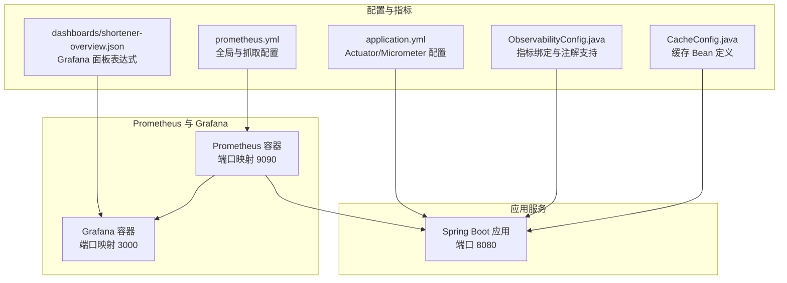
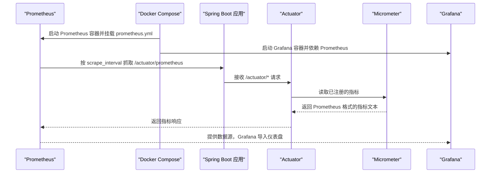
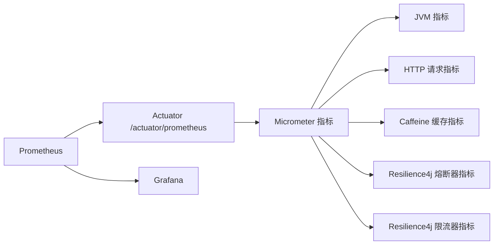

# 指标采集配置

<cite>
**本文引用的文件**
- [prometheus.yml](file://web/infra/observability/prometheus.yml)
- [application.yml](file://src/main/resources/application.yml)
- [ObservabilityConfig.java](file://src/main/java/com/layor/tinyflow/config/ObservabilityConfig.java)
- [CacheConfig.java](file://src/main/java/com/layor/tinyflow/config/CacheConfig.java)
- [docker-compose.yml](file://web/infra/observability/docker-compose.yml)
- [shortener-overview.json](file://web/infra/observability/dashboards/shortener-overview.json)
- [OBSERVABILITY.md](file://OBSERVABILITY.md)
</cite>

## 目录
1. [简介](#简介)
2. [项目结构](#项目结构)
3. [核心组件](#核心组件)
4. [架构总览](#架构总览)
5. [详细组件分析](#详细组件分析)
6. [依赖关系分析](#依赖关系分析)
7. [性能考量](#性能考量)
8. [故障排查指南](#故障排查指南)
9. [结论](#结论)
10. [附录](#附录)

## 简介
本文件围绕如何在本项目中配置 Prometheus 进行指标采集展开，重点说明以下内容：
- Prometheus 全局配置项 global 的作用与影响
- scrape_configs 中 job_name: 'tinyflow-backend' 的完整配置要点
- 如何通过 /actuator/prometheus 暴露 Micrometer 指标并与 Prometheus 对接
- Micrometer 自动暴露的 JVM、HTTP 请求、缓存、熔断器等指标类型
- 实际可用的 Prometheus 指标示例与 Grafana 面板表达式
- 指标采集频率对系统性能的影响与优化建议

## 项目结构
本项目的可观测性相关配置集中在以下位置：
- Prometheus 配置与容器编排：web/infra/observability/
- Spring Boot Actuator/Micrometer 配置：src/main/resources/application.yml
- 可观测性 Bean 注册：src/main/java/com/layor/tinyflow/config/ObservabilityConfig.java
- 缓存配置与指标绑定：src/main/java/com/layor/tinyflow/config/CacheConfig.java
- Grafana 仪表盘示例：web/infra/observability/dashboards/

图表来源
- [docker-compose.yml](file://web/infra/observability/docker-compose.yml#L1-L21)
- [prometheus.yml](file://web/infra/observability/prometheus.yml#L1-L9)
- [application.yml](file://src/main/resources/application.yml#L88-L132)
- [ObservabilityConfig.java](file://src/main/java/com/layor/tinyflow/config/ObservabilityConfig.java#L1-L60)
- [CacheConfig.java](file://src/main/java/com/layor/tinyflow/config/CacheConfig.java#L1-L20)
- [shortener-overview.json](file://web/infra/observability/dashboards/shortener-overview.json#L1-L55)

章节来源
- [docker-compose.yml](file://web/infra/observability/docker-compose.yml#L1-L21)
- [prometheus.yml](file://web/infra/observability/prometheus.yml#L1-L9)
- [application.yml](file://src/main/resources/application.yml#L88-L132)

## 核心组件
- Prometheus 抓取配置：定义全局抓取间隔、评估间隔，以及目标 job 的指标路径与目标地址
- Spring Boot Actuator/Micrometer：开启 /actuator/prometheus 指标导出，配置 HTTP 延迟分位与描述
- 观测性 Bean 注册：启用 @Timed 注解、线程池指标、Caffeine 缓存指标
- 缓存配置：定义本地缓存 Bean，供 Micrometer 绑定统计

章节来源
- [prometheus.yml](file://web/infra/observability/prometheus.yml#L1-L9)
- [application.yml](file://src/main/resources/application.yml#L88-L132)
- [ObservabilityConfig.java](file://src/main/java/com/layor/tinyflow/config/ObservabilityConfig.java#L1-L60)
- [CacheConfig.java](file://src/main/java/com/layor/tinyflow/config/CacheConfig.java#L1-L20)

## 架构总览
下图展示了从应用到 Prometheus/Grafana 的完整链路，以及 Micrometer 指标导出的关键节点。

图表来源
- [docker-compose.yml](file://web/infra/observability/docker-compose.yml#L1-L21)
- [prometheus.yml](file://web/infra/observability/prometheus.yml#L1-L9)
- [application.yml](file://src/main/resources/application.yml#L88-L132)
- [OBSERVABILITY.md](file://OBSERVABILITY.md#L139-L160)

## 详细组件分析

### Prometheus 全局配置项 global
- scrape_interval：控制 Prometheus 对目标抓取的频率，默认 5s
- evaluation_interval：控制规则评估的频率，默认 5s
- 影响：更短的抓取间隔会增加应用与 Prometheus 的网络与计算开销；更长的间隔会降低开销但增大指标延迟

章节来源
- [prometheus.yml](file://web/infra/observability/prometheus.yml#L1-L9)

### scrape_configs.job_name: 'tinyflow-backend'
- job_name：标识本次抓取作业名称
- metrics_path：必须设置为 /actuator/prometheus，以匹配 Spring Boot Actuator 的 Micrometer 指标导出端点
- static_configs.targets：配置被抓取的目标地址，此处为 host.docker.internal:8080
- 说明：该地址在容器网络中指向宿主机的 8080 端口，确保 Prometheus 能够访问应用的 /actuator/prometheus

章节来源
- [prometheus.yml](file://web/infra/observability/prometheus.yml#L5-L9)

### Spring Boot Actuator 与 Micrometer 指标导出
- Actuator 基础路径与暴露端点：management.endpoints.web.base-path 设置为 /actuator，并显式暴露 prometheus 端点
- 指标导出开关与步长：management.metrics.export.prometheus.enabled 开启，step 设置为 1m
- HTTP 请求延迟分位与 SLO：management.metrics.distribution.percentiles-* 与 slo 配置，便于 Grafana 使用分位与时延 SLO
- 应用标签：management.metrics.tags.application 指定应用名，便于多实例聚合与过滤

章节来源
- [application.yml](file://src/main/resources/application.yml#L88-L132)

### Micrometer 指标绑定与自动暴露
- 方法级监控：ObservabilityConfig 启用 @Timed 注解支持，使标注的方法自动产生计时指标
- 线程池监控：当存在 ThreadPoolTaskExecutor 时，自动注册线程池执行指标
- 缓存监控：ObservabilityConfig 将本地缓存 Bean 绑定到 Micrometer，自动产生缓存命中/未命中等指标
- 缓存定义：CacheConfig 定义了名为 localUrlCache 的 Caffeine 缓存 Bean，供指标绑定使用

章节来源
- [ObservabilityConfig.java](file://src/main/java/com/layor/tinyflow/config/ObservabilityConfig.java#L1-L60)
- [CacheConfig.java](file://src/main/java/com/layor/tinyflow/config/CacheConfig.java#L1-L20)

### 实际可用的 Prometheus 指标示例
- HTTP 请求延迟（分位）：http_server_requests_seconds{uri="/api/redirect/{code}",status="302",quantile="0.95"}
- 缓存命中/未命中：caffeine_cache_hit_total{cache="localUrlCache"}、caffeine_cache_miss_total{cache="localUrlCache"}
- 熔断器状态：resilience4j_circuitbreaker_state{name="redisBreaker",state="closed"}
- 限流器权限：resilience4j_ratelimiter_available_permissions{name="redirectLimit"}

章节来源
- [OBSERVABILITY.md](file://OBSERVABILITY.md#L139-L160)

### Grafana 仪表盘表达式参考
- 按 URI 的每秒请求数：sum(rate(http_server_requests_seconds_count{uri!~"/actuator.*"}[1m])) by (uri)
- 按 URI 的 P95 延迟：histogram_quantile(0.95, sum(rate(http_server_requests_seconds_bucket{uri!~"/actuator.*"}[5m])) by (le, uri))
- 5xx 错误率：sum(rate(http_server_requests_seconds_count{status=~"5..",uri!~"/actuator.*"}[5m])) / sum(rate(http_server_requests_seconds_count{uri!~"/actuator.*"}[5m]))
- 重定向接口 P95 延迟：histogram_quantile(0.95, sum(rate(http_server_requests_seconds_bucket{uri=~"/api/redirect/.*"}[5m])) by (le))

章节来源
- [shortener-overview.json](file://web/infra/observability/dashboards/shortener-overview.json#L1-L55)

## 依赖关系分析
- Prometheus 依赖于应用的 /actuator/prometheus 指标端点
- 应用侧依赖 Actuator/Micrometer 导出指标
- 观测性 Bean 注册负责将 JVM、线程池、缓存等指标接入 MeterRegistry
- Grafana 依赖 Prometheus 作为数据源，并通过仪表盘 JSON 表达式查询指标

图表来源
- [application.yml](file://src/main/resources/application.yml#L88-L132)
- [ObservabilityConfig.java](file://src/main/java/com/layor/tinyflow/config/ObservabilityConfig.java#L1-L60)
- [CacheConfig.java](file://src/main/java/com/layor/tinyflow/config/CacheConfig.java#L1-L20)
- [OBSERVABILITY.md](file://OBSERVABILITY.md#L139-L160)

章节来源
- [application.yml](file://src/main/resources/application.yml#L88-L132)
- [ObservabilityConfig.java](file://src/main/java/com/layor/tinyflow/config/ObservabilityConfig.java#L1-L60)
- [CacheConfig.java](file://src/main/java/com/layor/tinyflow/config/CacheConfig.java#L1-L20)

## 性能考量
- 抓取频率与开销
  - 更短的 scrape_interval 会提升 Prometheus 的抓取压力，同时增加应用 /actuator/prometheus 的导出负载
  - 在高 QPS 场景下，建议适度延长 scrape_interval，以平衡延迟与资源占用
- 指标导出步长
  - management.metrics.export.prometheus.step=1m 会减少导出频率，降低瞬时峰值开销
- 分位与 SLO
  - 启用百分位直方图与 SLO 有助于更精细的延迟分析，但会增加指标基数与存储开销
- 建议
  - 开发环境：scrape_interval=5s，便于快速验证
  - 生产环境：scrape_interval=15s 或更高，结合 1m 步长与合理的分位配置
  - 结合 Grafana 面板表达式，优先使用 rate/histogram_quantile 等聚合函数，避免一次性拉取过多时间序列

[本节为通用指导，无需列出具体文件来源]

## 故障排查指南
- Prometheus 无法抓取指标
  - 检查 Prometheus 配置是否正确挂载 prometheus.yml
  - 确认应用端口 8080 是否可达，且 /actuator/prometheus 路径可访问
  - 确认 Actuator 已暴露 prometheus 端点
- 指标缺失
  - 确认 Micrometer 指标绑定是否生效（线程池、缓存等）
  - 检查 @Timed 注解是否在目标方法上正确使用
- Grafana 无数据
  - 确认 Prometheus 数据源已添加并可用
  - 检查仪表盘 JSON 中的表达式是否与实际指标一致

章节来源
- [docker-compose.yml](file://web/infra/observability/docker-compose.yml#L1-L21)
- [prometheus.yml](file://web/infra/observability/prometheus.yml#L1-L9)
- [application.yml](file://src/main/resources/application.yml#L88-L132)
- [ObservabilityConfig.java](file://src/main/java/com/layor/tinyflow/config/ObservabilityConfig.java#L1-L60)
- [OBSERVABILITY.md](file://OBSERVABILITY.md#L139-L160)

## 结论
通过上述配置，Prometheus 可稳定地从 Spring Boot 应用的 /actuator/prometheus 端点采集 Micrometer 指标，覆盖 JVM、HTTP 请求、缓存、熔断器与限流器等关键维度。合理设置 scrape_interval 与导出步长，可在保证可观测性的前提下控制系统资源开销。配合 Grafana 仪表盘表达式，可快速构建面向业务的监控视图。

[本节为总结，无需列出具体文件来源]

## 附录
- 启动监控栈
  - 使用 docker-compose 启动 Prometheus 与 Grafana，并挂载本地配置
- 访问端点
  - /actuator/prometheus：查看 Micrometer 指标文本
  - /actuator/metrics：查看所有指标列表
  - /actuator/circuitbreakers、/actuator/ratelimiters：查看熔断器与限流器状态

章节来源
- [docker-compose.yml](file://web/infra/observability/docker-compose.yml#L1-L21)
- [OBSERVABILITY.md](file://OBSERVABILITY.md#L139-L160)