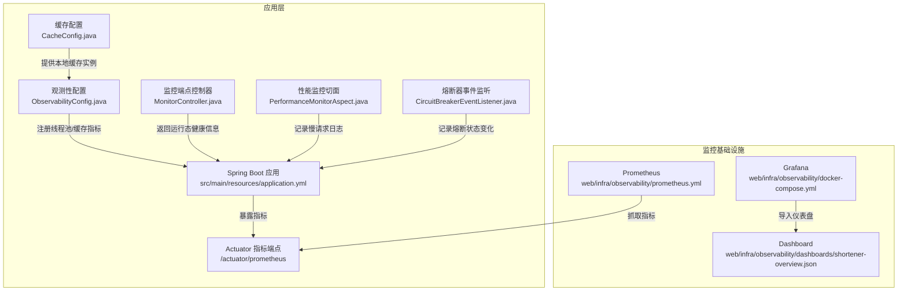
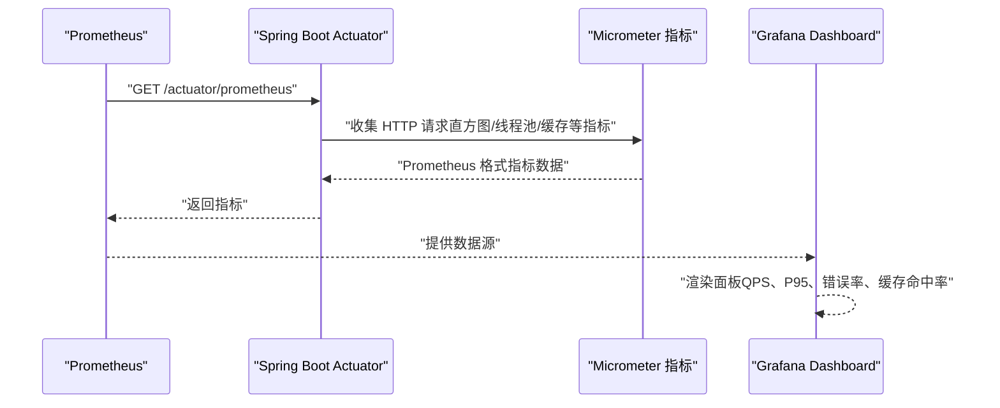
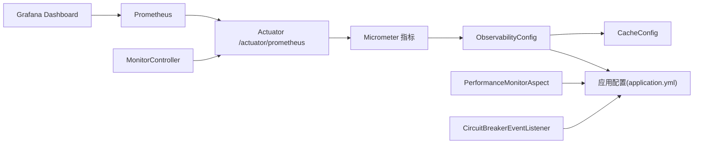
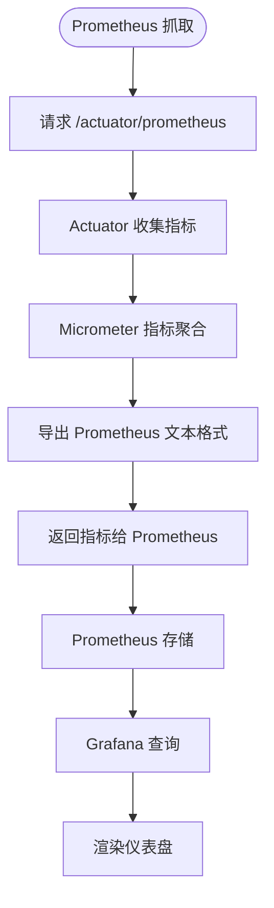

# 监控体系配置

<cite>
**本文引用的文件**
- [OBSERVABILITY.md](file://OBSERVABILITY.md)
- [prometheus.yml](file://web/infra/observability/prometheus.yml)
- [application.yml](file://src/main/resources/application.yml)
- [ObservabilityConfig.java](file://src/main/java/com/layor/tinyflow/config/ObservabilityConfig.java)
- [CacheConfig.java](file://src/main/java/com/layor/tinyflow/config/CacheConfig.java)
- [MonitorController.java](file://src/main/java/com/layor/tinyflow/Controller/MonitorController.java)
- [PerformanceMonitorAspect.java](file://src/main/java/com/layor/tinyflow/aspect/PerformanceMonitorAspect.java)
- [CircuitBreakerEventListener.java](file://src/main/java/com/layor/tinyflow/listener/CircuitBreakerEventListener.java)
- [shortener-overview.json](file://web/infra/observability/dashboards/shortener-overview.json)
- [docker-compose.yml](file://web/infra/observability/docker-compose.yml)
</cite>

## 目录
1. [简介](#简介)
2. [项目结构](#项目结构)
3. [核心组件](#核心组件)
4. [架构总览](#架构总览)
5. [详细组件分析](#详细组件分析)
6. [依赖关系分析](#依赖关系分析)
7. [性能考量](#性能考量)
8. [故障排查指南](#故障排查指南)
9. [结论](#结论)
10. [附录](#附录)

## 简介
本文件围绕项目的可观测性配置进行系统化说明，重点覆盖以下方面：
- 如何在 Prometheus 中配置抓取任务，包括 job_name 与 metrics_path 的设置
- 如何导入 Grafana 监控大盘，并解释关键面板的含义
- 如何配置告警规则，包含熔断器打开、错误率>1%、P95延迟>100ms、缓存命中率<90%等关键指标的 PromQL 表达式
- 结合代码中的 /actuator/prometheus 端点，说明指标暴露机制与 Micrometer/Actuator 的联动

## 项目结构
监控相关配置主要分布在如下位置：
- Prometheus 配置与 Grafana 监控大盘：web/infra/observability/
- Spring Boot Actuator 暴露与 Micrometer 指标导出：src/main/resources/application.yml
- 观测性相关 Bean 注册与缓存指标绑定：src/main/java/com/layor/tinyflow/config/
- 监控端点控制器：src/main/java/com/layor/tinyflow/Controller/
- 性能监控切面与熔断器事件监听：src/main/java/com/layor/tinyflow/aspect/ 与 src/main/java/com/layor/tinyflow/listener/

图表来源
- [prometheus.yml](file://web/infra/observability/prometheus.yml#L1-L9)
- [docker-compose.yml](file://web/infra/observability/docker-compose.yml#L1-L21)
- [shortener-overview.json](file://web/infra/observability/dashboards/shortener-overview.json#L1-L55)
- [application.yml](file://src/main/resources/application.yml#L88-L132)
- [ObservabilityConfig.java](file://src/main/java/com/layor/tinyflow/config/ObservabilityConfig.java#L1-L60)
- [CacheConfig.java](file://src/main/java/com/layor/tinyflow/config/CacheConfig.java#L1-L20)
- [MonitorController.java](file://src/main/java/com/layor/tinyflow/Controller/MonitorController.java#L1-L114)
- [PerformanceMonitorAspect.java](file://src/main/java/com/layor/tinyflow/aspect/PerformanceMonitorAspect.java#L1-L64)
- [CircuitBreakerEventListener.java](file://src/main/java/com/layor/tinyflow/listener/CircuitBreakerEventListener.java#L1-L58)

章节来源
- [prometheus.yml](file://web/infra/observability/prometheus.yml#L1-L9)
- [docker-compose.yml](file://web/infra/observability/docker-compose.yml#L1-L21)
- [shortener-overview.json](file://web/infra/observability/dashboards/shortener-overview.json#L1-L55)
- [application.yml](file://src/main/resources/application.yml#L88-L132)

## 核心组件
- Prometheus 抓取配置：定义 job_name 与 metrics_path，指向应用的 /actuator/prometheus 端点
- Spring Boot Actuator 指标导出：开启 /actuator/* 端点，启用 Prometheus 导出与 HTTP 请求直方图分位数
- Micrometer 指标绑定：注册线程池与 Caffeine 缓存指标，便于在 Prometheus/Grafana 中可视化
- 监控端点控制器：提供 /api/monitor/* 与 /actuator/* 的健康与运行态信息
- 性能监控切面：记录慢请求日志，辅助定位性能瓶颈
- 熔断器事件监听：记录熔断状态变化，便于告警与故障定位

章节来源
- [OBSERVABILITY.md](file://OBSERVABILITY.md#L40-L60)
- [application.yml](file://src/main/resources/application.yml#L88-L132)
- [ObservabilityConfig.java](file://src/main/java/com/layor/tinyflow/config/ObservabilityConfig.java#L1-L60)
- [MonitorController.java](file://src/main/java/com/layor/tinyflow/Controller/MonitorController.java#L1-L114)
- [PerformanceMonitorAspect.java](file://src/main/java/com/layor/tinyflow/aspect/PerformanceMonitorAspect.java#L1-L64)
- [CircuitBreakerEventListener.java](file://src/main/java/com/layor/tinyflow/listener/CircuitBreakerEventListener.java#L1-L58)

## 架构总览
下图展示了从 Prometheus 抓取到 Grafana 展示的完整链路，以及应用侧指标生成与暴露的关键环节。

图表来源
- [prometheus.yml](file://web/infra/observability/prometheus.yml#L1-L9)
- [application.yml](file://src/main/resources/application.yml#L88-L132)
- [ObservabilityConfig.java](file://src/main/java/com/layor/tinyflow/config/ObservabilityConfig.java#L1-L60)
- [shortener-overview.json](file://web/infra/observability/dashboards/shortener-overview.json#L1-L55)

## 详细组件分析

### Prometheus 抓取配置
- job_name：用于标识抓取任务，便于在 Prometheus 中区分不同应用或环境
- metrics_path：指向 /actuator/prometheus，确保 Prometheus 以 Prometheus 格式抓取指标
- targets：指定应用服务地址，Windows/本机 Docker 环境使用 host.docker.internal:8080

章节来源
- [prometheus.yml](file://web/infra/observability/prometheus.yml#L1-L9)
- [OBSERVABILITY.md](file://OBSERVABILITY.md#L139-L146)

### Spring Boot Actuator 指标导出与暴露
- 端点暴露：management.endpoints.web.exposure.include 包含 metrics、prometheus、circuitbreakers、ratelimiters 等
- 基础路径：management.endpoints.web.base-path 设置为 /actuator
- 指标导出：management.metrics.export.prometheus.enabled=true，开启 Prometheus 导出
- HTTP 请求直方图分位数：management.metrics.distribution.percentiles.http.server.requests 配置了 0.5、0.95、0.99、0.999
- 全局标签：management.metrics.tags.application= tinyflow

章节来源
- [application.yml](file://src/main/resources/application.yml#L88-L132)
- [OBSERVABILITY.md](file://OBSERVABILITY.md#L47-L60)

### Micrometer 指标绑定与注册
- 线程池指标：ObservabilityConfig 中注册 ExecutorServiceMetrics，标注类型为 async，便于区分异步执行器
- 缓存指标：ObservabilityConfig 中注册 CaffeineCacheMetrics，缓存名为 localUrlCache，标签 cache=l1

章节来源
- [ObservabilityConfig.java](file://src/main/java/com/layor/tinyflow/config/ObservabilityConfig.java#L1-L60)
- [CacheConfig.java](file://src/main/java/com/layor/tinyflow/config/CacheConfig.java#L1-L20)

### 监控端点控制器
- /api/monitor/health：返回系统健康状态、熔断器状态、限流器状态、本地缓存统计
- /api/monitor/cache/stats：返回缓存详细统计（命中/缺失、淘汰、平均加载惩罚等）
- /api/monitor/cache/clear：清空本地缓存并返回移除条目数

章节来源
- [MonitorController.java](file://src/main/java/com/layor/tinyflow/Controller/MonitorController.java#L1-L114)
- [OBSERVABILITY.md](file://OBSERVABILITY.md#L75-L128)

### 性能监控切面
- 对 Controller 与 Service 层方法进行环绕监控，记录慢请求（>100ms）与异常
- 输出到专用性能日志，便于定位慢调用

章节来源
- [PerformanceMonitorAspect.java](file://src/main/java/com/layor/tinyflow/aspect/PerformanceMonitorAspect.java#L1-L64)
- [OBSERVABILITY.md](file://OBSERVABILITY.md#L40-L46)

### 熔断器事件监听
- 订阅所有熔断器的状态转换事件，记录状态变化与错误/成功事件
- 当熔断器打开时输出告警日志，便于接入外部告警平台

章节来源
- [CircuitBreakerEventListener.java](file://src/main/java/com/layor/tinyflow/listener/CircuitBreakerEventListener.java#L1-L58)
- [OBSERVABILITY.md](file://OBSERVABILITY.md#L1-L24)

### Grafana 监控大盘
- 导入方式：在 Grafana 中导入 web/infra/observability/dashboards/shortener-overview.json
- 关键面板：
  - 请求吞吐量：按 URI 维度展示每秒请求数
  - 响应延迟：按 URI 维度展示 P50/P95/P99；另有一个专门的“重定向 P95”面板
  - 错误率（5xx）：按 5 分钟窗口计算 5xx 占比
  - 缓存命中率：可结合应用侧缓存统计与 Micrometer 指标进行展示

章节来源
- [shortener-overview.json](file://web/infra/observability/dashboards/shortener-overview.json#L1-L55)
- [OBSERVABILITY.md](file://OBSERVABILITY.md#L163-L178)

### 指标暴露机制（/actuator/prometheus）
- Actuator 暴露 Micrometer 指标，包括 HTTP 请求直方图（按 URI、状态码、分位数）、线程池、缓存等
- Prometheus 抓取 /actuator/prometheus，得到标准的 Prometheus 文本格式指标
- 应用通过 application.yml 开启 Prometheus 导出与 HTTP 请求直方图分位数

章节来源
- [OBSERVABILITY.md](file://OBSERVABILITY.md#L139-L160)
- [application.yml](file://src/main/resources/application.yml#L88-L132)

## 依赖关系分析
- Prometheus 依赖 Actuator 的 /actuator/prometheus 端点
- Actuator 依赖 Micrometer 指标注册（ObservabilityConfig）
- Micrometer 依赖缓存实例（CacheConfig）与线程池（应用配置）
- Grafana 依赖 Prometheus 提供的数据源
- 监控端点控制器与性能监控切面、熔断器事件监听共同构成可观测性闭环

图表来源
- [prometheus.yml](file://web/infra/observability/prometheus.yml#L1-L9)
- [application.yml](file://src/main/resources/application.yml#L88-L132)
- [ObservabilityConfig.java](file://src/main/java/com/layor/tinyflow/config/ObservabilityConfig.java#L1-L60)
- [CacheConfig.java](file://src/main/java/com/layor/tinyflow/config/CacheConfig.java#L1-L20)
- [MonitorController.java](file://src/main/java/com/layor/tinyflow/Controller/MonitorController.java#L1-L114)
- [PerformanceMonitorAspect.java](file://src/main/java/com/layor/tinyflow/aspect/PerformanceMonitorAspect.java#L1-L64)
- [CircuitBreakerEventListener.java](file://src/main/java/com/layor/tinyflow/listener/CircuitBreakerEventListener.java#L1-L58)
- [shortener-overview.json](file://web/infra/observability/dashboards/shortener-overview.json#L1-L55)

## 性能考量
- 抓取间隔：Prometheus 默认 5 秒，可根据数据量与资源占用调整
- 分位数选择：HTTP 请求直方图已配置 P50/P95/P99/P999，便于在 Grafana 中绘制 P95/P99 延迟
- 指标描述：management.metrics.export.prometheus.descriptions=true，有助于理解指标含义
- 线程池与缓存：通过 Micrometer 绑定线程池与缓存指标，便于定位并发与缓存问题

章节来源
- [prometheus.yml](file://web/infra/observability/prometheus.yml#L1-L9)
- [application.yml](file://src/main/resources/application.yml#L88-L132)
- [ObservabilityConfig.java](file://src/main/java/com/layor/tinyflow/config/ObservabilityConfig.java#L1-L60)

## 故障排查指南
- Prometheus 无法抓取指标
  - 检查 Prometheus 配置的 job_name 与 metrics_path 是否正确
  - 确认应用端 /actuator/prometheus 可访问且返回指标文本
  - 核对应用端 application.yml 中是否开启 Prometheus 导出与端点暴露
- Grafana 仪表盘空白
  - 确认 Prometheus 已成功抓取指标
  - 检查 Grafana 数据源连接与查询表达式
- 熔断器频繁打开
  - 查看熔断器事件日志，关注 Redis/DB 熔断器的慢调用与失败率
  - 结合性能日志定位慢请求
- 缓存命中率低
  - 通过 /api/monitor/cache/stats 或 Micrometer 指标查看命中/缺失情况
  - 调整缓存规格与预热策略

章节来源
- [prometheus.yml](file://web/infra/observability/prometheus.yml#L1-L9)
- [application.yml](file://src/main/resources/application.yml#L88-L132)
- [MonitorController.java](file://src/main/java/com/layor/tinyflow/Controller/MonitorController.java#L1-L114)
- [CircuitBreakerEventListener.java](file://src/main/java/com/layor/tinyflow/listener/CircuitBreakerEventListener.java#L1-L58)
- [PerformanceMonitorAspect.java](file://src/main/java/com/layor/tinyflow/aspect/PerformanceMonitorAspect.java#L1-L64)

## 结论
本项目的监控体系以 Spring Boot Actuator + Micrometer 为核心，通过 Prometheus 抓取 /actuator/prometheus 暴露的指标，并在 Grafana 中以短链接服务概览仪表盘进行可视化。配合熔断器事件监听、性能监控切面与监控端点控制器，形成完整的可观测性闭环。告警规则可直接基于 PromQL 在 Prometheus 中配置，实现对熔断器、错误率、延迟与缓存命中率等关键指标的自动化监控。

## 附录

### Prometheus 抓取配置要点
- job_name：用于区分任务，建议使用应用名或环境标识
- metrics_path：固定为 /actuator/prometheus
- targets：根据部署环境调整为实际主机与端口

章节来源
- [prometheus.yml](file://web/infra/observability/prometheus.yml#L1-L9)

### Grafana 监控大盘导入步骤
- 启动 Prometheus 与 Grafana 容器
- 在 Grafana 中导入 web/infra/observability/dashboards/shortener-overview.json
- 确认数据源指向 Prometheus

章节来源
- [docker-compose.yml](file://web/infra/observability/docker-compose.yml#L1-L21)
- [shortener-overview.json](file://web/infra/observability/dashboards/shortener-overview.json#L1-L55)

### 关键面板含义
- 请求吞吐量：按 URI 维度展示每秒请求数，便于识别热点接口
- 响应延迟：P50/P95/P99，反映尾延迟与稳定性
- 错误率（5xx）：按 5 分钟窗口计算 5xx 占比，快速发现异常
- 缓存命中率：结合应用缓存统计与 Micrometer 指标，评估缓存效率

章节来源
- [OBSERVABILITY.md](file://OBSERVABILITY.md#L163-L178)
- [shortener-overview.json](file://web/infra/observability/dashboards/shortener-overview.json#L1-L55)

### 告警规则（PromQL 表达式）
- 熔断器打开：resilience4j_circuitbreaker_state{state="open"} == 1
- 错误率 >1%：rate(http_server_requests_seconds_count{status=~"5.."}[1m]) > 0.01
- P95 延迟 >100ms：http_server_requests_seconds{quantile="0.95"} > 0.1
- 缓存命中率 <90%：caffeine_cache_hit_total / (caffeine_cache_hit_total + caffeine_cache_miss_total) < 0.9

章节来源
- [OBSERVABILITY.md](file://OBSERVABILITY.md#L210-L218)

### 指标暴露机制流程

图表来源
- [application.yml](file://src/main/resources/application.yml#L88-L132)
- [ObservabilityConfig.java](file://src/main/java/com/layor/tinyflow/config/ObservabilityConfig.java#L1-L60)
- [prometheus.yml](file://web/infra/observability/prometheus.yml#L1-L9)
- [shortener-overview.json](file://web/infra/observability/dashboards/shortener-overview.json#L1-L55)