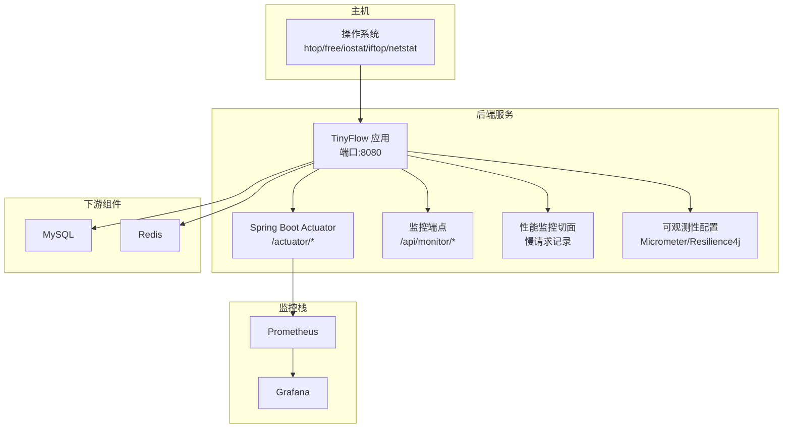
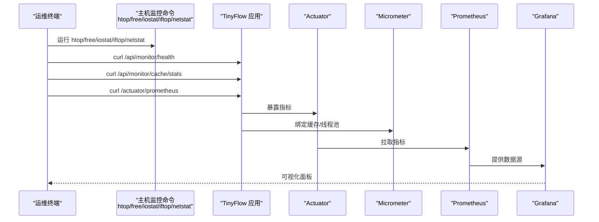
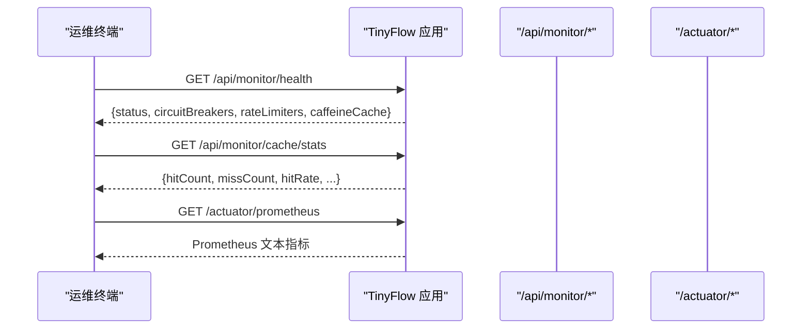
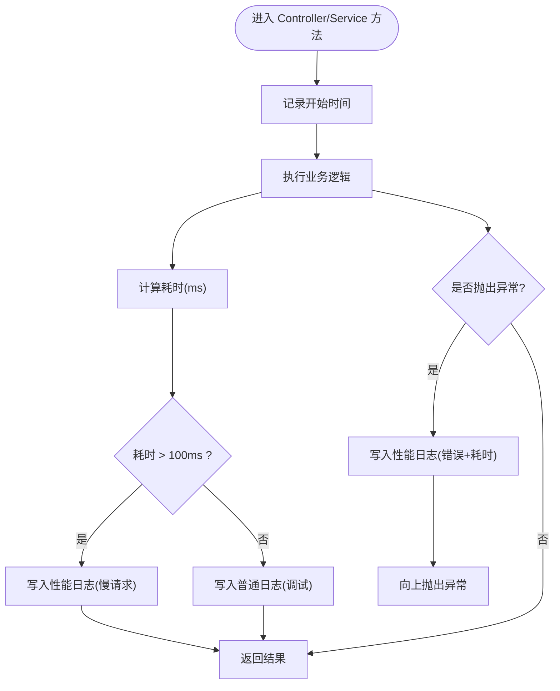
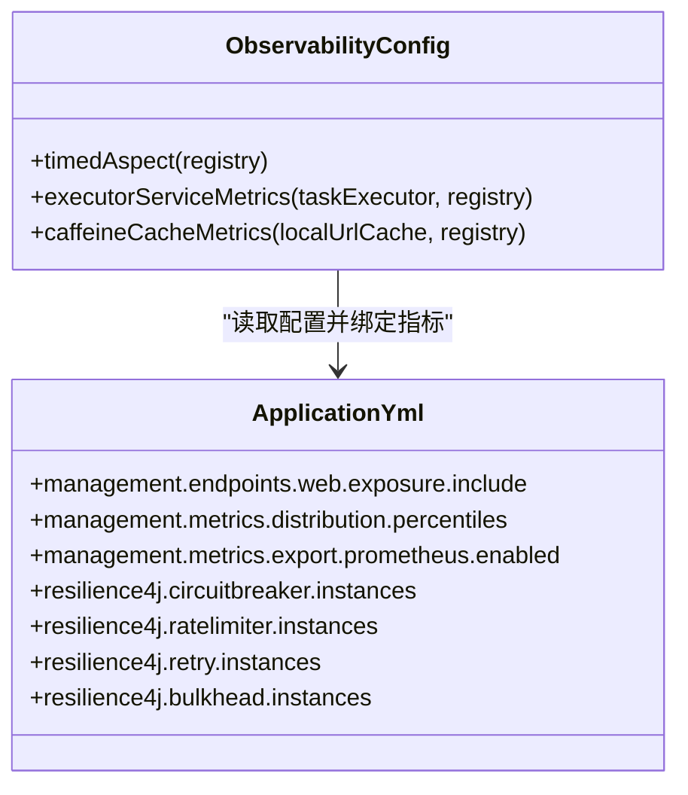
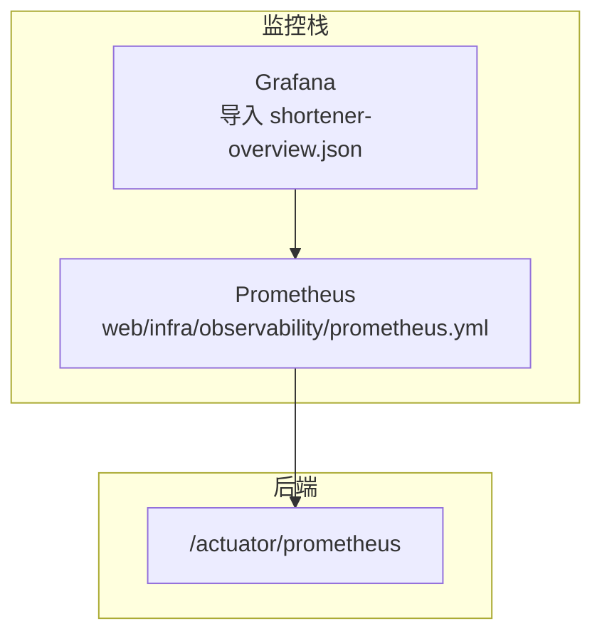
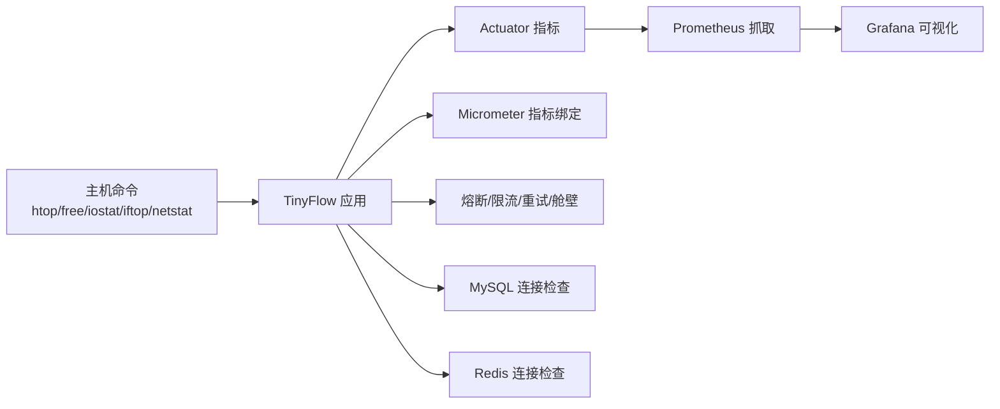

# 性能监控

<cite>
**本文引用的文件**
- [OPERATIONS.md](file://OPERATIONS.md)
- [OBSERVABILITY.md](file://OBSERVABILITY.md)
- [application.yml](file://src/main/resources/application.yml)
- [MonitorController.java](file://src/main/java/com/layor/tinyflow/Controller/MonitorController.java)
- [PerformanceMonitorAspect.java](file://src/main/java/com/layor/tinyflow/aspect/PerformanceMonitorAspect.java)
- [ObservabilityConfig.java](file://src/main/java/com/layor/tinyflow/config/ObservabilityConfig.java)
- [docker-compose.yml](file://web/infra/observability/docker-compose.yml)
- [prometheus.yml](file://web/infra/observability/prometheus.yml)
- [shortener-overview.json](file://web/infra/observability/dashboards/shortener-overview.json)
</cite>

## 目录
1. [简介](#简介)
2. [项目结构](#项目结构)
3. [核心组件](#核心组件)
4. [架构总览](#架构总览)
5. [详细组件分析](#详细组件分析)
6. [依赖关系分析](#依赖关系分析)
7. [性能考量](#性能考量)
8. [故障排查指南](#故障排查指南)
9. [结论](#结论)
10. [附录](#附录)

## 简介
本章节面向运维与开发人员，基于仓库中的运维与可观测性文档，系统梳理 TinyFlow 的性能监控体系，包括实时监控命令、关键指标采集、系统健康与缓存状态查询、数据库与缓存连接状态监控，以及基于 Spring Boot Actuator、Micrometer、Resilience4j 与 Prometheus/Grafana 的自动化监控与可视化方案。目标是帮助读者快速建立日常巡检清单，识别性能瓶颈，并在生产环境中稳定运行。

## 项目结构
- 运维与扩展指南：包含常用命令、服务管理、日志查看、故障排查、性能监控、备份与扩展等内容。
- 可观测性文档：定义了健康检查端点、缓存统计端点、Actuator 指标、Prometheus 导出、Grafana 仪表盘与告警建议。
- 后端配置：包含 Actuator 指标暴露、Tomcat 线程池、Redis/Hikari 连接池、Resilience4j 熔断/限流/舱壁隔离、Micrometer 缓存与线程池绑定等。
- 监控端点与切面：提供 /api/monitor/* 健康与缓存统计、慢请求切面记录、Micrometer 维度化指标与线程池绑定。

**图表来源**
- [application.yml](file://src/main/resources/application.yml#L88-L132)
- [MonitorController.java](file://src/main/java/com/layor/tinyflow/Controller/MonitorController.java#L1-L114)
- [PerformanceMonitorAspect.java](file://src/main/java/com/layor/tinyflow/aspect/PerformanceMonitorAspect.java#L1-L64)
- [ObservabilityConfig.java](file://src/main/java/com/layor/tinyflow/config/ObservabilityConfig.java#L1-L59)
- [docker-compose.yml](file://web/infra/observability/docker-compose.yml#L1-L21)
- [prometheus.yml](file://web/infra/observability/prometheus.yml#L1-L9)

**章节来源**
- [OPERATIONS.md](file://OPERATIONS.md#L241-L280)
- [OBSERVABILITY.md](file://OBSERVABILITY.md#L40-L160)

## 核心组件
- 实时监控命令与输出解读
  - htop：综合查看 CPU、内存、负载、进程树与 I/O 等；按 q 退出。
  - top：查看 CPU 使用率与进程占用。
  - free -h：查看物理内存与可用内存。
  - iostat -x 1：查看磁盘 IO 统计与扩展指标，持续刷新。
  - iftop：查看网络流量与连接方向。
  - netstat -tlnp：查看网络连接与监听端口。
  - ps aux | grep java 或 tinyflow：查看 Java 进程与 TinyFlow 进程。
- 关键性能指标采集
  - TinyFlow 进程资源使用：ps aux | grep tinyflow。
  - 端口连接数：netstat -an | grep :8080 | wc -l。
  - MySQL 连接数：mysql -u root -p -e "SHOW PROCESSLIST;"。
  - Redis 信息：redis-cli -a 123456 info stats。
- 后端内置监控端点
  - /api/monitor/health：系统健康、熔断器状态、限流器状态、本地缓存统计。
  - /api/monitor/cache/stats：缓存详细统计。
  - /api/monitor/cache/clear：清空本地缓存。
  - /actuator/health、/actuator/metrics、/actuator/prometheus、/actuator/circuitbreakers、/actuator/ratelimiters：Spring Boot Actuator 指标与状态。
- 慢请求与性能日志
  - 切面记录慢请求（阈值 100ms）与异常，日志文件 logs/performance.log。
- Micrometer 指标与 Resilience4j 熔断/限流
  - Micrometer 绑定本地缓存与线程池，导出 HTTP 请求延迟分位数、缓存命中/未命中、熔断器状态、限流器可用权限等。
  - Resilience4j 配置：Redis 熔断器（计数窗口）、数据库熔断器（时间窗口）、慢调用阈值、等待时间、重试与舱壁隔离。

**章节来源**
- [OPERATIONS.md](file://OPERATIONS.md#L241-L280)
- [OBSERVABILITY.md](file://OBSERVABILITY.md#L40-L160)
- [PerformanceMonitorAspect.java](file://src/main/java/com/layor/tinyflow/aspect/PerformanceMonitorAspect.java#L1-L64)
- [MonitorController.java](file://src/main/java/com/layor/tinyflow/Controller/MonitorController.java#L1-L114)
- [application.yml](file://src/main/resources/application.yml#L88-L132)

## 架构总览
下图展示从主机侧实时监控到后端应用、Actuator、Micrometer、Prometheus、Grafana 的完整链路，以及下游 MySQL 与 Redis 的连接状态监控路径。

**图表来源**
- [OPERATIONS.md](file://OPERATIONS.md#L241-L280)
- [OBSERVABILITY.md](file://OBSERVABILITY.md#L139-L160)
- [application.yml](file://src/main/resources/application.yml#L88-L132)
- [docker-compose.yml](file://web/infra/observability/docker-compose.yml#L1-L21)
- [prometheus.yml](file://web/infra/observability/prometheus.yml#L1-L9)

## 详细组件分析

### 实时监控命令与输出解读
- htop
  - 查看 CPU 使用率、负载、内存、进程树、I/O 等；适合快速定位高占用进程与资源瓶颈。
- free -h
  - 查看物理内存总量、已用、可用、缓冲区与缓存；结合系统负载判断是否缺内存。
- iostat -x 1
  - 查看磁盘 IO util、svctm、await、avgqu-sz 等；持续刷新便于观察波动。
- iftop
  - 查看网络流量与连接方向；可用于识别异常外网访问或内网高带宽占用。
- netstat -tlnp
  - 查看监听端口与连接状态；配合端口连接数统计识别连接堆积。
- ps aux | grep java 或 tinyflow
  - 快速定位 Java 进程 PID、CPU/内存占用与启动参数。

**章节来源**
- [OPERATIONS.md](file://OPERATIONS.md#L241-L280)

### 后端内置监控端点与输出解读
- /api/monitor/health
  - 返回系统状态、熔断器状态（如 redisBreaker、dbBreaker）、限流器状态（如 redirectLimit 的可用权限与等待线程数）、本地缓存统计（命中/未命中、命中率、大小等）。
- /api/monitor/cache/stats
  - 返回缓存详细统计（命中/未命中、加载成功/失败、平均加载惩罚、估计大小等）。
- /api/monitor/cache/clear
  - 清空本地缓存并返回移除条目数与结果。
- /actuator/prometheus
  - 返回 Micrometer 指标，包括 HTTP 请求延迟分位数、缓存命中/未命中、熔断器状态、限流器可用权限等，供 Prometheus 抓取。

**图表来源**
- [MonitorController.java](file://src/main/java/com/layor/tinyflow/Controller/MonitorController.java#L1-L114)
- [OBSERVABILITY.md](file://OBSERVABILITY.md#L139-L160)

**章节来源**
- [MonitorController.java](file://src/main/java/com/layor/tinyflow/Controller/MonitorController.java#L1-L114)
- [OBSERVABILITY.md](file://OBSERVABILITY.md#L75-L160)

### 慢请求监控与日志
- 性能监控切面
  - 对 Controller 与 Service 层方法进行环绕监控，记录执行时长；超过阈值（100ms）写入性能日志；异常时记录错误与耗时。
- 日志位置与查询
  - 性能日志：logs/performance.log；错误日志：logs/error.log；应用日志：logs/tinyflow.log。
  - 可通过 tail -f 实时跟踪，或 grep 按 TraceId 追踪单请求。

**图表来源**
- [PerformanceMonitorAspect.java](file://src/main/java/com/layor/tinyflow/aspect/PerformanceMonitorAspect.java#L1-L64)
- [OBSERVABILITY.md](file://OBSERVABILITY.md#L180-L207)

**章节来源**
- [PerformanceMonitorAspect.java](file://src/main/java/com/layor/tinyflow/aspect/PerformanceMonitorAspect.java#L1-L64)
- [OBSERVABILITY.md](file://OBSERVABILITY.md#L180-L207)

### Micrometer 指标与 Resilience4j 配置
- Micrometer 绑定
  - 本地缓存（Caffeine）与线程池（异步执行器）指标绑定，导出命中/未命中、队列长度、执行时长等。
- Resilience4j 配置要点
  - Redis 熔断器：计数窗口、失败率阈值、慢调用阈值（>1s）、等待时间（30s）、半开允许并发等。
  - 数据库熔断器：时间窗口、失败率阈值、慢调用阈值（>2s）、等待时间（60s）。
  - 重试：最大次数、等待时间、指数退避。
  - 限流：每秒许可数与超时。
  - 舱壁隔离：线程池隔离与最大等待时间。
- Actuator 暴露
  - /actuator/metrics、/actuator/prometheus、/actuator/circuitbreakers、/actuator/ratelimiters 等。

**图表来源**
- [ObservabilityConfig.java](file://src/main/java/com/layor/tinyflow/config/ObservabilityConfig.java#L1-L59)
- [application.yml](file://src/main/resources/application.yml#L88-L132)

**章节来源**
- [ObservabilityConfig.java](file://src/main/java/com/layor/tinyflow/config/ObservabilityConfig.java#L1-L59)
- [application.yml](file://src/main/resources/application.yml#L88-L132)

### Prometheus 与 Grafana 监控
- Prometheus
  - 通过 docker-compose 启动，抓取后端 /actuator/prometheus 指标。
- Grafana
  - 导入 dashboard 文件，展示 QPS、P95 延迟、错误率、熔断器状态、缓存命中率、线程池队列长度等关键面板。
- 告警建议
  - 熔断器打开、错误率、P95 延迟、缓存命中率等阈值告警表达式。

**图表来源**
- [docker-compose.yml](file://web/infra/observability/docker-compose.yml#L1-L21)
- [prometheus.yml](file://web/infra/observability/prometheus.yml#L1-L9)
- [shortener-overview.json](file://web/infra/observability/dashboards/shortener-overview.json#L1-L55)

**章节来源**
- [OBSERVABILITY.md](file://OBSERVABILITY.md#L163-L218)
- [docker-compose.yml](file://web/infra/observability/docker-compose.yml#L1-L21)
- [prometheus.yml](file://web/infra/observability/prometheus.yml#L1-L9)
- [shortener-overview.json](file://web/infra/observability/dashboards/shortener-overview.json#L1-L55)

## 依赖关系分析
- 主机侧命令依赖系统工具（htop/free/iostat/iftop/netstat）对 CPU、内存、磁盘、网络与进程进行观测。
- 后端应用通过 Actuator 暴露指标，Micrometer 绑定缓存与线程池，Resilience4j 提供熔断/限流/重试/舱壁隔离。
- Prometheus 从 /actuator/prometheus 抓取指标，Grafana 以仪表盘呈现。
- MySQL 与 Redis 通过命令行工具进行连接与状态检查，作为系统健康与容量评估的一部分。

**图表来源**
- [OPERATIONS.md](file://OPERATIONS.md#L241-L280)
- [OBSERVABILITY.md](file://OBSERVABILITY.md#L139-L160)
- [application.yml](file://src/main/resources/application.yml#L88-L132)

**章节来源**
- [OPERATIONS.md](file://OPERATIONS.md#L241-L280)
- [OBSERVABILITY.md](file://OBSERVABILITY.md#L139-L160)
- [application.yml](file://src/main/resources/application.yml#L88-L132)

## 性能考量
- 系统层
  - 使用 htop/free/iostat/iftop/netstat 快速定位 CPU、内存、磁盘与网络瓶颈；关注进程占用与连接堆积。
- 应用层
  - 通过 /api/monitor/health 与 /api/monitor/cache/stats 快速评估缓存命中率与熔断器状态；利用慢请求日志定位热点接口。
- 指标层
  - 通过 /actuator/prometheus 与 Grafana 面板观察 P95 延迟、QPS、错误率与缓存命中率；结合 Resilience4j 配置阈值进行容量规划。
- 连接层
  - MySQL 连接数与 Redis 连接数应与池配置匹配，避免连接池耗尽导致排队与超时。

[本节为通用指导，无需特定文件来源]

## 故障排查指南
- 服务无法启动
  - 查看 systemd journal 日志、端口占用、配置文件与 jar 包直跑验证；同时检查内存与磁盘使用。
- 数据库连接失败
  - 检查 MySQL 服务状态、登录测试、数据库日志与用户权限。
- Redis 连接失败
  - 检查 Redis 服务状态、ping 测试、日志与配置（密码、bind）。
- 前端访问失败
  - 检查 Nginx 状态与配置、静态文件存在性、后端 API 可达性。

**章节来源**
- [OPERATIONS.md](file://OPERATIONS.md#L161-L238)

## 结论
通过主机侧实时命令与后端内置监控端点、Actuator 指标、Micrometer 与 Resilience4j 的组合，TinyFlow 形成了“系统—应用—指标—可视化”的完整性能监控闭环。建议将 htop/free/iostat/iftop/netstat 作为日常巡检标配，结合 /api/monitor/* 与 /actuator/* 的指标，配合 Prometheus/Grafana 的仪表盘与告警，实现对 TinyFlow 的稳定运行与性能优化。

[本节为总结，无需特定文件来源]

## 附录

### 常用命令组合示例（巡检清单）
- 系统负载与进程
  - htop、free -h、iostat -x 1、iftop、netstat -tlnp
- 应用健康与缓存
  - curl /api/monitor/health、curl /api/monitor/cache/stats、curl /api/monitor/cache/clear
- 指标导出与可视化
  - curl /actuator/prometheus、导入 Grafana dashboard、配置 Prometheus 抓取
- 数据库与缓存连接
  - mysql -u tinyflow -p tiny-flow -e "SHOW PROCESSLIST;"、redis-cli -a 123456 info stats

**章节来源**
- [OPERATIONS.md](file://OPERATIONS.md#L241-L280)
- [OBSERVABILITY.md](file://OBSERVABILITY.md#L139-L160)