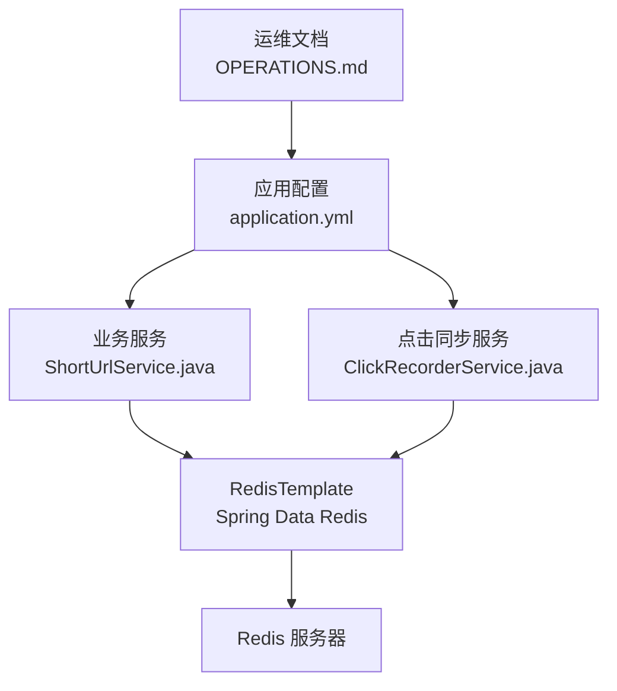
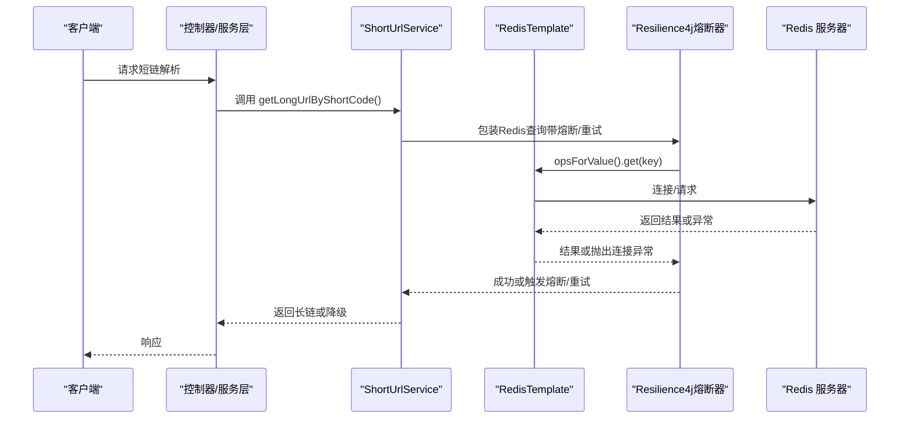
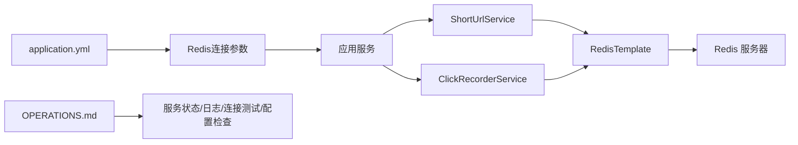

# Redis连接失败

<cite>
**本文引用的文件**
- [OPERATIONS.md](file://OPERATIONS.md)
- [application.yml](file://src/main/resources/application.yml)
- [deploy.sh](file://deploy.sh)
- [ShortUrlService.java](file://src/main/java/com/layor/tinyflow/service/ShortUrlService.java)
- [ClickRecorderService.java](file://src/main/java/com/layor/tinyflow/service/ClickRecorderService.java)
- [CircuitBreakerEventListener.java](file://src/main/java/com/layor/tinyflow/listener/CircuitBreakerEventListener.java)
</cite>

## 目录
1. [简介](#简介)
2. [项目结构](#项目结构)
3. [核心组件](#核心组件)
4. [架构总览](#架构总览)
5. [详细组件分析](#详细组件分析)
6. [依赖关系分析](#依赖关系分析)
7. [性能注意事项](#性能注意事项)
8. [故障排查指南](#故障排查指南)
9. [结论](#结论)

## 简介
本指南围绕“Redis连接失败”的运维场景，依据仓库中的运维文档与代码实现，给出系统化的排查步骤与修复建议。重点覆盖：
- 检查Redis服务进程状态
- 使用redis-cli进行ping测试验证连接
- 查看Redis服务日志以发现异常信息
- 检查redis.conf配置文件中的bind地址与requirepass密码设置
- 分析常见原因（服务崩溃、密码变更未同步、配置文件错误、网络策略限制）
- 提供重启服务、修正配置、重新加载配置的解决方案
- 建议监控Redis内存使用，避免因内存溢出导致的服务中断

## 项目结构
与Redis连接相关的关键位置：
- 运维文档：包含服务管理、日志查看、故障排查、性能监控等章节
- 应用配置：Spring Boot中对Redis的连接参数（主机、端口、密码、超时、连接池）定义
- 业务代码：短链查询与点击统计等模块通过RedisTemplate访问Redis
- 熔断与重试：Resilience4j对Redis连接失败进行熔断与重试保护

图表来源
- [OPERATIONS.md](file://OPERATIONS.md#L202-L216)
- [application.yml](file://src/main/resources/application.yml#L21-L33)
- [ShortUrlService.java](file://src/main/java/com/layor/tinyflow/service/ShortUrlService.java#L290-L367)
- [ClickRecorderService.java](file://src/main/java/com/layor/tinyflow/service/ClickRecorderService.java#L219-L246)

章节来源
- [OPERATIONS.md](file://OPERATIONS.md#L202-L216)
- [application.yml](file://src/main/resources/application.yml#L21-L33)

## 核心组件
- Redis连接参数（主机、端口、密码、超时、连接池）
- Spring Data Redis模板（StringRedisTemplate）用于读写键值
- Resilience4j熔断器与重试：针对Redis连接失败进行快速失败与恢复
- 业务服务对Redis的调用路径：短链查询、点击快照同步

章节来源
- [application.yml](file://src/main/resources/application.yml#L21-L33)
- [ShortUrlService.java](file://src/main/java/com/layor/tinyflow/service/ShortUrlService.java#L290-L367)
- [ClickRecorderService.java](file://src/main/java/com/layor/tinyflow/service/ClickRecorderService.java#L219-L246)
- [CircuitBreakerEventListener.java](file://src/main/java/com/layor/tinyflow/listener/CircuitBreakerEventListener.java#L1-L57)

## 架构总览
下图展示从应用到Redis的典型调用链路及熔断保护：

图表来源
- [ShortUrlService.java](file://src/main/java/com/layor/tinyflow/service/ShortUrlService.java#L290-L367)
- [application.yml](file://src/main/resources/application.yml#L148-L211)

## 详细组件分析

### Redis连接参数与配置
- 主机与端口：默认localhost:6379
- 密码：来自环境变量REDIS_PASSWORD
- 超时：2秒
- 连接池：最大活跃、最大空闲、最大等待、最小空闲
- 部署脚本中同样声明了Redis连接参数，便于生产环境一致性

章节来源
- [application.yml](file://src/main/resources/application.yml#L21-L33)
- [deploy.sh](file://deploy.sh#L265-L277)

### 业务对Redis的使用
- 短链解析：优先本地缓存，再查Redis，最后回源数据库；Redis失败则抛出异常触发熔断
- 点击快照同步：从Redis读取当日/累计快照，刷写数据库后清理快照

章节来源
- [ShortUrlService.java](file://src/main/java/com/layor/tinyflow/service/ShortUrlService.java#L290-L367)
- [ClickRecorderService.java](file://src/main/java/com/layor/tinyflow/service/ClickRecorderService.java#L219-L246)

### 熔断与重试保护
- Redis熔断器：在连接失败或Socket超时时开启熔断，降低对下游压力
- 重试策略：对连接失败异常进行有限次数指数退避重试
- 事件监听：记录熔断状态变化，便于告警与排障

章节来源
- [application.yml](file://src/main/resources/application.yml#L148-L211)
- [CircuitBreakerEventListener.java](file://src/main/java/com/layor/tinyflow/listener/CircuitBreakerEventListener.java#L1-L57)

## 依赖关系分析
- 应用配置依赖环境变量REDIS_PASSWORD
- 业务服务依赖RedisTemplate
- Resilience4j依赖Spring容器与业务方法注解
- 运维文档提供服务状态、日志、连接测试与配置检查命令

图表来源
- [application.yml](file://src/main/resources/application.yml#L21-L33)
- [ShortUrlService.java](file://src/main/java/com/layor/tinyflow/service/ShortUrlService.java#L290-L367)
- [ClickRecorderService.java](file://src/main/java/com/layor/tinyflow/service/ClickRecorderService.java#L219-L246)
- [OPERATIONS.md](file://OPERATIONS.md#L202-L216)

## 性能注意事项
- Redis内存使用需持续监控，避免因内存溢出导致服务中断
- 可通过redis-cli查看统计信息辅助定位
- 合理设置连接池大小与超时，避免高并发下的连接争用

章节来源
- [OPERATIONS.md](file://OPERATIONS.md#L277-L279)

## 故障排查指南

### 一、检查Redis服务进程状态
- 使用systemctl查看Redis状态，确认服务是否正常运行
- 若服务未运行，先尝试重启服务，再进行下一步验证

章节来源
- [OPERATIONS.md](file://OPERATIONS.md#L202-L207)

### 二、使用redis-cli进行ping测试验证连接
- 使用带密码的ping命令进行连通性测试
- 若返回PONG表示连接正常；否则进入下一步排查

章节来源
- [OPERATIONS.md](file://OPERATIONS.md#L208-L210)

### 三、查看Redis服务日志以发现异常信息
- 使用journalctl查看Redis最近日志，定位异常原因（如认证失败、内存不足、OOM等）

章节来源
- [OPERATIONS.md](file://OPERATIONS.md#L211-L212)

### 四、检查redis.conf配置文件中的bind地址与requirepass密码设置
- 检查bind绑定地址是否允许本机或内网访问
- 检查requirepass密码是否与应用配置一致
- 若配置变更，请重启Redis使配置生效

章节来源
- [OPERATIONS.md](file://OPERATIONS.md#L214-L216)

### 五、常见原因与定位要点
- 服务崩溃：检查systemctl状态与日志，确认Redis是否意外退出
- 密码变更未同步：应用侧REDIS_PASSWORD与Redis requirepass必须保持一致
- 配置文件错误：bind地址限制或持久化配置不当可能导致连接异常
- 网络策略限制：防火墙或安全组阻止6379端口访问
- 内存溢出：Redis内存耗尽导致服务中断，需监控并扩容或清理

章节来源
- [OPERATIONS.md](file://OPERATIONS.md#L202-L216)
- [OPERATIONS.md](file://OPERATIONS.md#L277-L279)

### 六、解决方案与操作步骤
- 重启Redis服务：确保配置正确后重启，观察状态
- 修正配置：修改redis.conf中的bind与requirepass，重启服务
- 重新加载配置：若仅调整非持久化参数，可考虑热重载（具体取决于Redis版本与配置项）
- 应用侧同步：确保REDIS_PASSWORD与Redis requirepass一致，必要时重启应用以加载新配置
- 监控Redis内存：定期查看统计信息，提前预警内存压力

章节来源
- [OPERATIONS.md](file://OPERATIONS.md#L202-L216)
- [OPERATIONS.md](file://OPERATIONS.md#L277-L279)
- [application.yml](file://src/main/resources/application.yml#L21-L33)

### 七、结合业务与熔断保护的排障思路
- 若出现大量连接失败，优先检查Redis状态与日志
- 观察熔断器事件：当熔断打开时，系统将降级走数据库回源，避免雪崩
- 对于短链解析与点击快照同步等高频路径，关注Redis可用性与延迟

章节来源
- [ShortUrlService.java](file://src/main/java/com/layor/tinyflow/service/ShortUrlService.java#L290-L367)
- [ClickRecorderService.java](file://src/main/java/com/layor/tinyflow/service/ClickRecorderService.java#L219-L246)
- [CircuitBreakerEventListener.java](file://src/main/java/com/layor/tinyflow/listener/CircuitBreakerEventListener.java#L1-L57)

## 结论
Redis连接失败通常由服务状态、认证密码、配置文件与网络策略等因素引起。建议按“状态—连通性—日志—配置—监控”的顺序逐步排查，并结合Resilience4j的熔断与重试机制，提升系统的韧性与可观测性。对于内存压力，应建立持续监控与预警机制，避免因内存溢出导致的服务中断。