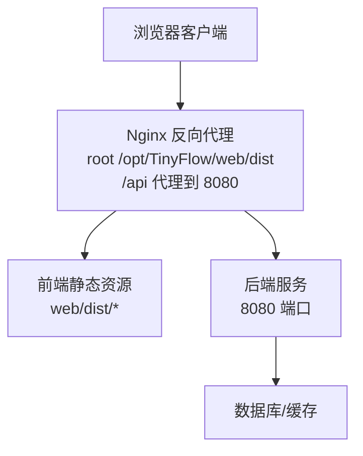
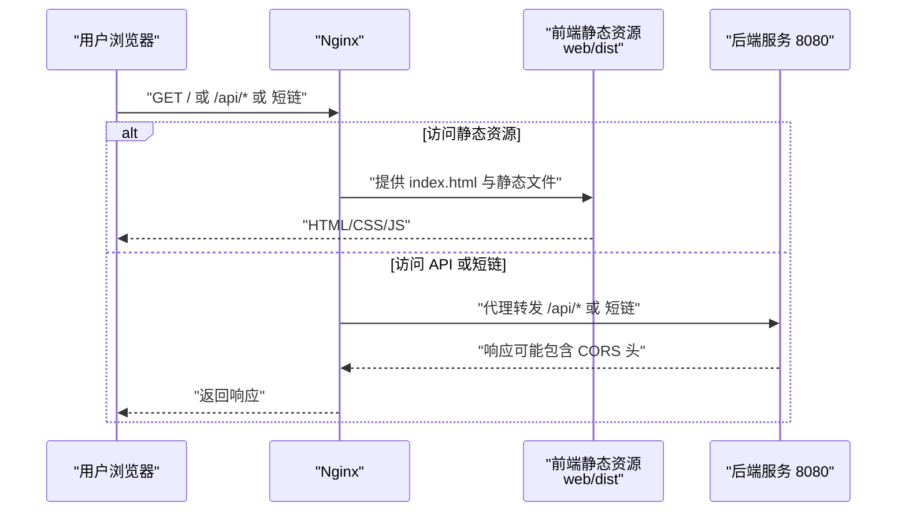
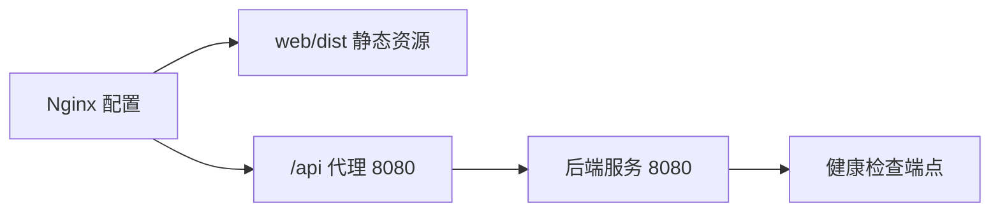
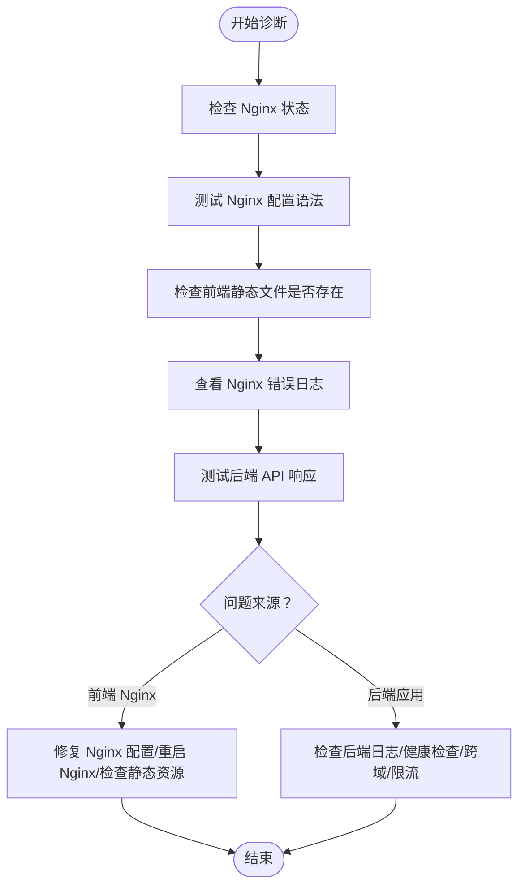

# 前端访问失败

<cite>
**本文引用的文件**
- [OPERATIONS.md](file://OPERATIONS.md)
- [DEPLOY_ALIYUN.md](file://DEPLOY_ALIYUN.md)
- [deploy.sh](file://deploy.sh)
- [web/vite.config.js](file://web/vite.config.js)
- [web/README.md](file://web/README.md)
- [src/main/java/com/layor/tinyflow/Controller/MonitorController.java](file://src/main/java/com/layor/tinyflow/Controller/MonitorController.java)
- [OBSERVABILITY.md](file://OBSERVABILITY.md)
</cite>

## 目录
1. [简介](#简介)
2. [项目结构](#项目结构)
3. [核心组件](#核心组件)
4. [架构总览](#架构总览)
5. [详细组件分析](#详细组件分析)
6. [依赖关系分析](#依赖关系分析)
7. [性能注意事项](#性能注意事项)
8. [故障排查指南](#故障排查指南)
9. [结论](#结论)

## 简介
本指南面向“前端访问失败”的运维场景，依据仓库中的运维与部署文档，提供一套标准化的诊断流程。目标是帮助运维人员快速判断问题出在前端 Nginx 层面（静态资源缺失、Nginx 配置错误、日志异常），还是后端应用层面（服务无响应、跨域问题、健康检查失败），并通过最小化的修复动作定位并解决问题。

## 项目结构
- 前端构建产物位于 /opt/TinyFlow/web/dist，Nginx 通过 root 指向该目录提供静态资源。
- Nginx 将 /api 前缀代理到后端 8080 端口；短链跳转路径也代理到后端。
- 后端提供健康检查端点，便于快速判断后端状态。

图表来源
- [DEPLOY_ALIYUN.md](file://DEPLOY_ALIYUN.md#L392-L441)
- [deploy.sh](file://deploy.sh#L366-L416)

章节来源
- [DEPLOY_ALIYUN.md](file://DEPLOY_ALIYUN.md#L392-L441)
- [deploy.sh](file://deploy.sh#L366-L416)

## 核心组件
- Nginx 配置：负责静态资源托管、前端路由回退、/api 代理、短链跳转代理、健康检查访问控制。
- 前端构建产物：web/dist 目录下的静态文件，由 Nginx 提供。
- 后端健康检查：/actuator/health（或 /api/monitor/health）用于快速判断后端可用性。
- 前端开发代理：开发阶段通过 vite.config.js 将 /api 代理到后端 8080，生产环境由 Nginx 代理。

章节来源
- [DEPLOY_ALIYUN.md](file://DEPLOY_ALIYUN.md#L392-L441)
- [deploy.sh](file://deploy.sh#L366-L416)
- [web/vite.config.js](file://web/vite.config.js#L1-L19)
- [web/README.md](file://web/README.md#L141-L150)
- [src/main/java/com/layor/tinyflow/Controller/MonitorController.java](file://src/main/java/com/layor/tinyflow/Controller/MonitorController.java#L37-L75)
- [OBSERVABILITY.md](file://OBSERVABILITY.md#L69-L144)

## 架构总览
前端访问失败的典型路径：
- 浏览器请求 Nginx（80 端口）
- Nginx 返回静态资源（web/dist）
- 若访问 /api 或短链路径，则转发至后端 8080
- 后端处理请求并返回结果

图表来源
- [DEPLOY_ALIYUN.md](file://DEPLOY_ALIYUN.md#L392-L441)
- [deploy.sh](file://deploy.sh#L366-L416)

## 详细组件分析

### Nginx 配置要点
- 静态资源根目录：root 指向 /opt/TinyFlow/web/dist
- 前端路由回退：location / 使用 try_files $uri $uri/ /index.html
- /api 代理：location /api 代理到 http://localhost:8080
- 短链跳转：location ~ ^/[a-zA-Z0-9]{4,8}$ 代理到 http://localhost:8080
- 健康检查：location /actuator 仅允许本机访问，代理到后端
- 日志：access_log 与 error_log 分离，便于排查

章节来源
- [DEPLOY_ALIYUN.md](file://DEPLOY_ALIYUN.md#L392-L441)
- [deploy.sh](file://deploy.sh#L366-L416)

### 健康检查端点
- Spring Boot Actuator：/actuator/health（仅本机访问）
- 自定义监控端点：/api/monitor/health（返回系统健康、熔断器、缓存统计）

章节来源
- [OBSERVABILITY.md](file://OBSERVABILITY.md#L69-L144)
- [src/main/java/com/layor/tinyflow/Controller/MonitorController.java](file://src/main/java/com/layor/tinyflow/Controller/MonitorController.java#L37-L75)

### 前端开发代理与生产差异
- 开发阶段：vite.config.js 将 /api 与 /shorten 代理到 8080
- 生产阶段：由 Nginx 统一代理，前端不再直接访问 8080

章节来源
- [web/vite.config.js](file://web/vite.config.js#L1-L19)
- [web/README.md](file://web/README.md#L141-L150)

## 依赖关系分析
- Nginx 依赖后端 8080 端口可用
- 前端静态资源依赖 web/dist 目录存在且可读
- 健康检查端点依赖后端服务运行
- CORS 与跨域策略由后端控制，Nginx 不做 CORS 处理

图表来源
- [DEPLOY_ALIYUN.md](file://DEPLOY_ALIYUN.md#L392-L441)
- [deploy.sh](file://deploy.sh#L366-L416)

## 性能注意事项
- Nginx 已开启 gzip 压缩，有助于减少传输体积
- 前端路由回退 try_files 需确保 index.html 正常，避免 404
- 后端健康检查端点可用于快速评估系统整体健康度

章节来源
- [DEPLOY_ALIYUN.md](file://DEPLOY_ALIYUN.md#L438-L441)
- [OBSERVABILITY.md](file://OBSERVABILITY.md#L69-L144)

## 故障排查指南

### 诊断流程（依据 OPERATIONS.md 4.4 节）
- 步骤 1：检查 Nginx 服务状态
- 步骤 2：测试 Nginx 配置语法
- 步骤 3：检查前端静态文件是否存在
- 步骤 4：查看 Nginx 错误日志
- 步骤 5：测试后端 API 是否正常响应

图表来源
- [OPERATIONS.md](file://OPERATIONS.md#L218-L237)

章节来源
- [OPERATIONS.md](file://OPERATIONS.md#L218-L237)

### 逐项检查清单与修复建议
- 检查 Nginx 服务状态
  - 命令：systemctl status nginx
  - 若未运行：systemctl start nginx
  - 若配置变更：nginx -t 测试配置，通过后再 systemctl restart nginx
  章节来源
  - [OPERATIONS.md](file://OPERATIONS.md#L68-L82)
  - [DEPLOY_ALIYUN.md](file://DEPLOY_ALIYUN.md#L450-L455)

- 检查前端静态文件是否存在
  - 目标目录：/opt/TinyFlow/web/dist/
  - 若不存在：重新构建前端并放置到 dist 目录
  章节来源
  - [OPERATIONS.md](file://OPERATIONS.md#L227-L229)
  - [deploy.sh](file://deploy.sh#L333-L360)

- 查看 Nginx 错误日志
  - 命令：tail -f /var/log/nginx/error.log
  - 关注 404（静态文件缺失）、403（权限问题）、502/504（后端不可达）
  章节来源
  - [OPERATIONS.md](file://OPERATIONS.md#L146-L157)

- 测试后端 API 是否正常响应
  - 健康检查：curl http://localhost:8080/actuator/health
  - 自定义监控：curl http://localhost:8080/api/monitor/health
  - 示例 API：curl -X POST http://localhost:8080/api/shorten -H "Content-Type: application/json" -d '{"longUrl":"https://example.com"}'
  章节来源
  - [OBSERVABILITY.md](file://OBSERVABILITY.md#L69-L144)
  - [DEPLOY_ALIYUN.md](file://DEPLOY_ALIYUN.md#L540-L547)

- 常见原因与修复
  - Nginx 配置错误
    - 使用 nginx -t 校验语法，修正后重启
    - 确认 root、try_files、/api 代理、短链代理、/actuator 访问控制
  - 静态资源未正确部署
    - 确认 dist 目录存在且权限可读
    - 重新执行前端构建并将产物放至 /opt/TinyFlow/web/dist
  - 后端服务无响应
    - 检查 systemctl status tinyflow
    - 查看 journalctl -u tinyflow -f
    - 通过健康检查端点判断后端状态
  - 跨域问题
    - 后端需正确设置 CORS 头（如 Access-Control-Allow-*）
    - Nginx 不处理 CORS，应在后端配置
  - 健康检查端点建议
    - /actuator/health（Spring Boot）或 /api/monitor/health（自定义）
    - 可在 Nginx 中限制 /actuator 仅本机访问，避免外网暴露

章节来源
- [DEPLOY_ALIYUN.md](file://DEPLOY_ALIYUN.md#L392-L441)
- [deploy.sh](file://deploy.sh#L366-L416)
- [OBSERVABILITY.md](file://OBSERVABILITY.md#L69-L144)
- [src/main/java/com/layor/tinyflow/Controller/MonitorController.java](file://src/main/java/com/layor/tinyflow/Controller/MonitorController.java#L37-L75)

## 结论
前端访问失败通常由三层因素导致：Nginx 配置/静态资源问题、后端服务不可用或跨域配置不当。按照 OPERATIONS.md 4.4 节提供的步骤，先确认 Nginx 与静态资源，再通过健康检查与 API 测试区分前后端故障点，即可高效定位并修复。建议在生产环境中启用健康检查端点，并对 /actuator 做访问控制，以提升可观测性与安全性。