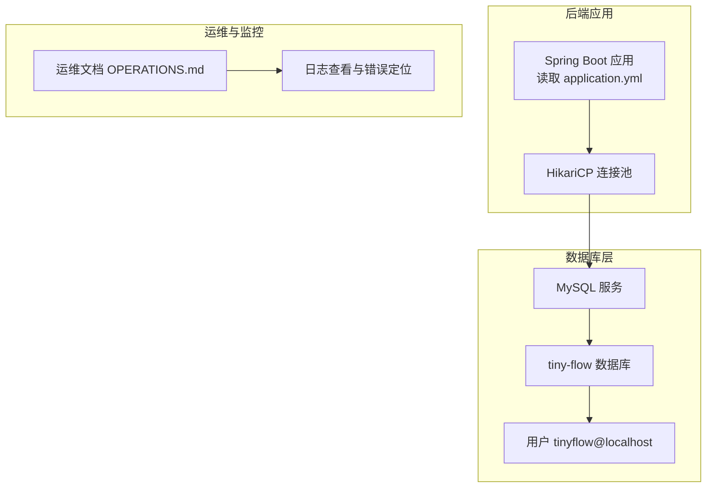
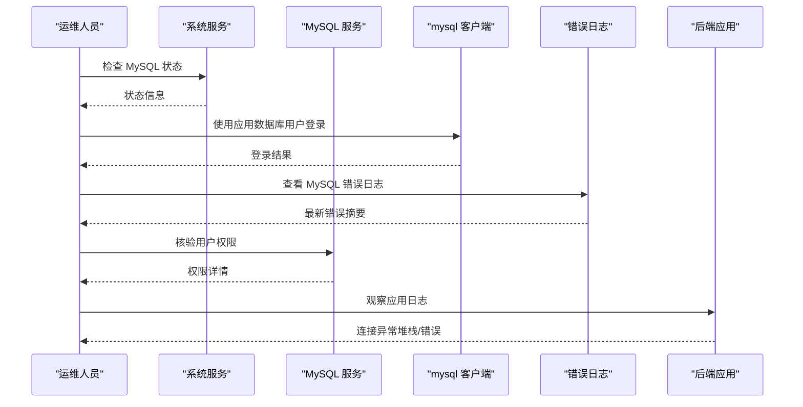
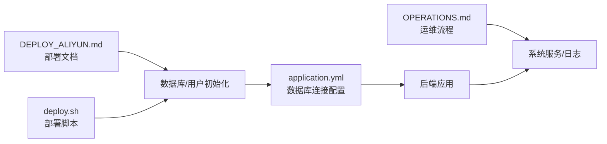

# 数据库连接失败

<cite>
**本文引用的文件**
- [OPERATIONS.md](file://OPERATIONS.md)
- [application.yml](file://src/main/resources/application.yml)
- [DEPLOY_ALIYUN.md](file://DEPLOY_ALIYUN.md)
- [deploy.sh](file://deploy.sh)
</cite>

## 目录
1. [简介](#简介)
2. [项目结构](#项目结构)
3. [核心组件](#核心组件)
4. [架构总览](#架构总览)
5. [详细组件分析](#详细组件分析)
6. [依赖关系分析](#依赖关系分析)
7. [性能注意事项](#性能注意事项)
8. [故障排查指南](#故障排查指南)
9. [结论](#结论)

## 简介
本指南围绕“数据库连接失败”的系统化诊断展开，依据仓库中的运维文档与配置文件，给出从 MySQL 服务状态、客户端连接测试、错误日志定位、数据库用户权限核验到常见原因与修复建议的完整流程。同时提供建立定期连接测试机制的建议，帮助在问题发生前主动发现并预防连接异常。

## 项目结构
- 后端通过 Spring Boot 读取配置文件中的数据库连接信息，使用 HikariCP 连接池管理数据库连接。
- 运维文档提供了 MySQL 服务状态检查、客户端连接测试、错误日志查看以及数据库用户权限核验等步骤。
- 部署脚本与部署文档明确了数据库与用户创建、授权与密码配置的关键步骤。

图表来源
- [application.yml](file://src/main/resources/application.yml#L1-L14)
- [OPERATIONS.md](file://OPERATIONS.md#L184-L201)
- [DEPLOY_ALIYUN.md](file://DEPLOY_ALIYUN.md#L200-L212)
- [deploy.sh](file://deploy.sh#L138-L146)

章节来源
- [application.yml](file://src/main/resources/application.yml#L1-L14)
- [OPERATIONS.md](file://OPERATIONS.md#L184-L201)
- [DEPLOY_ALIYUN.md](file://DEPLOY_ALIYUN.md#L200-L212)
- [deploy.sh](file://deploy.sh#L138-L146)

## 核心组件
- 数据库连接配置
  - JDBC URL、用户名、密码、驱动类、连接池参数均在配置文件中定义，应用启动时加载。
- 运维流程
  - 服务状态检查、客户端连接测试、错误日志查看、用户权限核验。
- 部署与初始化
  - 数据库与用户创建、授权、密码设置；生产配置生成与服务启动。

章节来源
- [application.yml](file://src/main/resources/application.yml#L1-L14)
- [OPERATIONS.md](file://OPERATIONS.md#L184-L201)
- [DEPLOY_ALIYUN.md](file://DEPLOY_ALIYUN.md#L200-L212)
- [deploy.sh](file://deploy.sh#L138-L146)

## 架构总览
后端应用通过 HikariCP 连接池访问 MySQL，连接参数来自配置文件；运维文档提供从服务状态到日志定位的完整排查路径；部署脚本与部署文档确保数据库与用户初始化正确。

图表来源
- [OPERATIONS.md](file://OPERATIONS.md#L184-L201)
- [application.yml](file://src/main/resources/application.yml#L1-L14)

## 详细组件分析

### 数据库连接配置与连接池
- 关键配置要点
  - JDBC URL 指向本地 MySQL 的 tiny-flow 数据库。
  - 用户名、密码通过环境变量注入，避免硬编码。
  - HikariCP 提供最大连接数、最小空闲、连接超时、空闲超时、最大生命周期等参数。
- 影响因素
  - 连接池大小与超时设置影响高并发下的连接可用性。
  - 密码变更需同步更新配置与数据库用户密码。

章节来源
- [application.yml](file://src/main/resources/application.yml#L1-L14)

### 运维排查流程（基于文档）
- 步骤一：检查 MySQL 服务状态
  - 使用 systemd 状态命令查看服务状态。
- 步骤二：测试数据库连接
  - 使用应用数据库用户登录目标数据库进行连通性验证。
- 步骤三：查看数据库错误日志
  - 实时跟踪最新错误，定位异常时间点与错误类型。
- 步骤四：检查数据库用户权限
  - 登录 MySQL，查询应用用户权限，确保对目标数据库具备必要权限。

章节来源
- [OPERATIONS.md](file://OPERATIONS.md#L184-L201)

### 部署与初始化（数据库与用户）
- 数据库与用户创建
  - 创建 tiny-flow 数据库与 tinyflow@localhost 用户。
  - 授权用户对 tiny-flow.* 的全部权限。
- 密码与配置
  - 部署脚本与部署文档均强调数据库密码的设置与替换。
  - 生产配置文件中明确 datasource 的用户名与密码字段。

章节来源
- [DEPLOY_ALIYUN.md](file://DEPLOY_ALIYUN.md#L200-L212)
- [deploy.sh](file://deploy.sh#L138-L146)
- [application.yml](file://src/main/resources/application.yml#L1-L14)

## 依赖关系分析
- 后端应用依赖配置文件中的数据库连接信息。
- 运维流程依赖系统服务状态、客户端工具与日志输出。
- 部署脚本与部署文档共同确保数据库与用户初始化正确。

图表来源
- [application.yml](file://src/main/resources/application.yml#L1-L14)
- [OPERATIONS.md](file://OPERATIONS.md#L184-L201)
- [DEPLOY_ALIYUN.md](file://DEPLOY_ALIYUN.md#L200-L212)
- [deploy.sh](file://deploy.sh#L138-L146)

## 性能注意事项
- 连接池参数
  - HikariCP 的最大连接数、最小空闲、连接超时、空闲超时、最大生命周期等参数直接影响连接可用性与资源占用。
- 并发与连接数上限
  - MySQL 的最大连接数限制与应用连接池大小需匹配，避免连接池耗尽或数据库拒绝连接。
- 日志与监控
  - 结合应用与数据库日志，观察连接异常峰值与错误类型，辅助定位瓶颈。

章节来源
- [application.yml](file://src/main/resources/application.yml#L1-L14)
- [OPERATIONS.md](file://OPERATIONS.md#L274-L276)

## 故障排查指南

### 一、检查 MySQL 服务运行状态
- 操作命令
  - 使用 systemd 状态命令查看 MySQL 服务状态。
- 期望结果
  - 服务处于运行中且无异常退出。
- 异常处理
  - 若服务未运行，先尝试重启服务并检查系统日志。

章节来源
- [OPERATIONS.md](file://OPERATIONS.md#L184-L190)

### 二、使用 mysql 客户端测试与 tiny-flow 数据库的连接
- 操作命令
  - 使用应用数据库用户登录目标数据库，验证连通性。
- 期望结果
  - 成功进入数据库客户端，无认证错误。
- 异常处理
  - 若提示认证失败，优先核对数据库用户密码与配置文件中的密码是否一致。

章节来源
- [OPERATIONS.md](file://OPERATIONS.md#L190-L193)

### 三、查看 MySQL 错误日志以定位具体问题
- 操作命令
  - 实时查看 MySQL 错误日志，关注最近错误与异常堆栈。
- 期望结果
  - 能够看到错误发生的时间点与错误类型。
- 异常处理
  - 根据错误类型调整数据库参数、权限或连接池配置。

章节来源
- [OPERATIONS.md](file://OPERATIONS.md#L194-L195)

### 四、检查数据库用户权限
- 操作命令
  - 登录 MySQL，查询应用用户的权限，确保对 tiny-flow.* 具备必要权限。
- 期望结果
  - 显示用户权限包含对目标数据库的授权。
- 异常处理
  - 若权限不足，重新授予相应权限并刷新权限。

章节来源
- [OPERATIONS.md](file://OPERATIONS.md#L197-L200)
- [DEPLOY_ALIYUN.md](file://DEPLOY_ALIYUN.md#L200-L212)
- [deploy.sh](file://deploy.sh#L138-L146)

### 五、常见原因与修复建议
- 服务未运行
  - 现象：连接超时或拒绝。
  - 修复：启动 MySQL 服务并设置开机自启。
- 密码错误
  - 现象：认证失败。
  - 修复：核对配置文件中的数据库密码与数据库用户密码一致；必要时修改数据库用户密码并同步配置。
- 用户权限不足
  - 现象：授权相关错误。
  - 修复：授予用户对 tiny-flow.* 的必要权限并刷新权限。
- 连接数超限
  - 现象：连接池耗尽或数据库拒绝连接。
  - 修复：调整 MySQL 最大连接数与应用连接池参数，平衡并发与资源。

章节来源
- [OPERATIONS.md](file://OPERATIONS.md#L184-L201)
- [application.yml](file://src/main/resources/application.yml#L1-L14)
- [DEPLOY_ALIYUN.md](file://DEPLOY_ALIYUN.md#L200-L212)
- [deploy.sh](file://deploy.sh#L138-L146)

### 六、建立定期连接测试机制（预防性措施）
- 建议内容
  - 在运维脚本或定时任务中加入数据库连接测试，周期性验证连接可用性。
  - 将测试结果纳入监控与告警体系，提前发现潜在问题。
- 参考命令
  - 使用 mysql 客户端执行简单查询或连接测试，结合日志与监控指标进行综合评估。

章节来源
- [OPERATIONS.md](file://OPERATIONS.md#L184-L201)

## 结论
数据库连接失败通常由服务状态、认证密码、用户权限与连接数限制等因素导致。依据运维文档提供的检查步骤与配置文件中的连接参数，可以快速定位问题并实施修复。同时，建议建立定期连接测试机制，将连接可用性纳入日常监控，降低故障发生概率并提升系统稳定性。