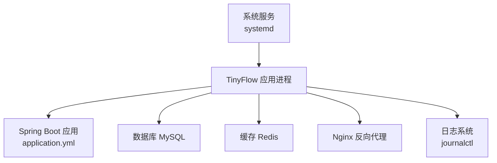
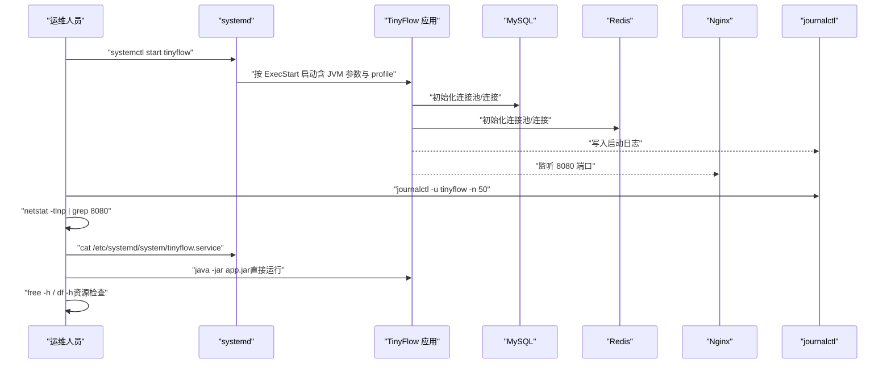
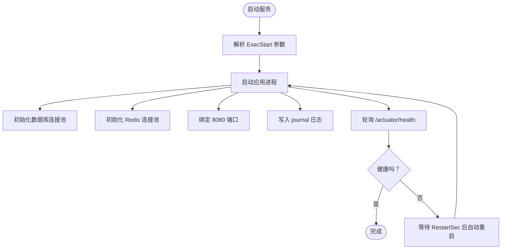
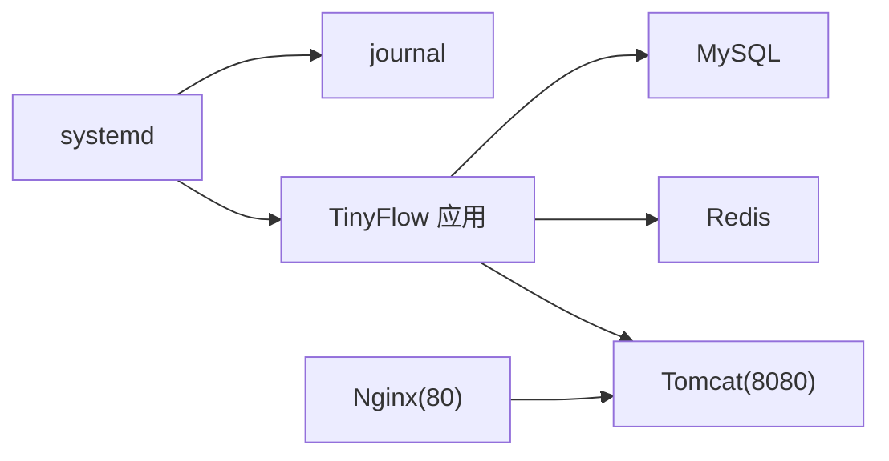
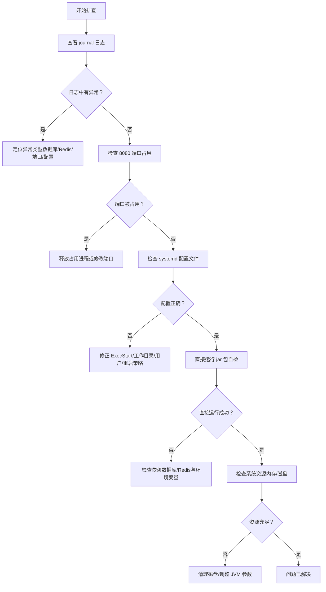

# 服务无法启动

<cite>
**本文引用的文件**
- [OPERATIONS.md](file://OPERATIONS.md)
- [DEPLOY_ALIYUN.md](file://DEPLOY_ALIYUN.md)
- [deploy.sh](file://deploy.sh)
- [application.yml](file://src/main/resources/application.yml)
- [Dockerfile](file://Dockerfile)
- [SecurityConfig.java](file://src/main/java/com/layor/tinyflow/config/SecurityConfig.java)
</cite>

## 目录
1. [简介](#简介)
2. [项目结构](#项目结构)
3. [核心组件](#核心组件)
4. [架构总览](#架构总览)
5. [详细组件分析](#详细组件分析)
6. [依赖关系分析](#依赖关系分析)
7. [性能注意事项](#性能注意事项)
8. [故障排查指南](#故障排查指南)
9. [结论](#结论)
10. [附录](#附录)

## 简介
本章节面向“TinyFlow 服务无法启动”的场景，基于仓库内的运维文档与部署脚本，提供一套完整的排查流程与根因定位方法。重点覆盖：使用 journalctl 查看启动错误日志、通过 netstat 检查 8080 端口占用、验证 systemd 服务配置文件、测试 jar 包直接运行能力、检查系统资源（内存与磁盘）是否充足，并总结可能导致启动失败的根本原因及对应解决方案。同时给出预防性检查建议，帮助避免常见问题反复发生。

## 项目结构
从运维视角，与“服务无法启动”直接相关的关键文件与位置如下：
- 运维与故障排查文档：OPERATIONS.md、DEPLOY_ALIYUN.md
- systemd 服务定义：/etc/systemd/system/tinyflow.service（由部署脚本生成）
- 应用配置：application.yml（包含端口、数据库、Redis、JVM 参数等）
- 部署脚本：deploy.sh（包含服务启动等待逻辑、日志提示）
- 容器镜像：Dockerfile（包含默认 JVM 参数）
- CORS 配置：SecurityConfig.java（涉及本地开发与跨域）

图表来源
- [deploy.sh](file://deploy.sh#L429-L467)
- [application.yml](file://src/main/resources/application.yml#L65-L78)
- [DEPLOY_ALIYUN.md](file://DEPLOY_ALIYUN.md#L1015-L1035)

章节来源
- [OPERATIONS.md](file://OPERATIONS.md#L161-L182)
- [deploy.sh](file://deploy.sh#L429-L467)

## 核心组件
- systemd 服务单元：负责以固定 JVM 参数与 profile 启动应用，输出到 journal，具备自动重启策略。
- 应用配置：定义端口、数据库与 Redis 连接、Actuator 暴露、Resilience4j 熔断与限流等。
- 日志系统：journalctl 作为 systemd 的标准日志入口，便于集中查看应用启动与运行期错误。
- 网络与代理：Nginx 代理 8080 端口，若后端未就绪，将导致前端访问异常。
- 容器镜像：容器内同样以固定 JVM 参数启动，便于对比宿主机与容器差异。

章节来源
- [deploy.sh](file://deploy.sh#L429-L467)
- [application.yml](file://src/main/resources/application.yml#L65-L78)
- [Dockerfile](file://Dockerfile#L1-L7)

## 架构总览
下图展示服务启动的关键路径与依赖关系，有助于定位“服务无法启动”的根因。

图表来源
- [deploy.sh](file://deploy.sh#L429-L467)
- [OPERATIONS.md](file://OPERATIONS.md#L163-L182)
- [application.yml](file://src/main/resources/application.yml#L65-L78)

## 详细组件分析

### systemd 服务配置与启动行为
- 服务单元位于 /etc/systemd/system/tinyflow.service，由部署脚本生成，包含：
  - ExecStart：指定 JVM 启动参数、应用 jar 与激活的 Spring Profile。
  - StandardOutput/StandardError：输出到 journal。
  - Restart=always 与 RestartSec=10：异常退出后自动重启。
  - LimitNOFILE：提高文件句柄上限。
- 部署脚本还包含“等待服务启动”的逻辑，通过轮询 /actuator/health 判断是否可用。

图表来源
- [deploy.sh](file://deploy.sh#L429-L467)
- [deploy.sh](file://deploy.sh#L469-L485)

章节来源
- [deploy.sh](file://deploy.sh#L429-L467)
- [deploy.sh](file://deploy.sh#L469-L485)

### 应用配置与端口监听
- 端口：server.port=8080，Tomcat 线程与连接参数在配置文件中定义。
- 数据库与 Redis：通过 application.yml 的 spring.datasource 与 spring.data.redis 配置，应用启动时会尝试建立连接。
- Actuator：暴露健康检查端点，便于自动化健康探测。
- CORS：SecurityConfig.java 中允许本地开发与特定来源访问，避免跨域导致的前端请求失败。

章节来源
- [application.yml](file://src/main/resources/application.yml#L65-L78)
- [application.yml](file://src/main/resources/application.yml#L1-L40)
- [SecurityConfig.java](file://src/main/java/com/layor/tinyflow/config/SecurityConfig.java#L104-L118)

### 日志采集与查看
- systemd 默认将服务的标准输出与错误输出写入 journal，可通过 journalctl 统一查看。
- 运维文档提供了多种查看方式：最近若干行、今日错误、按时间段过滤、按功能关键词过滤等。

章节来源
- [OPERATIONS.md](file://OPERATIONS.md#L125-L145)

### 端口占用与网络连通性
- 8080 端口被其他进程占用会导致应用无法绑定端口而启动失败。
- 运维文档提供了 netstat 命令用于检查端口占用情况。

章节来源
- [OPERATIONS.md](file://OPERATIONS.md#L169-L170)

### 直接运行 jar 包进行自检
- 若 systemd 启动失败，可在 /opt/tinyflow 目录下直接运行 java -jar app.jar，观察控制台输出，快速判断是否为配置或依赖问题。

章节来源
- [OPERATIONS.md](file://OPERATIONS.md#L176-L178)

### 系统资源检查
- 内存不足或磁盘空间不足会导致应用启动失败或运行不稳定。
- 运维文档提供了 free -h 与 df -h 用于检查内存与磁盘使用情况。

章节来源
- [OPERATIONS.md](file://OPERATIONS.md#L179-L182)

## 依赖关系分析
- 应用启动依赖：
  - 数据库：MySQL（连接字符串、凭据、方言、连接池参数）
  - 缓存：Redis（主机、端口、密码、超时与连接池）
  - 反向代理：Nginx（将 80 端口转发至 8080）
  - 日志：systemd/journald（统一采集）
- systemd 与应用的关系：systemd 控制应用生命周期；应用负责对外提供服务与内部依赖初始化。

图表来源
- [deploy.sh](file://deploy.sh#L429-L467)
- [application.yml](file://src/main/resources/application.yml#L1-L40)
- [application.yml](file://src/main/resources/application.yml#L65-L78)

章节来源
- [application.yml](file://src/main/resources/application.yml#L1-L40)
- [application.yml](file://src/main/resources/application.yml#L65-L78)
- [deploy.sh](file://deploy.sh#L429-L467)

## 性能注意事项
- JVM 内存参数：Dockerfile 中默认使用较小堆内存，若宿主机资源紧张，可参考部署脚本调整 systemd 的 -Xms/-Xmx 参数。
- 连接池与线程：application.yml 中定义了数据库连接池与 Tomcat 线程参数，过高的并发或过小的连接池均可能导致启动或运行异常。
- 磁盘与日志：定期清理日志可避免磁盘占满导致服务异常。

章节来源
- [Dockerfile](file://Dockerfile#L1-L7)
- [deploy.sh](file://deploy.sh#L429-L467)
- [application.yml](file://src/main/resources/application.yml#L65-L78)
- [DEPLOY_ALIYUN.md](file://DEPLOY_ALIYUN.md#L1094-L1111)

## 故障排查指南

### 4.1 服务无法启动的完整排查流程
- 步骤一：查看详细错误日志
  - 使用 journalctl 查看最近若干行与今日错误，定位启动期异常。
  - 参考路径：[查看日志命令](file://OPERATIONS.md#L125-L145)
- 步骤二：检查端口占用
  - 使用 netstat 检查 8080 端口是否被占用，确认应用是否能绑定端口。
  - 参考路径：[端口检查命令](file://OPERATIONS.md#L169-L170)
- 步骤三：检查 systemd 服务配置文件
  - 查看 /etc/systemd/system/tinyflow.service 的 ExecStart、工作目录、用户、重启策略等。
  - 参考路径：[服务配置文件查看](file://OPERATIONS.md#L172-L174)，[服务单元生成](file://deploy.sh#L429-L467)
- 步骤四：测试 jar 包直接运行能力
  - 在 /opt/tinyflow 目录下直接运行 java -jar app.jar，观察控制台输出，排除 systemd 配置或环境变量问题。
  - 参考路径：[直接运行命令](file://OPERATIONS.md#L176-L178)
- 步骤五：检查系统资源（内存与磁盘）
  - 使用 free -h 检查内存，使用 df -h 检查磁盘空间，确保资源充足。
  - 参考路径：[资源检查命令](file://OPERATIONS.md#L179-L182)

图表来源
- [OPERATIONS.md](file://OPERATIONS.md#L163-L182)
- [deploy.sh](file://deploy.sh#L429-L467)

章节来源
- [OPERATIONS.md](file://OPERATIONS.md#L163-L182)

### 可能的根本原因与解决方案
- 端口冲突
  - 现象：应用无法绑定 8080 端口，启动失败。
  - 解决：释放占用进程或修改应用端口；检查 systemd 配置与 netstat 输出。
  - 参考路径：[端口检查命令](file://OPERATIONS.md#L169-L170)
- 配置错误
  - 现象：数据库/Redis 连接失败、CORS 配置不当、profile 激活错误。
  - 解决：核对 application.yml 与 tinyflow.service 中的参数；修正数据库/Redis 密码与域名；必要时直接运行 jar 包验证。
  - 参考路径：[服务配置文件查看](file://OPERATIONS.md#L172-L174)，[应用配置](file://src/main/resources/application.yml#L1-L40)
- 资源不足
  - 现象：内存不足或磁盘空间不足导致启动失败或运行异常。
  - 解决：清理日志与临时文件，调整 JVM 参数；扩容磁盘或优化日志策略。
  - 参考路径：[资源检查命令](file://OPERATIONS.md#L179-L182)，[JVM 参数调整](file://DEPLOY_ALIYUN.md#L1094-L1111)
- jar 包损坏或依赖缺失
  - 现象：直接运行 java -jar app.jar 报错。
  - 解决：重新构建并替换 app.jar；检查依赖与运行环境。
  - 参考路径：[直接运行命令](file://OPERATIONS.md#L176-L178)，[构建与替换流程](file://deploy.sh#L334-L360)

章节来源
- [OPERATIONS.md](file://OPERATIONS.md#L163-L182)
- [application.yml](file://src/main/resources/application.yml#L1-L40)
- [DEPLOY_ALIYUN.md](file://DEPLOY_ALIYUN.md#L1094-L1111)
- [deploy.sh](file://deploy.sh#L334-L360)

### 预防性检查建议
- 定期清理日志，防止磁盘满
  - 使用 journalctl --vacuum-time 或 --vacuum-size 清理旧日志；必要时清理 Nginx 日志。
  - 参考路径：[日志清理命令](file://OPERATIONS.md#L577-L590)
- 设置合理的 JVM 内存参数
  - 根据服务器规格调整 -Xms 与 -Xmx；在 systemd 与 Dockerfile 中保持一致。
  - 参考路径：[JVM 参数调整](file://DEPLOY_ALIYUN.md#L1094-L1111)，[Dockerfile 默认参数](file://Dockerfile#L1-L7)
- 监控与健康检查
  - 使用 /actuator/health 进行健康检查；结合 journalctl 实时观察。
  - 参考路径：[健康检查命令](file://deploy.sh#L469-L485)

章节来源
- [OPERATIONS.md](file://OPERATIONS.md#L577-L590)
- [DEPLOY_ALIYUN.md](file://DEPLOY_ALIYUN.md#L1094-L1111)
- [Dockerfile](file://Dockerfile#L1-L7)
- [deploy.sh](file://deploy.sh#L469-L485)

## 结论
“服务无法启动”的问题通常由端口冲突、配置错误、资源不足或 jar 包问题引发。按照 OPERATIONS.md 与 DEPLOY_ALIYUN.md 的流程，结合 systemd 服务配置与应用配置，可快速定位并解决问题。建议建立定期日志清理与 JVM 参数校准的预防机制，提升系统稳定性与可维护性。

## 附录
- 常用命令速查
  - 查看服务状态与日志：systemctl status tinyflow、journalctl -u tinyflow -f
  - 端口检查：netstat -tlnp | grep 8080
  - 资源检查：free -h、df -h
  - 健康检查：curl http://localhost:8080/actuator/health
- 参考路径
  - [服务无法启动排查命令](file://OPERATIONS.md#L163-L182)
  - [服务单元生成与参数](file://deploy.sh#L429-L467)
  - [应用配置（端口/数据库/Redis）](file://src/main/resources/application.yml#L65-L78)
  - [Dockerfile 默认 JVM 参数](file://Dockerfile#L1-L7)