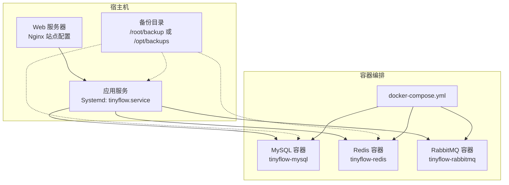
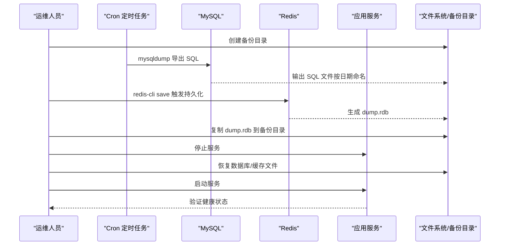
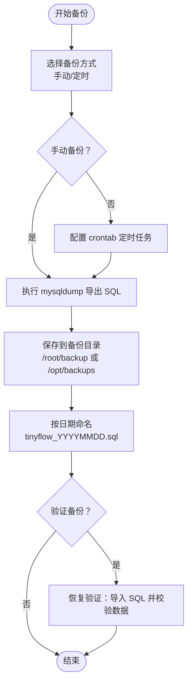
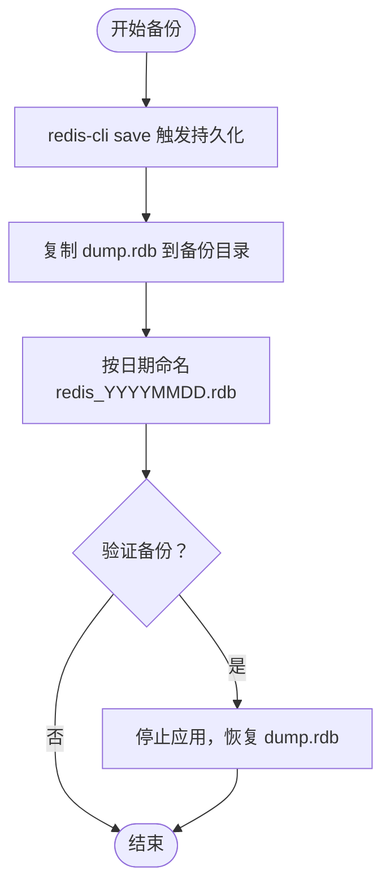
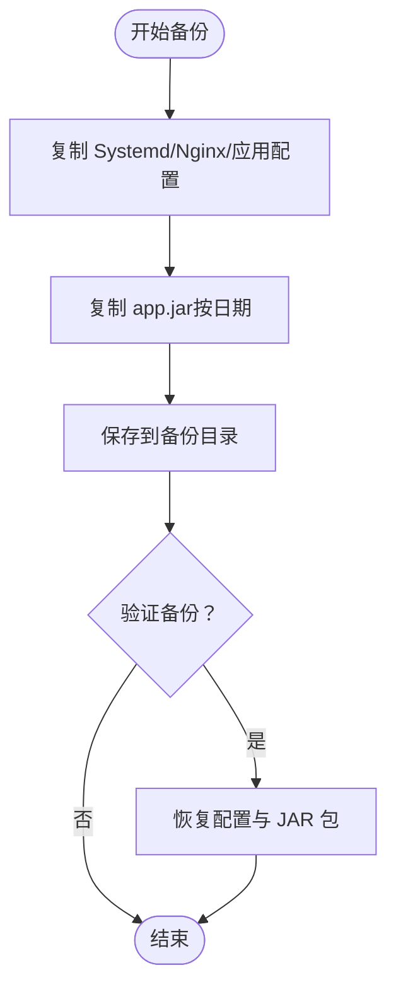
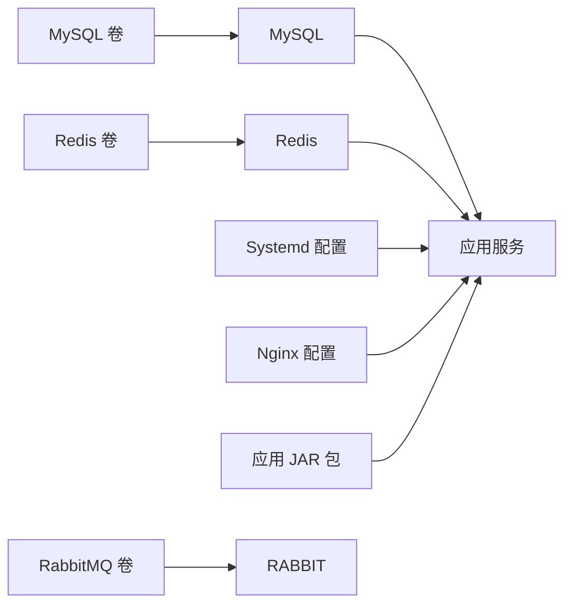

# 数据备份

<cite>
**本文引用的文件**
- [OPERATIONS.md](file://OPERATIONS.md)
- [application.yml](file://src/main/resources/application.yml)
- [docker-compose.yml](file://docker-compose.yml)
- [DEPLOY_ALIYUN.md](file://DEPLOY_ALIYUN.md)
- [deploy.sh](file://deploy.sh)
</cite>

## 目录
1. [简介](#简介)
2. [项目结构与备份范围](#项目结构与备份范围)
3. [核心组件与备份策略](#核心组件与备份策略)
4. [架构总览](#架构总览)
5. [组件详解](#组件详解)
6. [依赖关系分析](#依赖关系分析)
7. [性能与可靠性考量](#性能与可靠性考量)
8. [故障排查与恢复演练](#故障排查与恢复演练)
9. [结论](#结论)
10. [附录](#附录)

## 简介
本文件基于仓库中的运维与部署文档，制定面向生产环境的全面数据备份与恢复策略，覆盖数据库（MySQL）、缓存（Redis）以及应用代码与关键配置。文档提供手动与定时（crontab）备份命令示例，明确备份文件存储路径与命名规范，给出恢复步骤与验证要点，并列出需要备份的关键配置文件清单，确保系统可完整重建。

## 项目结构与备份范围
- 数据库：MySQL，使用 JDBC 连接，数据库名为 tiny-flow；容器化部署时挂载卷以持久化数据。
- 缓存：Redis，使用 RDB 持久化；容器化部署时启用 AOF。
- 应用：Spring Boot 后端，Systemd 管理；前端静态资源由 Nginx 提供。
- 关键配置：application.yml（数据库与 Redis 连接、JWT 等）、Nginx 站点配置、Systemd 服务文件、部署脚本等。

图表来源
- [docker-compose.yml](file://docker-compose.yml#L1-L67)
- [application.yml](file://src/main/resources/application.yml#L1-L40)
- [OPERATIONS.md](file://OPERATIONS.md#L283-L327)

章节来源
- [docker-compose.yml](file://docker-compose.yml#L1-L67)
- [application.yml](file://src/main/resources/application.yml#L1-L40)
- [OPERATIONS.md](file://OPERATIONS.md#L283-L327)

## 核心组件与备份策略
- 数据库（MySQL）
  - 手动备份：使用 mysqldump 导出 SQL 文件至备份目录。
  - 定时备份：通过 crontab 每日凌晨定时执行 mysqldump，输出按日期命名的 SQL 文件。
  - 恢复：使用 mysql 客户端导入备份文件。
  - 存储路径与命名：建议统一到 /root/backup 或 /opt/backups，命名包含日期，便于检索与轮转。
- 缓存（Redis）
  - RDB 持久化：默认持久化文件位于 /var/lib/redis/dump.rdb；可通过 save 命令触发即时保存。
  - 备份：将 dump.rdb 复制到备份目录，按日期命名。
  - 恢复：停止应用后，将备份文件复制回 /var/lib/redis/dump.rdb，再启动服务。
- 应用与配置
  - Systemd 服务文件：/etc/systemd/system/tinyflow.service
  - Nginx 站点配置：/etc/nginx/sites-available/tinyflow
  - 应用 JAR 包：/opt/tinyflow/app.jar
  - 应用配置：src/main/resources/application.yml（生产环境为 application-prod.yml）

章节来源
- [OPERATIONS.md](file://OPERATIONS.md#L283-L327)
- [application.yml](file://src/main/resources/application.yml#L1-L40)
- [deploy.sh](file://deploy.sh#L430-L467)
- [DEPLOY_ALIYUN.md](file://DEPLOY_ALIYUN.md#L390-L455)

## 架构总览
下图展示备份与恢复在系统中的位置与交互关系，突出数据库、缓存与应用之间的依赖与数据流向。

图表来源
- [OPERATIONS.md](file://OPERATIONS.md#L283-L327)
- [application.yml](file://src/main/resources/application.yml#L1-L40)

## 组件详解

### 数据库（MySQL）备份与恢复
- 备份方式
  - 手动备份：使用 mysqldump 导出数据库，输出到备份目录。
  - 定时备份：编辑 crontab，每日凌晨定时执行 mysqldump，输出按日期命名的 SQL 文件。
- 恢复方式
  - 使用 mysql 客户端将备份 SQL 文件导入数据库。
- 存储路径与命名规范
  - 建议统一到 /root/backup 或 /opt/backups。
  - 命名规范：tinyflow_YYYYMMDD.sql，便于按日期检索与轮转。
- 备份验证
  - 恢复后执行数据库查询，确认关键表数据完整性。
  - 对比备份前后的数据一致性（如计数、最新记录等）。

图表来源
- [OPERATIONS.md](file://OPERATIONS.md#L283-L301)

章节来源
- [OPERATIONS.md](file://OPERATIONS.md#L283-L301)

### Redis 备份与恢复
- 备份方式
  - RDB 持久化：默认持久化文件位于 /var/lib/redis/dump.rdb。
  - 手动触发：使用 redis-cli save 命令触发即时保存。
  - 备份：将 dump.rdb 复制到备份目录，按日期命名。
- 恢复方式
  - 停止应用服务，将备份的 dump.rdb 复制回 /var/lib/redis/dump.rdb，再启动服务。
- 存储路径与命名规范
  - 建议统一到 /root/backup 或 /opt/backups。
  - 命名规范：redis_YYYYMMDD.rdb。
- 备份验证
  - 恢复后使用 redis-cli keys * 或 get key 等命令验证键空间与数据。

图表来源
- [OPERATIONS.md](file://OPERATIONS.md#L303-L314)

章节来源
- [OPERATIONS.md](file://OPERATIONS.md#L303-L314)

### 应用代码与关键配置备份
- 需要备份的关键文件
  - Systemd 服务文件：/etc/systemd/system/tinyflow.service
  - Nginx 站点配置：/etc/nginx/sites-available/tinyflow
  - 应用 JAR 包：/opt/tinyflow/app.jar（建议按日期备份）
  - 应用配置：src/main/resources/application.yml（生产环境为 application-prod.yml）
- 备份方式
  - 手动复制到 /root/backup 或 /opt/backups。
  - 可结合 crontab 定时执行备份脚本，实现自动化。
- 恢复方式
  - 将备份的配置文件与 JAR 包恢复到原路径，重启服务验证。

图表来源
- [OPERATIONS.md](file://OPERATIONS.md#L316-L325)
- [deploy.sh](file://deploy.sh#L430-L467)
- [DEPLOY_ALIYUN.md](file://DEPLOY_ALIYUN.md#L390-L455)

章节来源
- [OPERATIONS.md](file://OPERATIONS.md#L316-L325)
- [deploy.sh](file://deploy.sh#L430-L467)
- [DEPLOY_ALIYUN.md](file://DEPLOY_ALIYUN.md#L390-L455)

### 容器化环境下的备份要点
- MySQL
  - docker-compose 中使用卷挂载（mysql_data）持久化数据目录。
  - 备份策略：优先使用 mysqldump；也可直接备份挂载卷目录（需停止容器或锁定数据库）。
- Redis
  - docker-compose 中启用 appendonly yes，配合 RDB/AOF 双重保障。
  - 备份策略：备份 dump.rdb 与 AOF 文件；或直接备份挂载卷目录。
- RabbitMQ
  - docker-compose 中使用卷挂载（rabbitmq_data）持久化数据目录。
  - 备份策略：备份挂载卷目录；或导出队列/交换机元数据（如有需要）。

章节来源
- [docker-compose.yml](file://docker-compose.yml#L1-L67)

## 依赖关系分析
- 应用服务依赖数据库与缓存；备份顺序应先数据库，再缓存，最后应用配置与 JAR 包。
- Systemd 服务文件与 Nginx 配置决定应用的启动行为与入口；恢复时需确保路径与权限正确。
- 容器化部署时，卷挂载是数据持久化的关键；备份卷目录可作为兜底方案。

图表来源
- [docker-compose.yml](file://docker-compose.yml#L1-L67)
- [application.yml](file://src/main/resources/application.yml#L1-L40)
- [deploy.sh](file://deploy.sh#L430-L467)
- [DEPLOY_ALIYUN.md](file://DEPLOY_ALIYUN.md#L390-L455)

## 性能与可靠性考量
- 备份窗口与停机时间
  - 数据库与缓存备份建议在低峰时段执行，尽量缩短停机窗口。
  - 对于在线服务，可考虑使用只读快照或逻辑备份（mysqldump）以降低影响。
- 备份频率
  - 数据库：建议每日全量 + 增量（如开启 binlog），或每日全量 + 每小时增量。
  - Redis：建议每日全量 + 每小时增量（AOF 持久化）。
- 存储与轮转
  - 备份目录容量规划，定期清理过期备份，保留最近 7/14/30 天的备份。
- 压缩与归档
  - 可对 SQL 文件进行压缩（如 gzip），减少存储占用。
- 多地备份
  - 建议异地/跨云备份，提高灾难恢复能力。

[本节为通用指导，无需引用具体文件]

## 故障排查与恢复演练
- 常见问题
  - 备份失败：检查 mysqldump/redis-cli 命令权限、数据库/缓存连接、备份目录权限。
  - 恢复失败：确认目标路径与文件权限，确保应用服务停止后再恢复。
- 恢复演练步骤
  - 数据库：停止应用服务，导入 SQL 文件，启动服务，验证关键接口与数据。
  - Redis：停止应用服务，恢复 dump.rdb，启动服务，验证键空间与数据。
  - 应用：恢复 Systemd/Nginx 配置与 JAR 包，重启服务，验证健康检查与 API。
- 备份验证清单
  - 数据库：查询关键表记录数、最新记录、索引完整性。
  - Redis：keys *、get key、info stats。
  - 应用：/actuator/health、Nginx 访问日志、应用日志。

章节来源
- [OPERATIONS.md](file://OPERATIONS.md#L283-L327)
- [DEPLOY_ALIYUN.md](file://DEPLOY_ALIYUN.md#L529-L547)

## 结论
通过规范的手动与定时备份流程、明确的存储路径与命名规范、严格的恢复验证与演练，可有效保障数据库、缓存与应用配置的完整性和可恢复性。建议结合容器化部署的卷挂载特性，制定“逻辑备份 + 物理备份”的双重策略，并建立异地备份与自动化巡检机制，持续提升系统的可靠性与灾备能力。

[本节为总结性内容，无需引用具体文件]

## 附录

### 备份命令与路径参考
- 数据库（MySQL）
  - 手动备份：mysqldump 导出到 /root/backup 或 /opt/backups，命名 tinyflow_YYYYMMDD.sql。
  - 定时备份：crontab 每日凌晨执行 mysqldump，输出按日期命名的 SQL 文件。
  - 恢复：mysql 导入备份 SQL 文件。
- 缓存（Redis）
  - 触发持久化：redis-cli save。
  - 备份：复制 /var/lib/redis/dump.rdb 到备份目录，命名 redis_YYYYMMDD.rdb。
  - 恢复：停止应用后恢复 dump.rdb，再启动服务。
- 应用与配置
  - Systemd 服务文件：/etc/systemd/system/tinyflow.service
  - Nginx 站点配置：/etc/nginx/sites-available/tinyflow
  - 应用 JAR 包：/opt/tinyflow/app.jar（建议按日期备份）

章节来源
- [OPERATIONS.md](file://OPERATIONS.md#L283-L327)
- [deploy.sh](file://deploy.sh#L430-L467)
- [DEPLOY_ALIYUN.md](file://DEPLOY_ALIYUN.md#L390-L455)