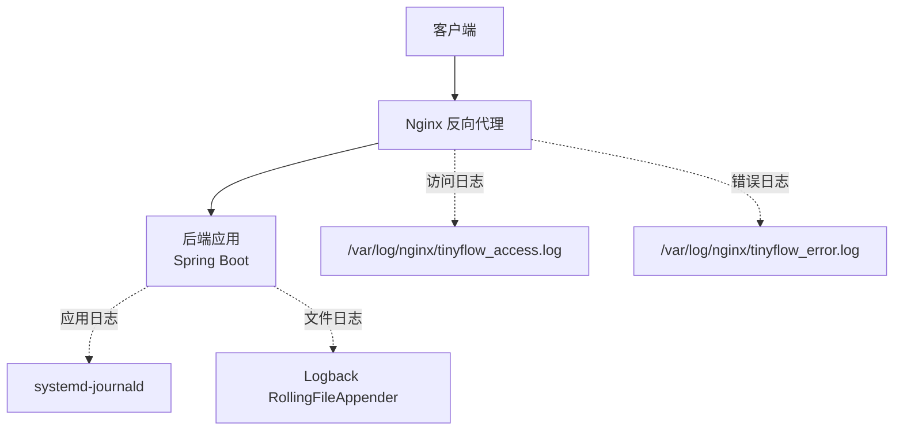
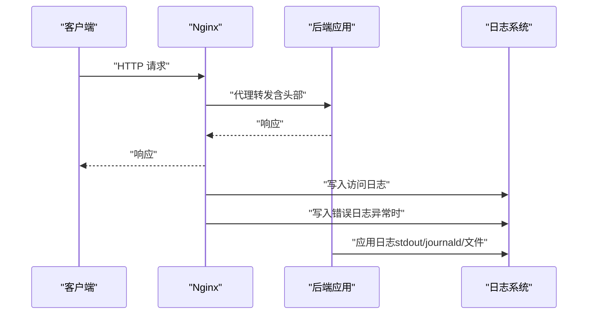
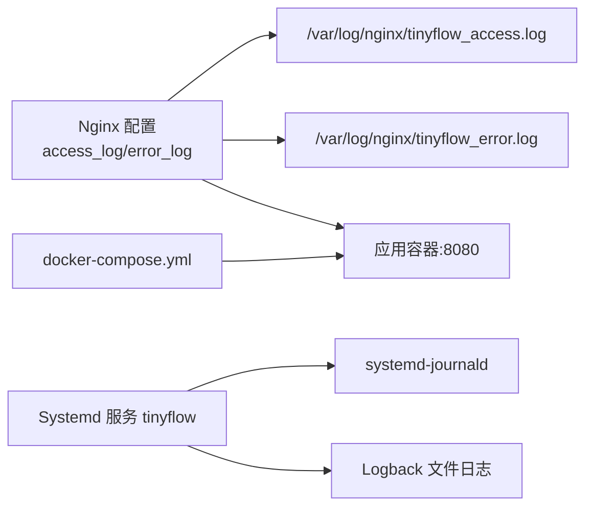

# Nginx 日志

<cite>
**本文引用的文件**
- [OPERATIONS.md](file://OPERATIONS.md)
- [DEPLOY_ALIYUN.md](file://DEPLOY_ALIYUN.md)
- [logback-spring.xml](file://src/main/resources/logback-spring.xml)
- [Dockerfile](file://Dockerfile)
- [docker-compose.yml](file://docker-compose.yml)
</cite>

## 目录
1. [简介](#简介)
2. [项目结构](#项目结构)
3. [核心组件](#核心组件)
4. [架构总览](#架构总览)
5. [详细组件分析](#详细组件分析)
6. [依赖关系分析](#依赖关系分析)
7. [性能考虑](#性能考虑)
8. [故障排查指南](#故障排查指南)
9. [结论](#结论)
10. [附录](#附录)

## 简介
本章节围绕 Nginx 访问日志与错误日志的查看方法展开，结合仓库中的运维文档与部署文档，系统性地说明日志位置、结构、常用查看命令、字段含义以及基于日志的流量分析、异常排查与安全审计实践，并给出日志轮转与存储优化建议，帮助运维人员快速定位问题、保障线上稳定运行。

## 项目结构
- Nginx 日志在部署文档中明确配置于 /var/log/nginx/ 目录下，分别对应访问日志与错误日志。
- 运维文档提供了实时查看与历史查询的常用命令，便于快速定位问题。
- 应用侧日志（后端）采用 systemd-journald 输出，可通过 journalctl 查看；同时应用内部也使用 Logback 输出到文件，便于配合 Nginx 日志进行联查。

图表来源
- [DEPLOY_ALIYUN.md](file://DEPLOY_ALIYUN.md#L390-L441)
- [OPERATIONS.md](file://OPERATIONS.md#L125-L158)
- [logback-spring.xml](file://src/main/resources/logback-spring.xml#L1-L102)

章节来源
- [DEPLOY_ALIYUN.md](file://DEPLOY_ALIYUN.md#L390-L441)
- [OPERATIONS.md](file://OPERATIONS.md#L125-L158)
- [logback-spring.xml](file://src/main/resources/logback-spring.xml#L1-L102)

## 核心组件
- Nginx 访问日志与错误日志
  - 访问日志：记录每个请求的基本信息，如客户端 IP、时间、请求行、状态码、响应字节数、用户代理等。
  - 错误日志：记录 Nginx 运行期的错误、警告与调试信息，便于定位配置问题、上游失败、权限错误等。
- 日志查看命令
  - 实时查看：tail -f /var/log/nginx/tinyflow_access.log 或 /var/log/nginx/tinyflow_error.log
  - 查看最近 N 条：tail -n 50 /var/log/nginx/tinyflow_access.log
  - 结合时间过滤：journalctl -u tinyflow --since "1 hour ago"（后端应用日志）
- 日志轮转与存储优化
  - 使用 logrotate 对 Nginx 日志进行按日轮转、压缩与保留策略配置，避免单文件过大导致磁盘压力。
  - 结合 systemd-journald 的磁盘占用清理能力，定期清理旧日志，防止磁盘被占满。

章节来源
- [OPERATIONS.md](file://OPERATIONS.md#L125-L158)
- [DEPLOY_ALIYUN.md](file://DEPLOY_ALIYUN.md#L943-L958)

## 架构总览
下图展示了 Nginx 作为入口网关，接收客户端请求并将请求转发至后端应用，同时产生访问与错误两类日志，供运维与安全审计使用。

图表来源
- [DEPLOY_ALIYUN.md](file://DEPLOY_ALIYUN.md#L390-L441)
- [OPERATIONS.md](file://OPERATIONS.md#L125-L158)
- [logback-spring.xml](file://src/main/resources/logback-spring.xml#L1-L102)

## 详细组件分析

### 访问日志与错误日志位置与结构
- 访问日志
  - 部署文档中明确配置了访问日志路径为 /var/log/nginx/tinyflow_access.log。
  - 运维文档提供了实时查看与查看最近 N 条的命令，便于快速定位热点请求与异常行为。
- 错误日志
  - 部署文档中明确配置了错误日志路径为 /var/log/nginx/tinyflow_error.log。
  - 运维文档提供了实时查看错误日志的命令，便于在出现 5xx、代理失败、上游不可达等问题时快速定位。
- 字段含义（基于典型 Nginx 访问日志格式）
  - 客户端 IP：发起请求的源地址。
  - 时间戳：请求到达的时间，通常包含时区信息。
  - 请求行：包含方法、URI、协议版本。
  - 状态码：HTTP 响应状态码（如 200、304、404、429、500 等）。
  - 响应字节：服务器发送给客户端的字节数。
  - 用户代理：客户端浏览器或爬虫标识。
  - 引导来源：请求来源页面（可选）。
  - 代理链：X-Forwarded-For 等代理头，体现真实客户端 IP。
  - 代理协议：X-Forwarded-Proto，区分 HTTP/HTTPS。
  - 延迟：请求处理耗时（可选，取决于日志格式）。

章节来源
- [DEPLOY_ALIYUN.md](file://DEPLOY_ALIYUN.md#L390-L441)
- [OPERATIONS.md](file://OPERATIONS.md#L125-L158)

### 常用查看命令与示例
- 实时查看访问日志
  - tail -f /var/log/nginx/tinyflow_access.log
- 实时查看错误日志
  - tail -f /var/log/nginx/tinyflow_error.log
- 查看最近 50 条访问记录
  - tail -n 50 /var/log/nginx/tinyflow_access.log
- 基于日志的流量分析与异常排查
  - 今日访问量统计
    - cat /var/log/nginx/tinyflow_access.log | grep "$(date +%d/%b/%Y)" | wc -l
  - 最频繁访问的 IP
    - cat /var/log/nginx/tinyflow_access.log | awk '{print $1}' | sort | uniq -c | sort -rn | head -10
  - 最常访问的 URL
    - cat /var/log/nginx/tinyflow_access.log | awk '{print $7}' | sort | uniq -c | sort -rn | head -10
- 后端应用日志联动
  - 实时查看后端应用日志
    - journalctl -u tinyflow -f
  - 查看最近 1 小时的应用日志
    - journalctl -u tinyflow --since "1 hour ago"

章节来源
- [OPERATIONS.md](file://OPERATIONS.md#L125-L158)
- [OPERATIONS.md](file://OPERATIONS.md#L637-L649)
- [OPERATIONS.md](file://OPERATIONS.md#L915-L941)

### 日志格式字段详解（面向运维与安全审计）
- 客户端 IP（$client_ip）
  - 用途：识别来源地域、封禁恶意 IP、统计活跃用户来源。
- 时间戳（$time_local 或 $time_iso8601）
  - 用途：定位事件发生时间，配合后端日志进行交叉比对。
- 请求行（$request）
  - 用途：识别请求方法、路径、协议版本，辅助发现异常路径与爬虫行为。
- 状态码（$status）
  - 用途：识别 4xx/5xx 异常，定位接口失败原因。
- 响应字节（$body_bytes_sent）
  - 用途：评估带宽消耗与接口体积，辅助容量规划。
- 用户代理（$http_user_agent）
  - 用途：识别浏览器、爬虫、自动化工具，辅助安全审计。
- 引导来源（$http_referer）
  - 用途：识别流量来源，辅助分析推广渠道与异常来源。
- 代理链（$http_x_forwarded_for）
  - 用途：在多级代理后仍能获取真实客户端 IP。
- 代理协议（$http_x_forwarded_proto）
  - 用途：区分 HTTPS/HTTP，辅助安全策略与重定向判断。

章节来源
- [DEPLOY_ALIYUN.md](file://DEPLOY_ALIYUN.md#L390-L441)
- [OPERATIONS.md](file://OPERATIONS.md#L125-L158)

### 日志轮转与存储优化策略
- Nginx 日志轮转
  - 使用 logrotate 对 /var/log/nginx/tinyflow*.log 进行每日轮转、压缩与保留，建议保留 7 天。
  - 配置要点：daily、rotate 7、compress、delaycompress、missingok、notifempty、create 0644 www-data www-data。
- systemd-journald 日志清理
  - 当应用日志过多时，可使用 journalctl --vacuum-time=7d 或 --vacuum-size=500M 清理旧日志，避免磁盘被占满。
- 存储优化建议
  - 将日志目录挂载到独立磁盘分区，避免与系统盘争用。
  - 对错误日志开启更细粒度的级别过滤，减少冗余信息。
  - 在容器化环境中，将日志输出到 stdout 并由容器运行时收集，结合集中式日志平台（如 ELK、Loki）统一管理。

章节来源
- [DEPLOY_ALIYUN.md](file://DEPLOY_ALIYUN.md#L943-L958)
- [OPERATIONS.md](file://OPERATIONS.md#L577-L590)

## 依赖关系分析
- Nginx 与后端应用
  - Nginx 作为反向代理，负责将请求转发至后端应用，应用日志与 Nginx 访问日志共同构成完整的请求链路视图。
- 日志系统
  - Nginx 日志写入文件系统，应用日志通过 systemd-journald 输出，同时应用内部也使用 Logback 输出到文件，三者协同支撑运维与审计。
- 容器化影响
  - 在容器编排中，应用容器暴露 8080 端口，Nginx 通过反向代理将外部请求转发至该端口；日志路径保持不变，便于统一管理。

图表来源
- [DEPLOY_ALIYUN.md](file://DEPLOY_ALIYUN.md#L390-L441)
- [logback-spring.xml](file://src/main/resources/logback-spring.xml#L1-L102)
- [docker-compose.yml](file://docker-compose.yml#L37-L60)

章节来源
- [DEPLOY_ALIYUN.md](file://DEPLOY_ALIYUN.md#L390-L441)
- [logback-spring.xml](file://src/main/resources/logback-spring.xml#L1-L102)
- [docker-compose.yml](file://docker-compose.yml#L37-L60)

## 性能考虑
- 日志写入开销
  - 访问日志量巨大，建议开启适当的日志轮转与压缩，避免单文件过大影响 IO。
- 日志级别与采样
  - 对错误日志采用更严格的级别过滤，减少噪声；对访问日志可按需裁剪字段，降低写入成本。
- 容器化日志采集
  - 在容器环境中，建议将日志输出到 stdout 并由运行时收集，结合集中式日志平台进行聚合与分析，减轻节点磁盘压力。

[本节为通用指导，无需引用具体文件]

## 故障排查指南
- 前端访问失败
  - 检查 Nginx 状态与配置测试，查看错误日志以定位代理失败、上游不可达等问题。
  - 参考命令：systemctl status nginx、nginx -t、tail -f /var/log/nginx/tinyflow_error.log。
- 后端服务异常
  - 通过 journalctl -u tinyflow -f 实时查看应用日志，结合访问日志中的状态码与路径定位问题。
- 数据库/缓存连接失败
  - 查看应用日志中的连接异常堆栈，结合 Nginx 错误日志中的上游超时或连接失败信息进行综合判断。
- 磁盘空间不足
  - 使用 journalctl --vacuum-time=7d 清理旧日志，必要时清空 Nginx 日志（echo > ...）以应急恢复，随后完善轮转策略。

章节来源
- [OPERATIONS.md](file://OPERATIONS.md#L161-L238)
- [OPERATIONS.md](file://OPERATIONS.md#L577-L590)

## 结论
通过规范化的日志位置与格式、完善的轮转与清理策略，以及基于访问日志与错误日志的联合分析，能够有效提升系统的可观测性与可维护性。结合后端应用日志与容器化日志采集，可形成覆盖全链路的运维闭环，为性能优化、安全审计与故障定位提供坚实支撑。

[本节为总结性内容，无需引用具体文件]

## 附录
- 快速命令速查
  - 实时查看 Nginx 访问日志：tail -f /var/log/nginx/tinyflow_access.log
  - 实时查看 Nginx 错误日志：tail -f /var/log/nginx/tinyflow_error.log
  - 查看最近 50 条访问记录：tail -n 50 /var/log/nginx/tinyflow_access.log
  - 实时查看后端应用日志：journalctl -u tinyflow -f
  - 清理旧日志（示例）：journalctl --vacuum-time=7d；echo > /var/log/nginx/tinyflow_access.log

章节来源
- [OPERATIONS.md](file://OPERATIONS.md#L685-L711)
- [DEPLOY_ALIYUN.md](file://DEPLOY_ALIYUN.md#L915-L941)
- [DEPLOY_ALIYUN.md](file://DEPLOY_ALIYUN.md#L943-L958)