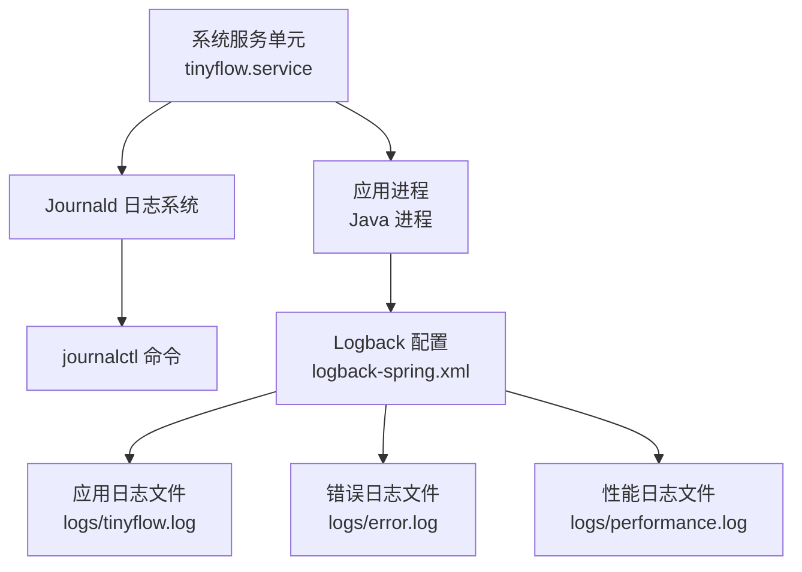
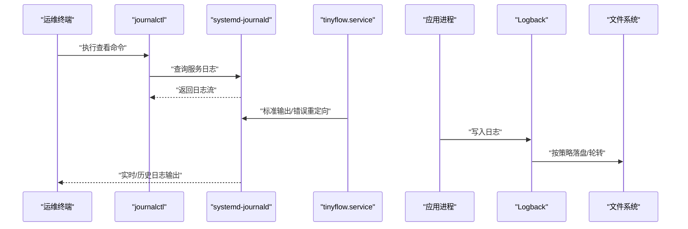
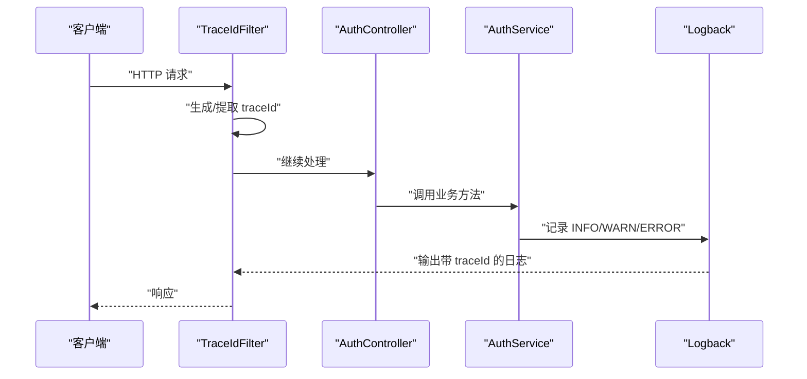
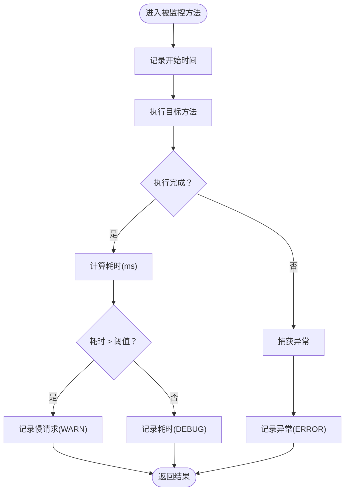
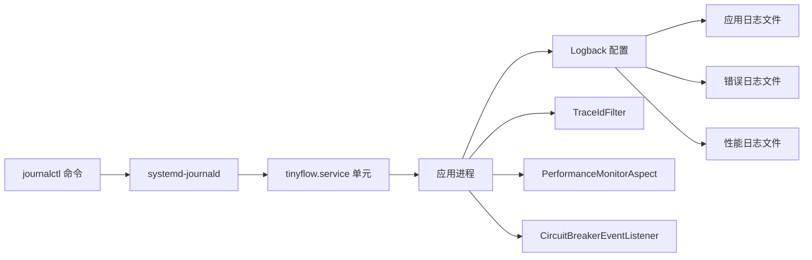

# 后端应用日志

<cite>
**本文引用的文件**
- [OPERATIONS.md](file://OPERATIONS.md)
- [logback-spring.xml](file://src/main/resources/logback-spring.xml)
- [application.yml](file://src/main/resources/application.yml)
- [TraceIdFilter.java](file://src/main/java/com/layor/tinyflow/filter/TraceIdFilter.java)
- [PerformanceMonitorAspect.java](file://src/main/java/com/layor/tinyflow/aspect/PerformanceMonitorAspect.java)
- [CircuitBreakerEventListener.java](file://src/main/java/com/layor/tinyflow/listener/CircuitBreakerEventListener.java)
- [AuthController.java](file://src/main/java/com/layor/tinyflow/Controller/AuthController.java)
- [AuthService.java](file://src/main/java/com/layor/tinyflow/service/AuthService.java)
</cite>

## 目录
1. [简介](#简介)
2. [项目结构](#项目结构)
3. [核心组件](#核心组件)
4. [架构总览](#架构总览)
5. [详细组件分析](#详细组件分析)
6. [依赖关系分析](#依赖关系分析)
7. [性能与日志轮转](#性能与日志轮转)
8. [故障排查指南](#故障排查指南)
9. [结论](#结论)

## 简介
本章节面向运维与开发人员，基于仓库中的运维文档与日志配置，系统性说明如何使用 journalctl 查看 TinyFlow 后端应用日志，涵盖实时查看、近时段检索、错误过滤、特定功能日志检索等场景；同时解释日志级别、常见日志格式与关键字段含义，并提供实际问题排查示例与日志轮转最佳实践。

## 项目结构
- 日志查看与运维命令主要在运维文档中给出，后端应用通过 Logback 输出到本地文件与 systemd-journald（systemd 单元文件将标准输出/错误重定向至 journald）。
- 日志格式与轮转策略由 Logback 配置文件定义，包含按天滚动、最大历史与总大小限制、独立错误日志文件等。
- 应用层通过注解与切面记录关键业务日志，如用户注册/登录、慢请求、熔断器状态变化等。

图表来源
- [OPERATIONS.md](file://OPERATIONS.md#L125-L144)
- [logback-spring.xml](file://src/main/resources/logback-spring.xml#L1-L102)

章节来源
- [OPERATIONS.md](file://OPERATIONS.md#L125-L144)
- [logback-spring.xml](file://src/main/resources/logback-spring.xml#L1-L102)

## 核心组件
- 日志查看命令
  - 实时查看：journalctl -u tinyflow -f
  - 最近100行：journalctl -u tinyflow -n 100 --no-pager
  - 最近1小时：journalctl -u tinyflow --since "1 hour ago"
  - 错误日志：journalctl -u tinyflow --since today | grep -i error
  - 特定功能日志：journalctl -u tinyflow --since "10 minutes ago" | grep "用户注册"
- 日志级别与格式
  - 日志级别：INFO/WARN/ERROR/DEBUG（生产默认 INFO，开发默认 DEBUG）
  - 日志格式：时间戳、线程名、链路追踪标识、日志级别、Logger 名称、消息
  - 关键字段：
    - 时间戳：精确到毫秒
    - 线程名：便于定位并发问题
    - 链路追踪标识：traceId/spanId，用于跨服务串联请求
    - 日志级别：区分正常、警告、错误、调试
    - Logger 名称：定位具体类或模块
    - 消息：业务语义化描述
- 日志轮转与存储
  - 应用日志按天滚动，保留历史天数与总大小上限
  - 错误日志独立文件，保留更长历史
  - 性能日志独立文件，仅保留短期历史
- 链路追踪
  - 请求进入时注入 traceId，贯穿整个请求生命周期，便于跨组件关联
- 性能监控
  - 切面记录慢请求与异常，写入性能日志文件
- 熔断器事件
  - 熔断状态变化、错误与成功事件统一记录，便于观测系统健康度

章节来源
- [OPERATIONS.md](file://OPERATIONS.md#L125-L144)
- [logback-spring.xml](file://src/main/resources/logback-spring.xml#L1-L102)
- [TraceIdFilter.java](file://src/main/java/com/layor/tinyflow/filter/TraceIdFilter.java#L1-L55)
- [PerformanceMonitorAspect.java](file://src/main/java/com/layor/tinyflow/aspect/PerformanceMonitorAspect.java#L1-L64)
- [CircuitBreakerEventListener.java](file://src/main/java/com/layor/tinyflow/listener/CircuitBreakerEventListener.java#L1-L58)

## 架构总览
下图展示从 systemd 单元到 journald、再到日志查看命令的完整路径，以及应用侧日志输出与轮转策略。

图表来源
- [OPERATIONS.md](file://OPERATIONS.md#L125-L144)
- [logback-spring.xml](file://src/main/resources/logback-spring.xml#L1-L102)

## 详细组件分析

### 日志查看命令与检索
- 实时查看
  - 命令：journalctl -u tinyflow -f
  - 适用：观察线上突发问题、接口调用链路
- 最近100行
  - 命令：journalctl -u tinyflow -n 100 --no-pager
  - 适用：快速回溯最近事件，避免分页干扰
- 最近1小时
  - 命令：journalctl -u tinyflow --since "1 hour ago"
  - 适用：定位时段性异常、限流/熔断影响范围
- 错误日志过滤
  - 命令：journalctl -u tinyflow --since today | grep -i error
  - 适用：集中排查异常与告警
- 特定功能日志
  - 命令：journalctl -u tinyflow --since "10 minutes ago" | grep "用户注册"
  - 适用：验证业务流程（如注册/登录）是否按预期执行

章节来源
- [OPERATIONS.md](file://OPERATIONS.md#L125-L144)

### 日志级别与格式
- 日志级别
  - INFO：常规业务事件（如注册/登录成功）
  - WARN：参数校验失败、认证失败等非致命问题
  - ERROR：异常、熔断器告警等严重问题
  - DEBUG：性能监控切面的细粒度耗时记录
- 日志格式字段
  - 时间戳：yyyy-MM-dd HH:mm:ss.SSS
  - 线程名：便于并发定位
  - 链路追踪标识：traceId/spanId
  - 日志级别：INFO/WARN/ERROR/DEBUG
  - Logger 名称：类/模块名
  - 消息：业务语义化描述
- 生产与开发环境差异
  - 生产默认 INFO，减少冗余输出
  - 开发默认 DEBUG，便于问题定位

章节来源
- [logback-spring.xml](file://src/main/resources/logback-spring.xml#L1-L102)
- [application.yml](file://src/main/resources/application.yml#L1-L218)

### 链路追踪与日志关联
- 请求进入时注入 traceId，贯穿整个请求生命周期，便于跨组件串联
- 日志格式中包含 traceId/spanId，结合业务日志可快速定位一次请求的全链路行为

图表来源
- [TraceIdFilter.java](file://src/main/java/com/layor/tinyflow/filter/TraceIdFilter.java#L1-L55)
- [AuthController.java](file://src/main/java/com/layor/tinyflow/Controller/AuthController.java#L1-L173)
- [AuthService.java](file://src/main/java/com/layor/tinyflow/service/AuthService.java#L1-L141)
- [logback-spring.xml](file://src/main/resources/logback-spring.xml#L1-L102)

章节来源
- [TraceIdFilter.java](file://src/main/java/com/layor/tinyflow/filter/TraceIdFilter.java#L1-L55)
- [AuthController.java](file://src/main/java/com/layor/tinyflow/Controller/AuthController.java#L1-L173)
- [AuthService.java](file://src/main/java/com/layor/tinyflow/service/AuthService.java#L1-L141)
- [logback-spring.xml](file://src/main/resources/logback-spring.xml#L1-L102)

### 性能监控与慢请求日志
- 切面监控 Controller/Service 方法，超过阈值（毫秒级）记录慢请求
- 正常耗时记录为 DEBUG，异常记录为 ERROR，便于区分性能与错误两类问题

图表来源
- [PerformanceMonitorAspect.java](file://src/main/java/com/layor/tinyflow/aspect/PerformanceMonitorAspect.java#L1-L64)

章节来源
- [PerformanceMonitorAspect.java](file://src/main/java/com/layor/tinyflow/aspect/PerformanceMonitorAspect.java#L1-L64)

### 熔断器事件日志
- 熔断状态变化、错误与成功事件统一记录
- OPEN 时输出告警级别日志，CLOSED 时输出恢复级别日志，便于观测系统健康度

章节来源
- [CircuitBreakerEventListener.java](file://src/main/java/com/layor/tinyflow/listener/CircuitBreakerEventListener.java#L1-L58)

### 业务日志示例（注册/登录）
- 注册/登录接口在参数校验失败、认证失败、异常等情况分别记录不同级别日志
- 可通过关键字检索“用户注册”“用户登录”等语义化日志，快速定位业务行为

章节来源
- [AuthController.java](file://src/main/java/com/layor/tinyflow/Controller/AuthController.java#L1-L173)
- [AuthService.java](file://src/main/java/com/layor/tinyflow/service/AuthService.java#L1-L141)

## 依赖关系分析
- 日志输出依赖 Logback 配置，决定日志级别、格式与落盘策略
- systemd 单元将应用标准输出/错误重定向至 journald，journalctl 作为查询入口
- 链路追踪通过过滤器注入 traceId，贯穿应用日志
- 性能监控与熔断器事件分别通过切面与监听器产生专用日志

图表来源
- [OPERATIONS.md](file://OPERATIONS.md#L125-L144)
- [logback-spring.xml](file://src/main/resources/logback-spring.xml#L1-L102)
- [TraceIdFilter.java](file://src/main/java/com/layor/tinyflow/filter/TraceIdFilter.java#L1-L55)
- [PerformanceMonitorAspect.java](file://src/main/java/com/layor/tinyflow/aspect/PerformanceMonitorAspect.java#L1-L64)
- [CircuitBreakerEventListener.java](file://src/main/java/com/layor/tinyflow/listener/CircuitBreakerEventListener.java#L1-L58)

章节来源
- [OPERATIONS.md](file://OPERATIONS.md#L125-L144)
- [logback-spring.xml](file://src/main/resources/logback-spring.xml#L1-L102)
- [TraceIdFilter.java](file://src/main/java/com/layor/tinyflow/filter/TraceIdFilter.java#L1-L55)
- [PerformanceMonitorAspect.java](file://src/main/java/com/layor/tinyflow/aspect/PerformanceMonitorAspect.java#L1-L64)
- [CircuitBreakerEventListener.java](file://src/main/java/com/layor/tinyflow/listener/CircuitBreakerEventListener.java#L1-L58)

## 性能与日志轮转
- 日志轮转策略
  - 应用日志：按天滚动，保留一定历史天数与总大小上限
  - 错误日志：独立文件，保留更长历史，便于长期问题追踪
  - 性能日志：独立文件，短期滚动，聚焦慢请求与异常
- 大日志文件处理建议
  - 使用 --since 限定时间范围，减少扫描量
  - 使用 -n 限制输出行数，避免一次性输出过多
  - 使用 --no-pager 避免分页器带来的额外开销
  - 对于错误日志，先筛选日期再过滤关键字，提高效率
- 磁盘空间管理
  - 定期清理旧日志，避免磁盘占满
  - 结合 systemd-journald 的磁盘用量与清理命令，保持系统稳定

章节来源
- [logback-spring.xml](file://src/main/resources/logback-spring.xml#L1-L102)
- [OPERATIONS.md](file://OPERATIONS.md#L577-L589)
- [OPERATIONS.md](file://OPERATIONS.md#L610-L622)

## 故障排查指南
- 服务无法启动
  - 查看最近若干行日志，定位初始化异常
  - 检查端口占用与配置文件
  - 直接运行 jar 包验证
- 数据库连接失败
  - 检查数据库服务状态与连接测试
  - 查看数据库错误日志
  - 校验用户权限
- Redis 连接失败
  - 检查 Redis 服务状态与连接
  - 查看 Redis 日志与配置
- 前端访问失败
  - 检查 Nginx 状态与配置
  - 查看 Nginx 错误日志
  - 测试后端 API

章节来源
- [OPERATIONS.md](file://OPERATIONS.md#L163-L237)

## 结论
通过 systemd-journald 与 journalctl，可以高效地查看与检索 TinyFlow 后端应用日志。结合 Logback 的日志级别、格式与轮转策略，以及链路追踪、性能监控与熔断器事件日志，能够快速定位问题、评估性能并保障系统稳定性。建议在日常运维中遵循“限定时间范围 + 关键字过滤 + 分级查看”的原则，配合定期清理与容量监控，确保日志系统的可持续运行。