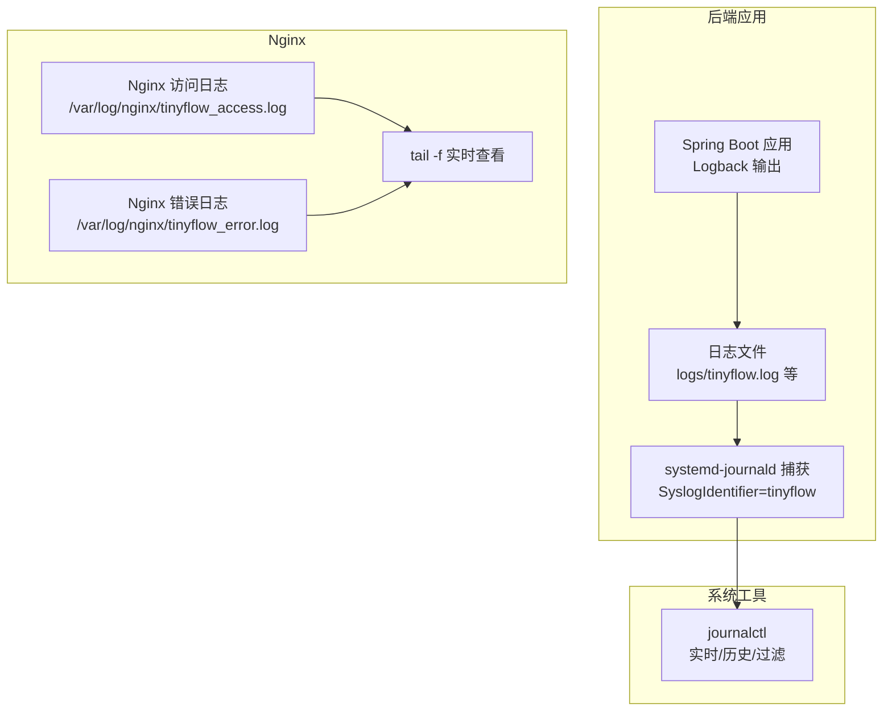
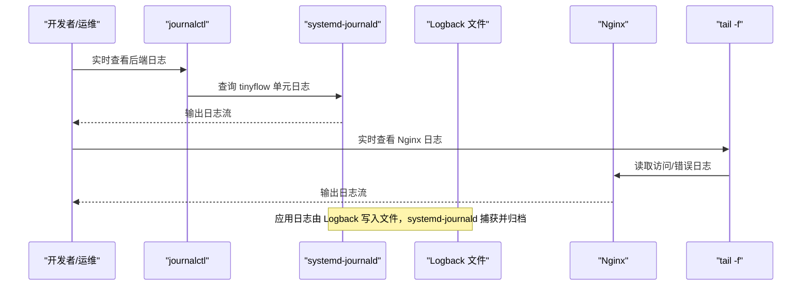
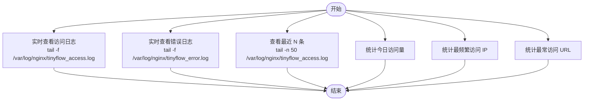
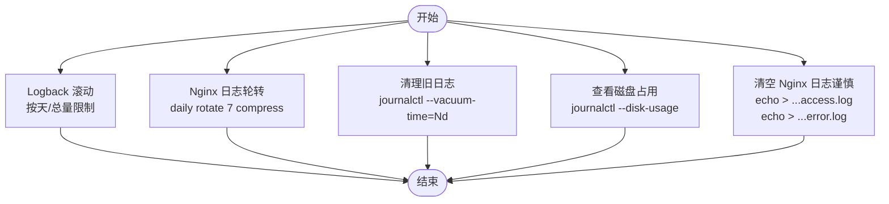
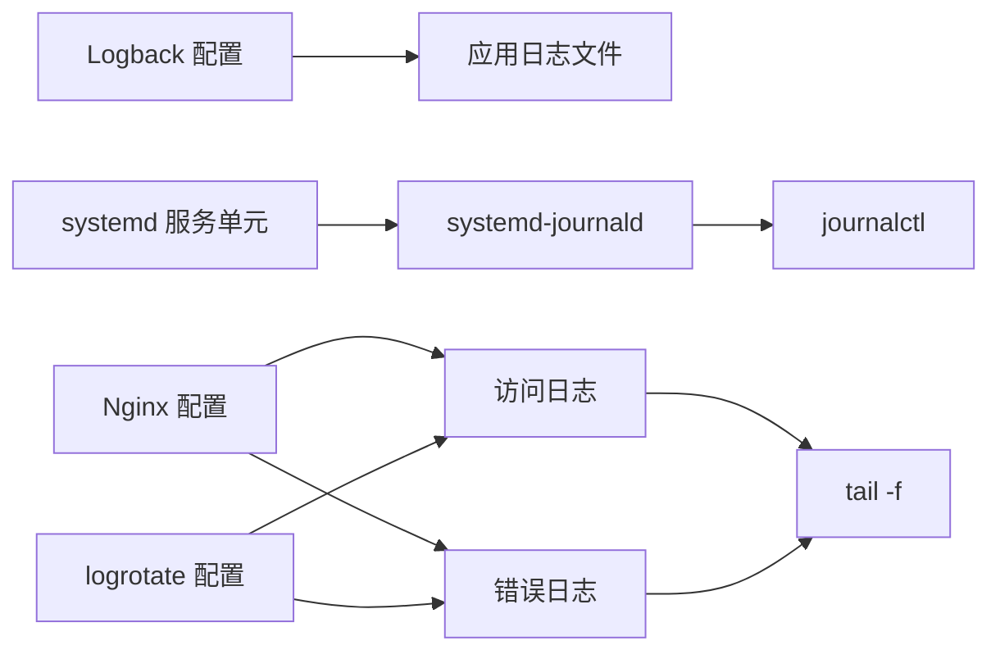

# 日志查看

<cite>
**本文引用的文件**
- [OPERATIONS.md](file://OPERATIONS.md)
- [DEPLOY_ALIYUN.md](file://DEPLOY_ALIYUN.md)
- [logback-spring.xml](file://src/main/resources/logback-spring.xml)
- [application.yml](file://src/main/resources/application.yml)
- [tinyflow.service](file://DEPLOY_ALIYUN.md#L460-L488)
</cite>

## 目录
1. [简介](#简介)
2. [项目结构](#项目结构)
3. [核心组件](#核心组件)
4. [架构总览](#架构总览)
5. [详细组件分析](#详细组件分析)
6. [依赖关系分析](#依赖关系分析)
7. [性能注意事项](#性能注意事项)
8. [故障排查指南](#故障排查指南)
9. [结论](#结论)
10. [附录](#附录)

## 简介
本章节围绕后端应用日志与 Nginx 日志的查看方法展开，结合仓库中的运维文档与日志配置文件，系统性地给出：
- 使用 systemd-journald 记录与查看后端应用日志的方法（包括实时查看、时间段筛选、关键词过滤、错误日志统计等）
- Nginx 访问日志与错误日志的位置、查看方式与常用分析命令
- 日志轮转机制与大日志文件处理的最佳实践

## 项目结构
- 后端应用日志由 Spring Boot 通过 Logback 输出至文件，并由 systemd-journald 捕获写入 journald，便于统一使用 journalctl 查看
- Nginx 将访问与错误日志分别输出到独立文件，便于分离分析
- 运维文档中提供了日志查看、轮转与清理的完整命令与流程



图表来源
- [logback-spring.xml](file://src/main/resources/logback-spring.xml#L1-L102)
- [tinyflow.service](file://DEPLOY_ALIYUN.md#L460-L488)
- [DEPLOY_ALIYUN.md](file://DEPLOY_ALIYUN.md#L400-L441)

章节来源
- [logback-spring.xml](file://src/main/resources/logback-spring.xml#L1-L102)
- [DEPLOY_ALIYUN.md](file://DEPLOY_ALIYUN.md#L400-L441)
- [OPERATIONS.md](file://OPERATIONS.md#L125-L158)

## 核心组件
- 后端应用日志（Spring Boot + Logback）
  - 日志输出位置与滚动策略由 Logback 配置决定
  - systemd-journald 捕获标准输出与标准错误，SyslogIdentifier 为 tinyflow，便于通过 journalctl 统一查看
- Nginx 日志
  - 访问日志与错误日志分别输出到独立文件，便于实时跟踪与分析
- 运维命令
  - journalctl 用于后端日志的实时查看、时间段筛选、关键词过滤
  - tail -f 用于 Nginx 日志的实时查看
  - 日志轮转通过 logrotate 配置实现

章节来源
- [logback-spring.xml](file://src/main/resources/logback-spring.xml#L1-L102)
- [DEPLOY_ALIYUN.md](file://DEPLOY_ALIYUN.md#L400-L441)
- [OPERATIONS.md](file://OPERATIONS.md#L125-L158)

## 架构总览
下图展示了从应用到日志系统的整体链路，以及运维人员常用的查看与分析路径。



图表来源
- [tinyflow.service](file://DEPLOY_ALIYUN.md#L460-L488)
- [logback-spring.xml](file://src/main/resources/logback-spring.xml#L1-L102)
- [DEPLOY_ALIYUN.md](file://DEPLOY_ALIYUN.md#L400-L441)
- [OPERATIONS.md](file://OPERATIONS.md#L125-L158)

## 详细组件分析

### 后端应用日志（Spring Boot + Logback + journald）
- 日志输出与滚动
  - Logback 将日志输出到 logs 目录下的主日志文件，并按天滚动；同时提供独立的错误日志与性能日志滚动策略
  - 生产环境 profile 下，根日志级别为 INFO，控制台输出关闭，仅落盘
- systemd-journald 捕获
  - systemd 服务单元将 StandardOutput 与 StandardError 指向 journald，并设置 SyslogIdentifier 为 tinyflow
  - 因此可通过 journalctl -u tinyflow 统一查看后端日志
- 常用查看命令
  - 实时查看：journalctl -u tinyflow -f
  - 最近 N 行：journalctl -u tinyflow -n N --no-pager
  - 时间段过滤：journalctl -u tinyflow --since "1 hour ago"
  - 错误日志筛选：journalctl -u tinyflow --since today | grep -i error
  - 关键词过滤：journalctl -u tinyflow --since "10 minutes ago" | grep "功能关键词"

```mermaid
flowchart TD
Start(["开始"]) --> Realtime["实时查看<br/>journalctl -u tinyflow -f"]
Start --> LastN["最近 N 行<br/>journalctl -u tinyflow -n 100 --no-pager"]
Start --> Since["时间段过滤<br/>--since \"1 hour ago\""]
Start --> ErrorOnly["错误日志筛选<br/>--since today | grep -i error"]
Start --> Keyword["关键词过滤<br/>--since \"10 minutes ago\" | grep \"功能关键词\""]
Realtime --> End(["结束"])
LastN --> End
Since --> End
ErrorOnly --> End
Keyword --> End
```

图表来源
- [OPERATIONS.md](file://OPERATIONS.md#L125-L145)
- [logback-spring.xml](file://src/main/resources/logback-spring.xml#L1-L102)
- [tinyflow.service](file://DEPLOY_ALIYUN.md#L460-L488)

章节来源
- [logback-spring.xml](file://src/main/resources/logback-spring.xml#L1-L102)
- [DEPLOY_ALIYUN.md](file://DEPLOY_ALIYUN.md#L460-L488)
- [OPERATIONS.md](file://OPERATIONS.md#L125-L145)

### Nginx 日志（访问日志与错误日志）
- 日志位置与输出
  - 访问日志：/var/log/nginx/tinyflow_access.log
  - 错误日志：/var/log/nginx/tinyflow_error.log
- 常用查看命令
  - 实时查看访问日志：tail -f /var/log/nginx/tinyflow_access.log
  - 实时查看错误日志：tail -f /var/log/nginx/tinyflow_error.log
  - 查看最近 N 条记录：tail -n 50 /var/log/nginx/tinyflow_access.log
- 常用分析命令
  - 统计今日访问量：cat /var/log/nginx/tinyflow_access.log | grep "$(date +%d/%b/%Y)" | wc -l
  - 统计最频繁访问的 IP：cat /var/log/nginx/tinyflow_access.log | awk '{print $1}' | sort | uniq -c | sort -rn | head -10
  - 统计最常访问的 URL：cat /var/log/nginx/tinyflow_access.log | awk '{print $7}' | sort | uniq -c | sort -rn | head -10



图表来源
- [DEPLOY_ALIYUN.md](file://DEPLOY_ALIYUN.md#L400-L441)
- [OPERATIONS.md](file://OPERATIONS.md#L146-L158)

章节来源
- [DEPLOY_ALIYUN.md](file://DEPLOY_ALIYUN.md#L400-L441)
- [OPERATIONS.md](file://OPERATIONS.md#L146-L158)

### 日志轮转与大日志文件处理最佳实践
- 后端应用日志轮转（Logback）
  - 主日志按天滚动，保留一定历史天数并限制总大小
  - 错误日志独立滚动，保留更长历史天数
  - 性能日志独立滚动，保留较短历史天数
- Nginx 日志轮转（logrotate）
  - 每日轮转，保留固定数量的归档文件，压缩旧文件
  - 通过 logrotate.d 配置实现自动化
- 清理与维护
  - 清理旧日志（保留最近 N 天）：journalctl --vacuum-time=Nd
  - 查看日志占用空间：journalctl --disk-usage
  - 清理 Nginx 日志（谨慎操作）：echo > /var/log/nginx/tinyflow_access.log 与 echo > /var/log/nginx/tinyflow_error.log



图表来源
- [logback-spring.xml](file://src/main/resources/logback-spring.xml#L1-L102)
- [DEPLOY_ALIYUN.md](file://DEPLOY_ALIYUN.md#L944-L960)
- [OPERATIONS.md](file://OPERATIONS.md#L577-L590)

章节来源
- [logback-spring.xml](file://src/main/resources/logback-spring.xml#L1-L102)
- [DEPLOY_ALIYUN.md](file://DEPLOY_ALIYUN.md#L944-L960)
- [OPERATIONS.md](file://OPERATIONS.md#L577-L590)

## 依赖关系分析
- 后端应用日志链路
  - 应用层：Logback 输出到文件
  - 系统层：systemd-journald 捕获并归档
  - 运维层：journalctl 提供统一查询与过滤能力
- Nginx 日志链路
  - Nginx 写入访问与错误日志文件
  - tail -f 实时查看
  - logrotate 定期轮转



图表来源
- [logback-spring.xml](file://src/main/resources/logback-spring.xml#L1-L102)
- [tinyflow.service](file://DEPLOY_ALIYUN.md#L460-L488)
- [DEPLOY_ALIYUN.md](file://DEPLOY_ALIYUN.md#L400-L441)
- [DEPLOY_ALIYUN.md](file://DEPLOY_ALIYUN.md#L944-L960)

章节来源
- [logback-spring.xml](file://src/main/resources/logback-spring.xml#L1-L102)
- [DEPLOY_ALIYUN.md](file://DEPLOY_ALIYUN.md#L400-L441)
- [DEPLOY_ALIYUN.md](file://DEPLOY_ALIYUN.md#L944-L960)
- [tinyflow.service](file://DEPLOY_ALIYUN.md#L460-L488)

## 性能注意事项
- 后端日志滚动策略已在 Logback 中配置，避免单文件无限增长
- Nginx 日志轮转通过 logrotate 实现，减少磁盘压力
- 使用 journalctl 的时间段与关键词过滤，避免一次性读取过大的日志集
- 对于高频访问的 Nginx 日志，建议配合 logrotate 与定期清理策略

## 故障排查指南
- 后端服务无法启动
  - 查看最近日志：journalctl -u tinyflow -n 50 --no-pager
  - 检查端口占用：netstat -tlnp | grep 8080
  - 检查服务配置：cat /etc/systemd/system/tinyflow.service
  - 直接运行 jar 包验证：java -jar /opt/tinyflow/app.jar
- Nginx 前端访问失败
  - 检查 Nginx 状态与配置：systemctl status nginx；nginx -t
  - 查看 Nginx 错误日志：tail -f /var/log/nginx/tinyflow_error.log
  - 测试后端 API：curl http://localhost:8080/api/auth/login
- 数据库/Redis 连接失败
  - 检查对应服务状态与连接：systemctl status mysql|redis；redis-cli -a ... ping
  - 查看对应日志：journalctl -u redis -n 50 或 tail -f /var/log/mysql/error.log

章节来源
- [OPERATIONS.md](file://OPERATIONS.md#L161-L238)
- [DEPLOY_ALIYUN.md](file://DEPLOY_ALIYUN.md#L920-L941)
- [DEPLOY_ALIYUN.md](file://DEPLOY_ALIYUN.md#L1057-L1074)

## 结论
- 后端日志通过 systemd-journald 统一采集，journalctl 是最便捷的查看与过滤工具
- Nginx 日志采用独立文件输出，tail -f 与 logrotate 是日常运维的核心手段
- Logback 的滚动策略与 logrotate 的轮转配置共同保障了日志文件的可控规模
- 建议在生产环境中结合时间段与关键词过滤，配合 logrotate 与定期清理，确保日志可追溯且不影响系统性能

## 附录
- 快速命令速查
  - 后端实时日志：journalctl -u tinyflow -f
  - Nginx 访问日志实时查看：tail -f /var/log/nginx/tinyflow_access.log
  - Nginx 错误日志实时查看：tail -f /var/log/nginx/tinyflow_error.log
  - 统计今日访问量：cat /var/log/nginx/tinyflow_access.log | grep "$(date +%d/%b/%Y)" | wc -l
  - 清理旧日志（journalctl）：journalctl --vacuum-time=7d
  - 清理 Nginx 日志（谨慎）：echo > /var/log/nginx/tinyflow_access.log 与 echo > /var/log/nginx/tinyflow_error.log

章节来源
- [OPERATIONS.md](file://OPERATIONS.md#L685-L715)
- [DEPLOY_ALIYUN.md](file://DEPLOY_ALIYUN.md#L915-L941)
- [DEPLOY_ALIYUN.md](file://DEPLOY_ALIYUN.md#L944-L960)
- [DEPLOY_ALIYUN.md](file://DEPLOY_ALIYUN.md#L1133-L1143)