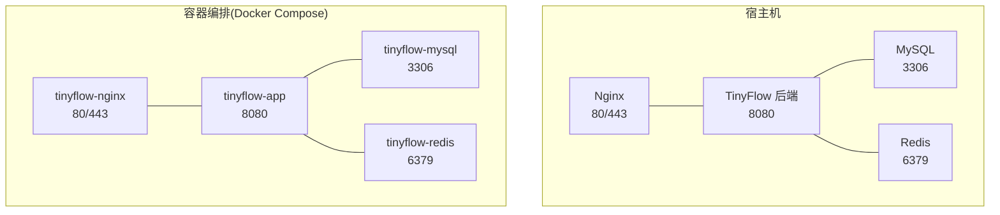
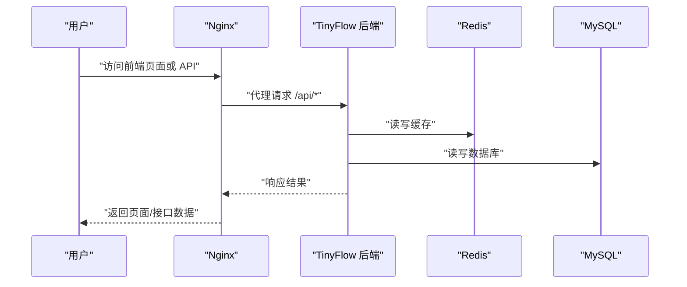
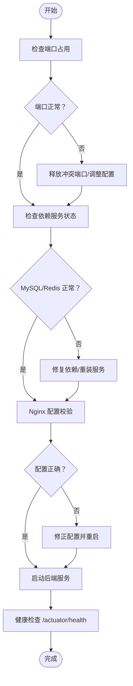

# 服务管理

<cite>
**本文引用的文件**
- [OPERATIONS.md](file://OPERATIONS.md)
- [DEPLOY_ALIYUN.md](file://DEPLOY_ALIYUN.md)
- [deploy.sh](file://deploy.sh)
- [Dockerfile](file://Dockerfile)
- [docker-compose.yml](file://docker-compose.yml)
- [application.yml](file://src/main/resources/application.yml)
- [TinyFlowApplication.java](file://src/main/java/com/layor/tinyflow/TinyFlowApplication.java)
</cite>

## 目录
1. [简介](#简介)
2. [项目结构](#项目结构)
3. [核心组件](#核心组件)
4. [架构总览](#架构总览)
5. [详细组件分析](#详细组件分析)
6. [依赖分析](#依赖分析)
7. [性能考虑](#性能考虑)
8. [故障排查指南](#故障排查指南)
9. [结论](#结论)
10. [附录](#附录)

## 简介
本章节围绕 TinyFlow 的后端服务、Nginx、MySQL、Redis 的运维管理展开，基于仓库中的运维与部署文档，系统性地给出启动、停止、重启、查看状态等命令及使用场景，并补充服务单元文件位置、开机自启设置、执行前检查项（端口占用、依赖服务状态）等内容，帮助读者在生产环境中稳定地管理这些服务。

## 项目结构
- 后端服务：Spring Boot 应用，监听 8080 端口，通过 Systemd 管理。
- 反向代理：Nginx，负责静态资源与 API 代理。
- 数据库：MySQL，提供持久化存储。
- 缓存：Redis，提供高性能读写与会话/计数等缓存能力。
- 部署方式：既支持 Systemd 单机部署，也支持 Docker Compose 多容器编排。

图表来源
- [docker-compose.yml](file://docker-compose.yml#L1-L67)
- [Dockerfile](file://Dockerfile#L1-L7)
- [DEPLOY_ALIYUN.md](file://DEPLOY_ALIYUN.md#L457-L501)

章节来源
- [DEPLOY_ALIYUN.md](file://DEPLOY_ALIYUN.md#L457-L501)
- [docker-compose.yml](file://docker-compose.yml#L1-L67)

## 核心组件
- 后端服务（TinyFlow）：Systemd 管理，开机自启，日志输出到 systemd journal。
- Nginx：反向代理与静态资源服务，配置位于 sites-available，启用于 sites-enabled。
- MySQL：关系型数据库，提供应用数据持久化。
- Redis：键值缓存，支持密码认证，持久化配置见容器命令。

章节来源
- [OPERATIONS.md](file://OPERATIONS.md#L47-L122)
- [DEPLOY_ALIYUN.md](file://DEPLOY_ALIYUN.md#L457-L501)
- [docker-compose.yml](file://docker-compose.yml#L1-L67)

## 架构总览
下图展示了服务间的依赖与交互关系，便于理解服务启动顺序与健康检查路径。

图表来源
- [DEPLOY_ALIYUN.md](file://DEPLOY_ALIYUN.md#L388-L456)
- [application.yml](file://src/main/resources/application.yml#L1-L120)

## 详细组件分析

### 后端服务（TinyFlow）
- 管理命令
  - 启动：systemctl start tinyflow
  - 停止：systemctl stop tinyflow
  - 重启：systemctl restart tinyflow
  - 查看状态：systemctl status tinyflow
  - 开机自启：systemctl enable tinyflow
- 作用与使用场景
  - 作为 Spring Boot 应用，承载短链生成、统计、鉴权等业务逻辑。
  - 通过 Systemd 管理，具备自动重启与日志采集能力。
- 实际操作示例
  - 查看状态：systemctl status tinyflow
  - 实时日志：journalctl -u tinyflow -f
  - 重启服务：systemctl restart tinyflow
- 开机自启设置
  - 已在 Systemd 服务文件中配置，可通过 systemctl enable tinyflow 设置开机自启。
- 服务单元文件位置与修改
  - 位置：/etc/systemd/system/tinyflow.service
  - 修改要点：ExecStart 参数（JVM 内存、Spring Profile）、依赖服务 After、重启策略 RestartSec 等。
- 执行前检查项
  - 端口占用：netstat -tlnp | grep 8080
  - 依赖服务状态：systemctl status mysql、systemctl status redis
  - 直接运行验证：cd /opt/tinyflow && java -jar app.jar
  - 资源检查：free -h、df -h

章节来源
- [OPERATIONS.md](file://OPERATIONS.md#L47-L122)
- [DEPLOY_ALIYUN.md](file://DEPLOY_ALIYUN.md#L457-L501)
- [deploy.sh](file://deploy.sh#L429-L467)

### Nginx 服务
- 管理命令
  - 启动：systemctl start nginx
  - 重启：systemctl restart nginx
  - 配置校验：nginx -t
  - 查看状态：systemctl status nginx
- 作用与使用场景
  - 提供静态资源托管与反向代理，将 /api 请求转发至后端 8080 端口。
- 实际操作示例
  - 配置校验：nginx -t
  - 重启生效：systemctl restart nginx
  - 查看状态：systemctl status nginx
- 配置位置与修改
  - 站点配置：/etc/nginx/sites-available/tinyflow
  - 启用站点：ln -s /etc/nginx/sites-available/tinyflow /etc/nginx/sites-enabled/
  - 删除默认站点：rm -f /etc/nginx/sites-enabled/default
- 执行前检查项
  - 端口占用：netstat -tlnp | grep 80
  - 配置语法：nginx -t
  - 前端构建产物：ls -lh /opt/TinyFlow/web/dist/

章节来源
- [OPERATIONS.md](file://OPERATIONS.md#L68-L101)
- [DEPLOY_ALIYUN.md](file://DEPLOY_ALIYUN.md#L388-L456)

### MySQL 服务
- 管理命令
  - 重启：systemctl restart mysql
  - 查看状态：systemctl status mysql
  - 登录数据库：mysql -u root -p；登录应用库：mysql -u tinyflow -p tiny-flow
- 作用与使用场景
  - 存储用户、短链、统计数据等关系型数据。
- 实际操作示例
  - 登录应用库：mysql -u tinyflow -p tiny-flow
  - 查看状态：systemctl status mysql
- 执行前检查项
  - 端口占用：netstat -tlnp | grep 3306
  - 数据库权限：SHOW GRANTS FOR 'tinyflow'@'localhost'

章节来源
- [OPERATIONS.md](file://OPERATIONS.md#L84-L101)
- [DEPLOY_ALIYUN.md](file://DEPLOY_ALIYUN.md#L177-L214)

### Redis 服务
- 管理命令
  - 重启：systemctl restart redis
  - 查看状态：systemctl status redis
  - 连接测试：redis-cli -a 123456 ping
  - 进入客户端：redis-cli -a 123456
- 作用与使用场景
  - 缓存热点数据、计数快照、会话存储等。
- 实际操作示例
  - 连接测试：redis-cli -a 123456 ping
  - 查看状态：systemctl status redis
- 执行前检查项
  - 端口占用：netstat -tlnp | grep 6379
  - 配置检查：grep -E "requirepass|bind" /etc/redis/redis.conf

章节来源
- [OPERATIONS.md](file://OPERATIONS.md#L102-L122)
- [DEPLOY_ALIYUN.md](file://DEPLOY_ALIYUN.md#L214-L238)

### Systemd 服务单元文件（tinyflow.service）
- 文件位置
  - /etc/systemd/system/tinyflow.service
- 关键配置说明
  - [Unit]：描述服务、After=network.target mysql.service redis.service
  - [Service]：ExecStart 指定 JVM 参数与 JAR 路径；Restart=always；RestartSec=10；LimitNOFILE=65535
  - [Install]：WantedBy=multi-user.target
- 修改方法
  - nano /etc/systemd/system/tinyflow.service
  - 修改后执行：systemctl daemon-reload
  - 重启服务：systemctl restart tinyflow
- 开机自启
  - systemctl enable tinyflow

章节来源
- [DEPLOY_ALIYUN.md](file://DEPLOY_ALIYUN.md#L457-L501)
- [deploy.sh](file://deploy.sh#L429-L467)

### Docker Compose 编排（可选）
- 服务组成
  - redis、mysql、rabbitmq、app（后端）
- 端口映射
  - redis: 6379
  - mysql: 3306
  - rabbitmq: 5672/15672
  - app: 8080
- 启动与停止
  - 启动：docker compose up -d
  - 停止：docker compose down
- 适用场景
  - 快速搭建与演示；与 Systemd 单机部署互为补充。

章节来源
- [docker-compose.yml](file://docker-compose.yml#L1-L67)
- [Dockerfile](file://Dockerfile#L1-L7)

## 依赖分析
- 服务启动顺序
  - Nginx 依赖网络可达；后端依赖 MySQL 与 Redis；后端再提供 API 服务。
- 依赖检查清单
  - 端口占用：80/443（Nginx）、8080（后端）、3306（MySQL）、6379（Redis）
  - 依赖服务状态：systemctl status mysql、systemctl status redis
  - 配置校验：nginx -t
  - 前端构建产物：/opt/TinyFlow/web/dist

图表来源
- [OPERATIONS.md](file://OPERATIONS.md#L163-L238)
- [DEPLOY_ALIYUN.md](file://DEPLOY_ALIYUN.md#L457-L501)

章节来源
- [OPERATIONS.md](file://OPERATIONS.md#L163-L238)
- [DEPLOY_ALIYUN.md](file://DEPLOY_ALIYUN.md#L457-L501)

## 性能考虑
- JVM 内存调优
  - 在 Systemd 的 ExecStart 中增加 -Xms/-Xmx 参数，提升内存上限。
- Nginx 并发与压缩
  - 合理设置 worker_processes、worker_connections、gzip 压缩类型与阈值。
- 数据库与缓存
  - MySQL 连接数与缓冲池参数；Redis 连接池大小与持久化策略。

章节来源
- [OPERATIONS.md](file://OPERATIONS.md#L467-L519)
- [DEPLOY_ALIYUN.md](file://DEPLOY_ALIYUN.md#L483-L501)

## 故障排查指南
- 服务无法启动
  - 查看最近日志：journalctl -u tinyflow -n 50 --no-pager
  - 检查端口占用：netstat -tlnp | grep 8080
  - 检查服务单元文件：cat /etc/systemd/system/tinyflow.service
  - 直接运行验证：cd /opt/tinyflow && java -jar app.jar
  - 资源检查：free -h、df -h
- 数据库连接失败
  - 检查 MySQL 状态：systemctl status mysql
  - 测试连接：mysql -u tinyflow -p tiny-flow
  - 查看数据库日志：tail -f /var/log/mysql/error.log
  - 检查用户权限：SHOW GRANTS FOR 'tinyflow'@'localhost'
- Redis 连接失败
  - 检查 Redis 状态：systemctl status redis
  - 测试连接：redis-cli -a 123456 ping
  - 查看 Redis 日志：journalctl -u redis -n 50
  - 检查 Redis 配置：grep -E "requirepass|bind" /etc/redis/redis.conf
- 前端访问失败
  - 检查 Nginx 状态：systemctl status nginx
  - 测试 Nginx 配置：nginx -t
  - 检查前端构建产物：ls -lh /opt/TinyFlow/web/dist/
  - 查看 Nginx 错误日志：tail -f /var/log/nginx/error.log
  - 测试后端 API：curl http://localhost:8080/api/auth/login -X POST ...

章节来源
- [OPERATIONS.md](file://OPERATIONS.md#L163-L238)

## 结论
通过 Systemd 管理后端服务、Nginx 提供统一入口、MySQL 与 Redis 保障数据与缓存能力，结合 Docker Compose 可实现快速编排。运维时应优先检查端口占用与依赖服务状态，确保配置正确后再启动服务，并利用日志与健康检查快速定位问题。

## 附录
- 常用命令速查
  - 重启后端：systemctl restart tinyflow
  - 重启前端：systemctl restart nginx
  - 重启数据库：systemctl restart mysql
  - 重启缓存：systemctl restart redis
  - 实时后端日志：journalctl -u tinyflow -f
  - 实时访问日志：tail -f /var/log/nginx/access.log
  - 查看所有服务状态：systemctl status tinyflow nginx mysql redis
  - 磁盘与内存：df -h && free -h
  - 快速备份数据库：mysqldump -u root -p123456 tiny-flow > ~/backup_$(date +%Y%m%d).sql
  - 更新部署流程：git pull && mvn clean package -DskipTests；systemctl stop tinyflow；cp target/TinyFlow-*.jar /opt/tinyflow/app.jar；systemctl start tinyflow

章节来源
- [OPERATIONS.md](file://OPERATIONS.md#L685-L715)