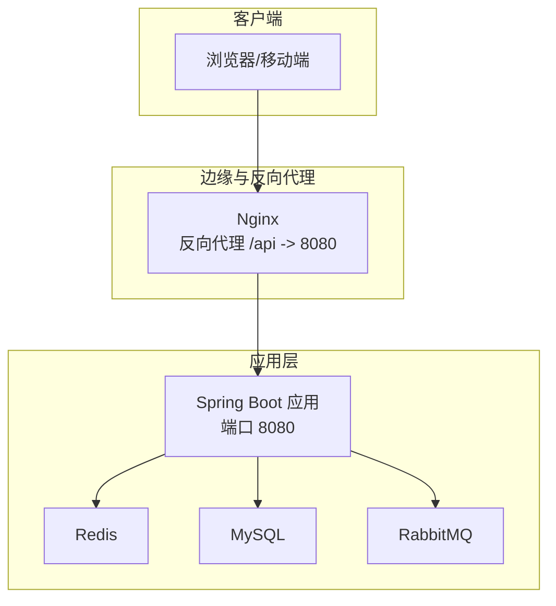
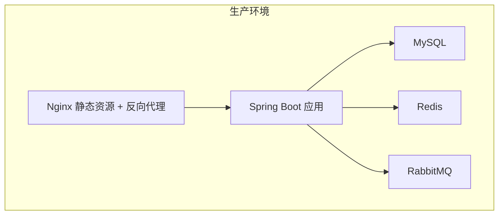
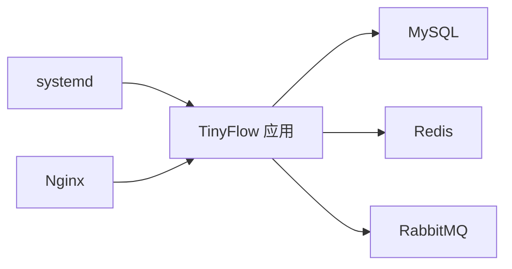

# 运维命令与流程

<cite>
**本文引用的文件**
- [OPERATIONS.md](file://OPERATIONS.md)
- [DEPLOY_ALIYUN.md](file://DEPLOY_ALIYUN.md)
- [OBSERVABILITY.md](file://OBSERVABILITY.md)
- [deploy.sh](file://deploy.sh)
- [docker-compose.yml](file://docker-compose.yml)
- [application.yml](file://src/main/resources/application.yml)
- [Dockerfile](file://Dockerfile)
- [README.md](file://README.md)
</cite>

## 目录
1. [引言](#引言)
2. [项目结构](#项目结构)
3. [核心组件](#核心组件)
4. [架构总览](#架构总览)
5. [详细组件分析](#详细组件分析)
6. [依赖关系分析](#依赖关系分析)
7. [性能监控与命令](#性能监控与命令)
8. [故障排查流程](#故障排查流程)
9. [数据备份与恢复策略](#数据备份与恢复策略)
10. [结论](#结论)

## 引言
本文件基于仓库内的运维与部署文档，系统化整理了服务管理、日志查看、故障排查、性能监控、数据备份与恢复等运维操作指南，帮助运维人员快速掌握 TinyFlow 在生产环境中的日常维护与应急处置流程。

## 项目结构
- 后端服务：Spring Boot 应用，通过 systemd 管理，监听 8080 端口，提供 API 与健康检查端点。
- 前端静态资源：由 Nginx 提供静态托管，反向代理 /api 到后端。
- 数据与缓存：MySQL（关系型数据）、Redis（分布式缓存）、RabbitMQ（消息队列，按需启用）。
- 监控与可观测性：Actuator 指标、Prometheus、Grafana、Zipkin（可选）。

**章节来源**
- [README.md](file://README.md#L150-L200)
- [docker-compose.yml](file://docker-compose.yml#L1-L67)

## 核心组件
- 后端服务（TinyFlow）：systemd 管理，日志输出到 systemd journal，支持健康检查与指标导出。
- Nginx：静态资源托管与 API 反向代理，提供访问与错误日志。
- MySQL：关系型数据库，提供应用数据持久化。
- Redis：分布式缓存，支持本地缓存与异步统计。
- RabbitMQ：消息队列（按需启用），用于异步统计与解耦。

**章节来源**
- [application.yml](file://src/main/resources/application.yml#L80-L120)
- [docker-compose.yml](file://docker-compose.yml#L1-L67)

## 架构总览
系统采用“Nginx + Spring Boot + MySQL + Redis + RabbitMQ”的生产架构，前端静态资源由 Nginx 提供，后端通过反向代理统一对外提供 API 与短链跳转。

**章节来源**
- [README.md](file://README.md#L150-L200)
- [docker-compose.yml](file://docker-compose.yml#L1-L67)

## 详细组件分析

### 服务管理命令
- 后端服务（TinyFlow）
  - 启动：systemctl start tinyflow
  - 停止：systemctl stop tinyflow
  - 重启：systemctl restart tinyflow
  - 状态：systemctl status tinyflow
  - 开机自启：systemctl enable tinyflow
- Nginx
  - 启动：systemctl start nginx
  - 重启：systemctl restart nginx
  - 配置校验：nginx -t
  - 状态：systemctl status nginx
- MySQL
  - 重启：systemctl restart mysql
  - 状态：systemctl status mysql
  - 登录：mysql -u root -p 或 mysql -u tinyflow -p tiny-flow
- Redis
  - 重启：systemctl restart redis
  - 状态：systemctl status redis
  - 连接测试：redis-cli -a 123456 ping
  - 客户端：redis-cli -a 123456

**章节来源**
- [OPERATIONS.md](file://OPERATIONS.md#L47-L122)
- [DEPLOY_ALIYUN.md](file://DEPLOY_ALIYUN.md#L457-L501)

### 日志查看方法
- 后端应用日志（systemd journal）
  - 实时查看：journalctl -u tinyflow -f
  - 最近 N 行：journalctl -u tinyflow -n 100 --no-pager
  - 时间范围：journalctl -u tinyflow --since "1 hour ago"
  - 错误过滤：journalctl -u tinyflow --since today | grep -i error
  - 功能日志：journalctl -u tinyflow --since "10 minutes ago" | grep "用户注册"
- Nginx 日志
  - 访问日志：tail -f /var/log/nginx/access.log
  - 错误日志：tail -f /var/log/nginx/error.log
  - 最近 N 条：tail -n 50 /var/log/nginx/access.log

**章节来源**
- [OPERATIONS.md](file://OPERATIONS.md#L125-L158)

### 故障排查流程
- 服务无法启动
  - 查看详细错误：journalctl -u tinyflow -n 50 --no-pager
  - 检查端口占用：netstat -tlnp | grep 8080
  - 检查 systemd 配置：cat /etc/systemd/system/tinyflow.service
  - 直接运行 jar 包验证：cd /opt/tinyflow && java -jar app.jar
  - 检查系统资源：free -h、df -h
- 数据库连接失败
  - 检查 MySQL 状态：systemctl status mysql
  - 登录测试：mysql -u tinyflow -p tiny-flow
  - 查看数据库错误日志：tail -f /var/log/mysql/error.log
  - 检查用户权限：mysql -u root -p -e "SHOW GRANTS FOR 'tinyflow'@'localhost';"
- Redis 连接失败
  - 检查 Redis 状态：systemctl status redis
  - 连接测试：redis-cli -a 123456 ping
  - 查看 Redis 日志：journalctl -u redis -n 50
  - 检查配置：grep -E "requirepass|bind" /etc/redis/redis.conf
- 前端访问失败
  - 检查 Nginx 状态：systemctl status nginx
  - 配置校验：nginx -t
  - 检查静态资源：ls -lh /opt/TinyFlow/web/dist/
  - 查看 Nginx 错误日志：tail -f /var/log/nginx/error.log
  - 测试后端 API：curl http://localhost:8080/api/auth/login -X POST -H "Content-Type: application/json" -d '{"username":"test","password":"test123"}'

**章节来源**
- [OPERATIONS.md](file://OPERATIONS.md#L161-L238)

### 性能监控命令与指标
- 实时监控
  - htop（综合监控）
  - top（CPU）
  - free -h（内存）
  - iostat -x 1（磁盘 IO）
  - iftop（网络流量）
  - ps aux | grep java（进程）
- 指标查询
  - TinyFlow 进程资源：ps aux | grep tinyflow
  - 端口连接数：netstat -an | grep :8080 | wc -l
  - MySQL 连接数：mysql -u root -p -e "SHOW PROCESSLIST;"
  - Redis 信息：redis-cli -a 123456 info stats
- 可观测性端点
  - 健康检查：/actuator/health
  - 指标导出：/actuator/metrics、/actuator/prometheus
  - 熔断器状态：/actuator/circuitbreakers
  - 限流器状态：/actuator/ratelimiters

**章节来源**
- [OPERATIONS.md](file://OPERATIONS.md#L241-L279)
- [OBSERVABILITY.md](file://OBSERVABILITY.md#L40-L60)

### 数据备份与恢复策略
- 数据库备份
  - 手动备份：mysqldump -u root -p tiny-flow > /root/backup/tinyflow_$(date +%Y%m%d).sql
  - 定时备份：crontab -e 添加每日凌晨 2 点的备份任务
  - 恢复数据：mysql -u root -p tiny-flow < /root/backup/tinyflow_YYYYMMDD.sql
- Redis 数据备份
  - 自动持久化路径：/var/lib/redis/dump.rdb
  - 手动保存：redis-cli -a 123456 save
  - 备份文件：cp /var/lib/redis/dump.rdb /root/backup/redis_$(date +%Y%m%d).rdb
- 代码与配置备份
  - systemd 服务配置：cp /etc/systemd/system/tinyflow.service /root/backup/
  - Nginx 站点配置：cp /etc/nginx/sites-available/tinyflow /root/backup/
  - 应用 jar 包：cp /opt/tinyflow/app.jar /root/backup/app_$(date +%Y%m%d).jar

**章节来源**
- [OPERATIONS.md](file://OPERATIONS.md#L283-L326)

## 依赖关系分析
- systemd 服务依赖 MySQL 与 Redis 启动顺序，确保应用在依赖服务就绪后再启动。
- Nginx 依赖后端服务提供 API 与静态资源。
- 应用通过环境变量与配置文件连接数据库、缓存与消息队列。
- Docker Compose 提供容器化依赖（MySQL、Redis、RabbitMQ），便于本地开发与测试。

**章节来源**
- [application.yml](file://src/main/resources/application.yml#L1-L120)
- [docker-compose.yml](file://docker-compose.yml#L1-L67)

## 性能监控与命令
- 常用命令
  - htop、free -h、netstat -tlnp
- 指标端点
  - /actuator/health、/actuator/metrics、/actuator/prometheus、/actuator/circuitbreakers、/actuator/ratelimiters
- 日志与追踪
  - 后端日志：journalctl -u tinyflow -f
  - 慢请求日志：tail -f logs/performance.log
  - 错误日志：tail -f logs/error.log

**章节来源**
- [OPERATIONS.md](file://OPERATIONS.md#L241-L279)
- [OBSERVABILITY.md](file://OBSERVABILITY.md#L180-L201)

## 故障排查流程
- 服务无法启动
  - 查看 systemd 日志、端口占用、配置文件、直接运行 jar 包、检查系统资源
- 数据库连接失败
  - 检查 MySQL 状态、登录测试、查看错误日志、检查用户权限
- Redis 连接失败
  - 检查 Redis 状态、连接测试、查看日志、检查配置
- 前端访问失败
  - 检查 Nginx 状态与配置、确认静态资源存在、查看错误日志、测试后端 API

**章节来源**
- [OPERATIONS.md](file://OPERATIONS.md#L161-L238)

## 数据备份与恢复策略
- 数据库
  - 手动备份与定时备份、恢复到指定 SQL 文件
- Redis
  - 自动持久化文件位置、手动 save、备份 rdb 文件
- 代码与配置
  - systemd 服务、Nginx 配置、应用 jar 包备份

**章节来源**
- [OPERATIONS.md](file://OPERATIONS.md#L283-L326)

## 结论
通过本运维指南，运维人员可以：
- 快速管理后端、Nginx、MySQL、Redis 服务；
- 使用 systemd journal 与 Nginx 日志进行问题定位；
- 基于健康检查与指标端点进行性能与稳定性监控；
- 建立数据库、Redis 与应用配置的定期备份与恢复流程；
- 在出现服务异常时，按步骤快速定位并解决问题。