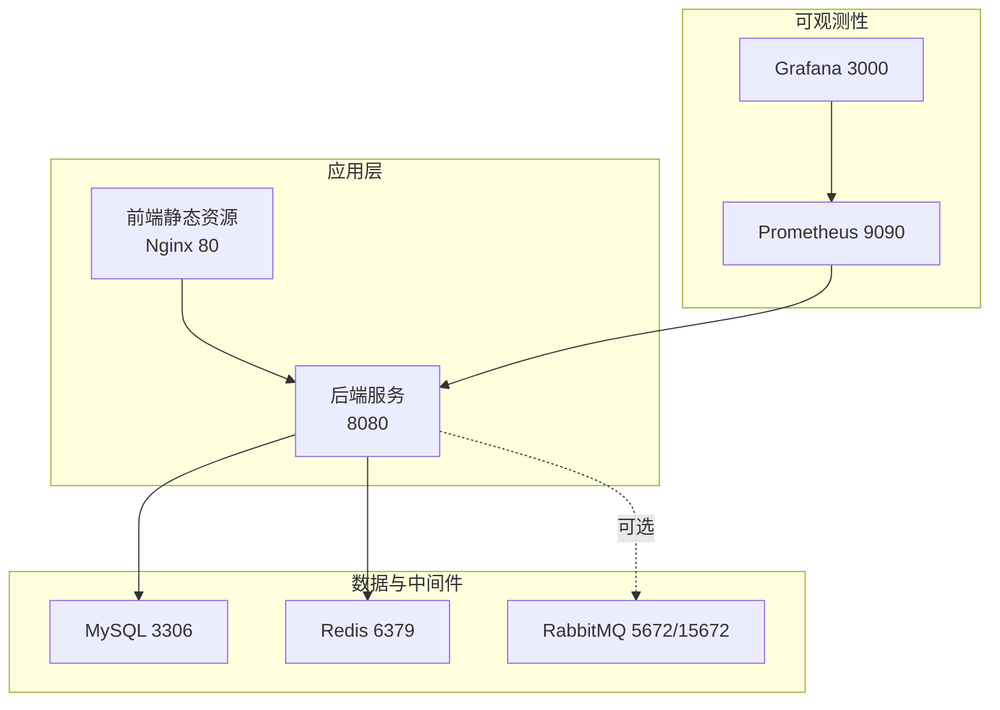
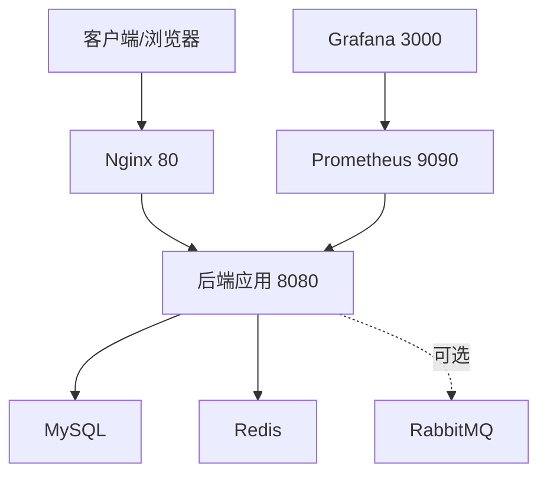
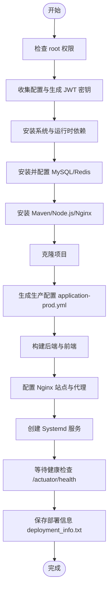
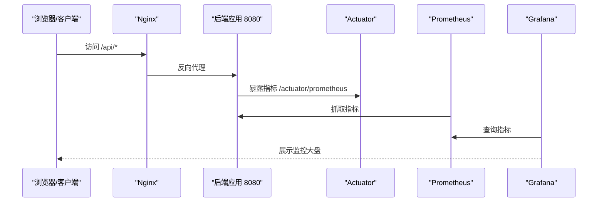
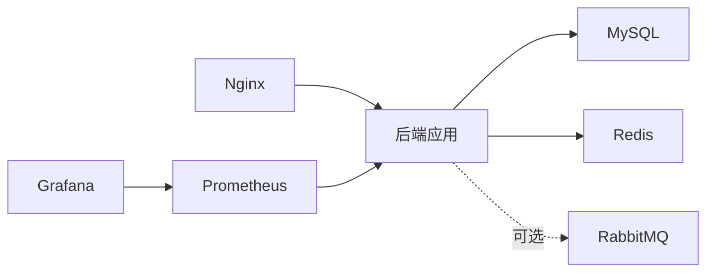

# 部署与运维

<cite>
**本文引用的文件**
- [Dockerfile](file://Dockerfile)
- [Dockerfile.app](file://Dockerfile.app)
- [docker-compose.yml](file://docker-compose.yml)
- [deploy.sh](file://deploy.sh)
- [DEPLOY_ALIYUN.md](file://DEPLOY_ALIYUN.md)
- [OBSERVABILITY.md](file://OBSERVABILITY.md)
- [OPERATIONS.md](file://OPERATIONS.md)
- [application.yml](file://src/main/resources/application.yml)
- [web/infra/observability/docker-compose.yml](file://web/infra/observability/docker-compose.yml)
- [web/infra/observability/prometheus.yml](file://web/infra/observability/prometheus.yml)
- [web/infra/observability/dashboards/shortener-overview.json](file://web/infra/observability/dashboards/shortener-overview.json)
- [web/infra/load/k6/max-qps-test.js](file://web/infra/load/k6/max-qps-test.js)
- [web/infra/load/k6/real-qps-test.js](file://web/infra/load/k6/real-qps-test.js)
- [web/infra/load/k6/shortener.js](file://web/infra/load/k6/shortener.js)
- [web/infra/load/k6/stress-5000qps.js](file://web/infra/load/k6/stress-5000qps.js)
- [web/infra/load/k6/verify-1000qps.js](file://web/infra/load/k6/verify-1000qps.js)
- [web/infra/load/k6/verify-3000qps.js](file://web/infra/load/k6/verify-3000qps.js)
</cite>

## 目录
1. [简介](#简介)
2. [项目结构](#项目结构)
3. [核心组件](#核心组件)
4. [架构总览](#架构总览)
5. [详细组件分析](#详细组件分析)
6. [依赖关系分析](#依赖关系分析)
7. [性能考虑](#性能考虑)
8. [故障排查指南](#故障排查指南)
9. [结论](#结论)
10. [附录](#附录)

## 简介
本指南面向运维工程师与开发者，提供从零到一的部署与运维实践，覆盖：
- 使用 docker-compose.yml 一键拉起应用、MySQL、Redis、RabbitMQ 的完整流程
- Dockerfile 与 Dockerfile.app 的构建差异与最佳实践
- deploy.sh 自动化部署脚本的执行逻辑与关键步骤
- 生产环境部署到阿里云的完整步骤与安全组配置
- 可观测性：Prometheus 指标采集、Grafana 监控大盘导入、Zipkin 链路追踪
- 使用 k6 脚本进行性能压测
- 健康检查与常见故障排查命令

## 项目结构
本仓库采用前后端分离与可观测性基础设施分离的组织方式：
- 后端与前端：位于根目录与 web 子目录
- 可观测性：web/infra/observability 提供 Prometheus、Grafana 与仪表盘
- 压测脚本：web/infra/load/k6 提供多类 k6 脚本
- 部署与运维：DEPLOY_ALIYUN.md、OBSERVABILITY.md、OPERATIONS.md、deploy.sh、docker-compose.yml、Dockerfile/Dockerfile.app

图表来源
- [docker-compose.yml](file://docker-compose.yml#L1-L67)
- [web/infra/observability/docker-compose.yml](file://web/infra/observability/docker-compose.yml#L1-L21)

章节来源
- [docker-compose.yml](file://docker-compose.yml#L1-L67)
- [web/infra/observability/docker-compose.yml](file://web/infra/observability/docker-compose.yml#L1-L21)

## 核心组件
- 后端应用镜像构建
  - Dockerfile：用于本地打包后的镜像构建，基于 JRE 运行时
  - Dockerfile.app：用于直接复制目标 JAR 构建的应用镜像
- 服务编排
  - docker-compose.yml：统一编排 Redis、MySQL、RabbitMQ、应用容器
- 自动化部署
  - deploy.sh：一键安装系统依赖、构建项目、配置 Nginx、创建 Systemd 服务并等待健康检查
- 生产部署指南
  - DEPLOY_ALIYUN.md：阿里云部署全流程（含安全组、HTTPS、域名等）
- 可观测性
  - OBSERVABILITY.md：健康端点、缓存统计、熔断器、指标导出、Grafana 导入与告警建议
  - web/infra/observability：Prometheus、Grafana、仪表盘 JSON
- 运维手册
  - OPERATIONS.md：常用命令、服务管理、日志查看、故障排查、备份与扩展
- 配置
  - application.yml：Actuator 暴露、Prometheus 指标、Resilience4j 熔断与限流、Zipkin Tracing

章节来源
- [Dockerfile](file://Dockerfile#L1-L7)
- [Dockerfile.app](file://Dockerfile.app#L1-L6)
- [docker-compose.yml](file://docker-compose.yml#L1-L67)
- [deploy.sh](file://deploy.sh#L1-L596)
- [DEPLOY_ALIYUN.md](file://DEPLOY_ALIYUN.md#L1-L1188)
- [OBSERVABILITY.md](file://OBSERVABILITY.md#L1-L257)
- [OPERATIONS.md](file://OPERATIONS.md#L1-L715)
- [application.yml](file://src/main/resources/application.yml#L1-L218)

## 架构总览
下图展示了生产环境的典型拓扑：Nginx 作为入口，后端提供 API 与静态页面；MySQL/Redis/RabbitMQ 作为数据与中间件；Prometheus/Grafana 采集与可视化指标。

图表来源
- [docker-compose.yml](file://docker-compose.yml#L1-L67)
- [web/infra/observability/docker-compose.yml](file://web/infra/observability/docker-compose.yml#L1-L21)

## 详细组件分析

### 1) Dockerfile 与 Dockerfile.app 的构建差异
- Dockerfile
  - 基于 JRE 运行时镜像，将打包好的 JAR 复制到镜像内，设置 JAVA_OPTS，暴露 8080 端口，入口为 java -jar
- Dockerfile.app
  - 与 Dockerfile 类似，但使用 slim 版本的基础镜像，适合直接复制 target/*.jar 构建应用镜像
- 选择建议
  - 若使用 docker-compose.yml 中的 app 服务构建上下文指向 Dockerfile.app，则优先使用该文件
  - 若需最小化镜像体积且保持运行时一致，两者均可

章节来源
- [Dockerfile](file://Dockerfile#L1-L7)
- [Dockerfile.app](file://Dockerfile.app#L1-L6)

### 2) docker-compose.yml 一键编排
- 服务定义
  - redis：启用 AOF 持久化，映射 6379
  - mysql：设置 root 密码与数据库，映射 3306，挂载数据卷
  - rabbitmq：开启管理界面，映射 5672/15672，挂载数据卷
  - app：基于 Dockerfile.app 构建，依赖上述服务，注入数据库、Redis、RabbitMQ 连接信息，暴露 8080
- 数据卷
  - mysql_data、rabbitmq_data 用于持久化
- 适用场景
  - 本地开发与测试环境快速拉起
  - 生产环境可参考该编排思路，结合 Nginx、安全组与证书配置

章节来源
- [docker-compose.yml](file://docker-compose.yml#L1-L67)

### 3) deploy.sh 自动化部署逻辑
- 核心流程
  - 权限校验（root 用户）
  - 收集配置：MySQL root 密码、数据库用户密码、Redis 密码、JWT 密钥生成、服务器 IP
  - 系统更新与基础工具安装
  - 安装 Java、MySQL、Redis、Maven、Node.js、Nginx
  - 克隆项目、生成生产配置 application-prod.yml（包含数据库、Redis、Tomcat、JWT、Resilience4j、Actuator 指标）
  - 构建后端与前端（Maven 打包、npm install 与 build）
  - 配置 Nginx：静态资源、API 代理、短链跳转、/actuator 限制本地访问
  - 创建 Systemd 服务 tinyflow.service，设置 JVM 参数与 profile
  - 等待服务健康检查（/actuator/health），打印部署信息与常用命令
- 关键产出
  - /opt/TinyFlow/deployment_info.txt：部署信息汇总
  - Systemd 服务与 Nginx 配置文件
  - 前端 dist 静态资源

图表来源
- [deploy.sh](file://deploy.sh#L1-L596)

章节来源
- [deploy.sh](file://deploy.sh#L1-L596)

### 4) 生产环境部署到阿里云（参考 DEPLOY_ALIYUN.md）
- 前置准备
  - 服务器规格与系统镜像（Ubuntu 22.04）
  - 本地工具与记录信息（服务器公网 IP、root 密码、MySQL 密码、Redis 密码）
- 快速部署（一键脚本）
  - 通过 wget/curl 下载 deploy.sh，赋予执行权限并运行
  - 脚本会交互式收集配置并自动完成安装与部署
- 手动部署（详细步骤）
  - 更新系统、安装 Java、MySQL、Redis、Maven、Node.js、Nginx
  - 克隆项目、生成生产配置、构建项目、配置 Nginx、创建 Systemd 服务
  - 配置阿里云安全组（开放 80/443，限制 22；谨慎开放 3306/6379/8080）
  - 验证部署：服务状态、应用日志、健康检查、API 测试
- 域名与 HTTPS
  - 域名解析到服务器 IP
  - 使用 certbot 申请免费证书并自动配置 Nginx
- 备注
  - 备案说明与阶段性上线建议（IP 访问、域名、HTTPS）

章节来源
- [DEPLOY_ALIYUN.md](file://DEPLOY_ALIYUN.md#L1-L1188)

### 5) 可观测性：Prometheus、Grafana 与 Zipkin
- 指标采集
  - 后端 application.yml 暴露 /actuator/prometheus，并开启 Micrometer 指标导出
  - web/infra/observability/docker-compose.yml 启动 Prometheus 与 Grafana
  - web/infra/observability/prometheus.yml 配置抓取 job，目标为 host.docker.internal:8080
- Grafana 监控大盘
  - 导入 web/infra/observability/dashboards/shortener-overview.json
  - 关键面板：QPS、P95 延迟、错误率、重定向延迟、熔断器状态、缓存命中率
- Zipkin 链路追踪
  - application.yml 已配置 Zipkin endpoint，便于集成分布式追踪
- 健康检查与监控端点
  - /api/monitor/health：系统健康状态
  - /actuator/health、/actuator/metrics、/actuator/prometheus、/actuator/circuitbreakers、/actuator/ratelimiters

图表来源
- [application.yml](file://src/main/resources/application.yml#L80-L132)
- [web/infra/observability/docker-compose.yml](file://web/infra/observability/docker-compose.yml#L1-L21)
- [web/infra/observability/prometheus.yml](file://web/infra/observability/prometheus.yml#L1-L9)
- [OBSERVABILITY.md](file://OBSERVABILITY.md#L1-L257)

章节来源
- [OBSERVABILITY.md](file://OBSERVABILITY.md#L1-L257)
- [application.yml](file://src/main/resources/application.yml#L80-L132)
- [web/infra/observability/docker-compose.yml](file://web/infra/observability/docker-compose.yml#L1-L21)
- [web/infra/observability/prometheus.yml](file://web/infra/observability/prometheus.yml#L1-L9)
- [web/infra/observability/dashboards/shortener-overview.json](file://web/infra/observability/dashboards/shortener-overview.json#L1-L55)

### 6) 使用 k6 脚本进行性能压测
- 脚本分类
  - verify-1000qps.js、verify-3000qps.js：验证性压测，设定目标 QPS
  - max-qps-test.js：探索最大 QPS
  - real-qps-test.js：模拟真实流量
  - stress-5000qps.js：极限压力测试
  - shortener.js：通用短链接口压测脚本
- 使用建议
  - 先用 verify-* 脚本确定稳定上限
  - 再用 stress-* 脚本观察系统在高负载下的表现
  - 结合 Grafana 与 Prometheus 观察延迟、错误率、熔断器状态

章节来源
- [web/infra/load/k6/max-qps-test.js](file://web/infra/load/k6/max-qps-test.js)
- [web/infra/load/k6/real-qps-test.js](file://web/infra/load/k6/real-qps-test.js)
- [web/infra/load/k6/shortener.js](file://web/infra/load/k6/shortener.js)
- [web/infra/load/k6/stress-5000qps.js](file://web/infra/load/k6/stress-5000qps.js)
- [web/infra/load/k6/verify-1000qps.js](file://web/infra/load/k6/verify-1000qps.js)
- [web/infra/load/k6/verify-3000qps.js](file://web/infra/load/k6/verify-3000qps.js)

### 7) 健康检查与故障排查
- 健康检查
  - /api/monitor/health：系统健康状态、熔断器、限流器、缓存统计
  - /actuator/health：Spring Boot 健康检查
- 常用命令
  - 服务管理：systemctl start/restart/stop/status tinyflow/nginx/mysql/redis
  - 日志查看：journalctl -u tinyflow -f；tail -f /var/log/nginx/access.log
  - 端口与进程：netstat -tlnp | grep :8080；ps aux | grep java
  - 数据库与缓存：mysql 登录、redis-cli ping/keys/flushall（谨慎）
- 故障排查
  - 服务无法启动：查看 journalctl 最近日志、检查端口占用、验证配置文件
  - 数据库连接失败：检查 MySQL 状态、用户权限、错误日志
  - Redis 连接失败：检查 Redis 状态、密码、配置 bind/requirepass
  - 前端访问失败：检查 Nginx 状态、配置测试、静态资源存在性、后端 API 可达性

章节来源
- [OBSERVABILITY.md](file://OBSERVABILITY.md#L1-L257)
- [OPERATIONS.md](file://OPERATIONS.md#L1-L715)

## 依赖关系分析
- 组件耦合
  - 应用对 MySQL、Redis、RabbitMQ 的依赖通过 application.yml 与 docker-compose.yml 注入
  - Nginx 作为反向代理，将 /api/* 与短链路径转发至后端
  - Prometheus 通过 /actuator/prometheus 抓取指标，Grafana 展示
- 外部依赖
  - Java 17 运行时、MySQL 8.0、Redis 7、RabbitMQ 3.13（可选）
  - Prometheus 与 Grafana（可观测性）
  - Nginx（反向代理与静态资源）

图表来源
- [docker-compose.yml](file://docker-compose.yml#L1-L67)
- [web/infra/observability/docker-compose.yml](file://web/infra/observability/docker-compose.yml#L1-L21)

章节来源
- [docker-compose.yml](file://docker-compose.yml#L1-L67)
- [web/infra/observability/docker-compose.yml](file://web/infra/observability/docker-compose.yml#L1-L21)

## 性能考虑
- JVM 与线程池
  - application.yml 中 Tomcat 线程池与连接参数较大，适合高并发场景
  - deploy.sh 中 Systemd 服务设置了较大的堆内存参数，可根据实例规格调整
- 缓存与熔断
  - Caffeine 本地缓存与 Resilience4j 熔断器/限流器降低下游压力
- 指标与可视化
  - Prometheus 抓取 /actuator/prometheus，Grafana 展示 QPS、延迟、错误率、熔断器状态
- 压测建议
  - 从 verify-* 开始，逐步提升到 stress-*，观察 p95/p99 延迟与错误率

章节来源
- [application.yml](file://src/main/resources/application.yml#L60-L120)
- [deploy.sh](file://deploy.sh#L430-L467)
- [OBSERVABILITY.md](file://OBSERVABILITY.md#L1-L257)

## 故障排查指南
- 服务无法启动
  - 查看 journalctl -u tinyflow -n 50；检查端口占用；核对 Systemd 配置
- 数据库连接失败
  - systemctl status mysql；mysql -u tinyflow -p；查看错误日志；检查权限
- Redis 连接失败
  - systemctl status redis；redis-cli -a ... ping；检查 requirepass/bind
- 前端访问失败
  - nginx -t；ls -lh /opt/TinyFlow/web/dist；tail -f /var/log/nginx/error.log；curl /api/... 验证后端

章节来源
- [OPERATIONS.md](file://OPERATIONS.md#L1-L715)

## 结论
通过 docker-compose.yml 与 deploy.sh，可快速完成应用、数据库、缓存与中间件的一键部署；结合 OBSERVABILITY.md 与 web/infra/observability 的 Prometheus/Grafana 配置，实现可观测性闭环；配合 k6 脚本进行压测，持续优化性能与稳定性。生产部署建议遵循 DEPLOY_ALIYUN.md 的安全组与 HTTPS 配置，确保服务安全与合规。

## 附录
- 常用命令速查
  - 服务管理：systemctl restart tinyflow/nginx/mysql/redis
  - 日志查看：journalctl -u tinyflow -f；tail -f /var/log/nginx/access.log
  - 健康检查：/actuator/health、/api/monitor/health
- 配置文件位置
  - 生产配置：/opt/TinyFlow/src/main/resources/application-prod.yml（deploy.sh 生成）
  - Nginx 站点：/etc/nginx/sites-available/tinyflow
  - Systemd 服务：/etc/systemd/system/tinyflow.service