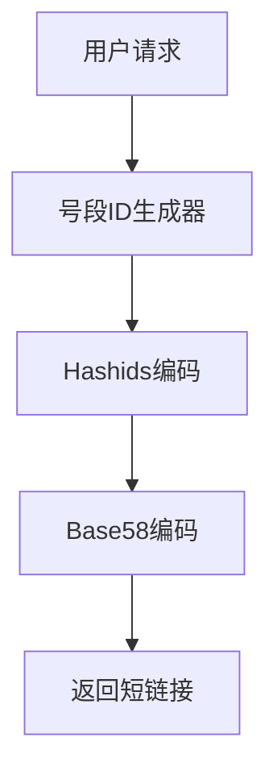

# TinyFlow 图片资源说明

本文档说明 README.md 中需要插入的图片位置和建议。

## 需要插入的图片列表

### 1. 项目 Logo
**位置**: README.md 顶部（第 5 行）
**路径**: `./docs/images/logo.png`
**建议尺寸**: 200x200px
**设计建议**:
- 主题：雨滴 + 流动元素
- 颜色：蓝色渐变（#3370FF → #38BDF8）
- 风格：简洁、现代、科技感
- 可以使用 Figma/Canva/AI 工具生成

### 2. 系统架构图
**位置**: README.md "系统架构" 章节（第 134 行之后）
**路径**: `./docs/images/architecture.png`
**建议尺寸**: 1200x800px
**内容要求**:
- 展示前端 → Nginx → 后端 → 缓存/数据库/消息队列的完整链路
- 标注各组件版本号（MySQL 8、Redis 7、RabbitMQ 等）
- 突出多级缓存流程（L1 → L2 → L3）
- 可以使用 draw.io / ProcessOn / Excalidraw 绘制

### 3. 短码生成流程图
**位置**: README.md "短码生成流程" 章节（第 176 行之后）
**路径**: `./docs/images/shortcode-generation.png`
**建议尺寸**: 800x600px
**内容要求**:
- 号段 ID 生成器 → Hashids 编码 → Base58 编码
- 标注双 Buffer 机制
- 展示 ID 预分配流程
- 可以使用 Mermaid / draw.io 绘制

### 4. 多级缓存架构图
**位置**: README.md "多级缓存读取流程" 章节（第 196 行之后）
**路径**: `./docs/images/cache-architecture.png`
**建议尺寸**: 800x600px
**内容要求**:
- L1 Caffeine → L2 Redis → L3 MySQL
- 标注命中率、回填策略
- 展示缓存预热机制
- 可以使用 Mermaid / draw.io 绘制

### 5. 异步统计流程图
**位置**: README.md "异步统计流程" 章节（第 219 行之后）
**路径**: `./docs/images/async-stats.png`
**建议尺寸**: 800x600px
**内容要求**:
- 用户点击 → RabbitMQ → 批量消费 → 数据库
- 标注死信队列、手动 ACK、重试机制
- 展示异步解耦优势
- 可以使用 Mermaid / draw.io 绘制

### 6. 性能监控截图
**位置**: README.md "性能指标" 章节（第 272 行之后）
**路径**: `./docs/images/grafana-dashboard.png`
**建议尺寸**: 1400x800px
**内容要求**:
- Grafana 监控大盘截图
- 展示 QPS、延迟、错误率等核心指标
- 包含时间序列图表、饼图等
- 真实压测数据截图

### 7. 压测结果截图
**位置**: README.md "性能指标" 章节（第 273 行之后）
**路径**: `./docs/images/k6-test-results.png`
**建议尺寸**: 1200x600px
**内容要求**:
- K6 压测报告截图
- 展示 3000+ QPS、P99 延迟等数据
- 包含请求成功率、错误率等
- 真实压测数据截图

### 8. 生产环境部署架构图
**位置**: README.md "部署到生产环境" 章节（第 360 行之后）
**路径**: `./docs/images/production-deployment.png`
**建议尺寸**: 1200x800px
**内容要求**:
- Nginx + Spring Boot + MySQL 主从 + Redis 哨兵 + RabbitMQ 集群
- 展示负载均衡、高可用架构
- 标注监控告警组件
- 可以使用 draw.io 绘制

## 快速生成建议

### 方式一：使用 Mermaid 生成流程图
在 README.md 中使用 Mermaid 代码块，GitHub 会自动渲染：



### 方式二：使用在线工具
- **架构图**: https://app.diagrams.net/ (draw.io)
- **流程图**: https://mermaid.live/
- **Logo**: https://www.canva.com/ 或 https://looka.com/
- **截图**: 直接运行系统后截图（Grafana、K6）

### 方式三：AI 生成
使用 DALL-E、Midjourney 或国内的 AI 绘图工具，提示词示例：
```
"A modern tech logo with water droplet and flow elements, 
blue gradient color (#3370FF to #38BDF8), 
minimalist style, vector graphic"
```

## 临时替代方案

在图片准备好之前，可以：
1. **使用占位符**: https://via.placeholder.com/1200x800?text=TinyFlow+Architecture
2. **使用 Mermaid 代码块**（GitHub 支持渲染）
3. **暂时注释掉图片引用**，先上线文字版 README

## 图片优化建议

- **格式**: PNG（透明背景）或 JPG（照片）
- **压缩**: 使用 TinyPNG (https://tinypng.com/) 压缩
- **CDN**: 考虑使用 GitHub CDN 或图床（如 SM.MS）
- **暗色模式**: 如果有暗色主题，准备两套图片

## 参考资源

- **优秀开源项目 README 参考**: 
  - https://github.com/microsoft/vscode
  - https://github.com/vercel/next.js
  - https://github.com/vuejs/core

- **架构图参考**:
  - https://github.com/doocs/advanced-java

希望这些建议能帮助你快速准备好项目图片！
